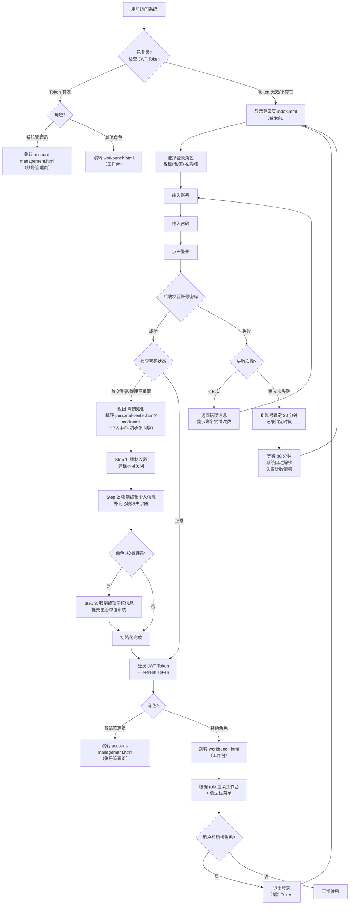
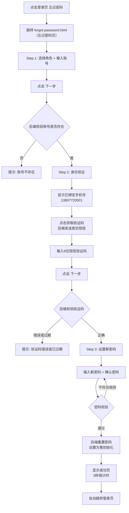
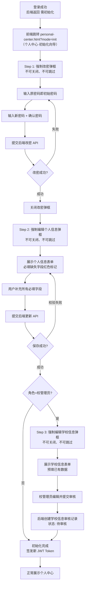
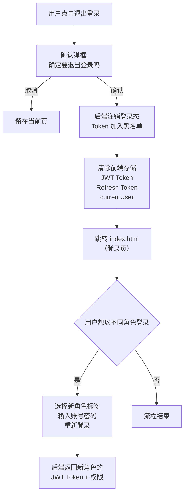
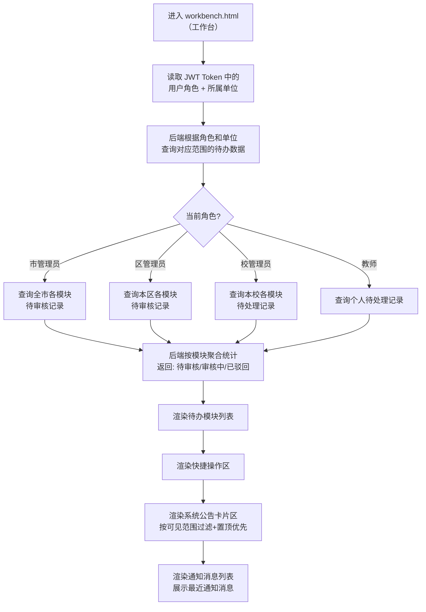
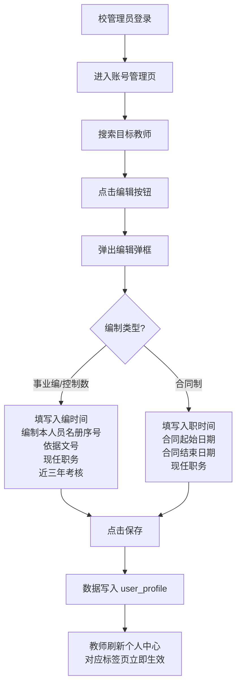

# PRD 系统基础模块 — 柳州教育人事管理平台

> 产品需求文档 · 登录 / 工作台 / 个人中心 / 忘记密码

> 📅 2026-07-10 &nbsp; 📌 Version 2.5（正式版） &nbsp; 📎 父文档：PRD_总纲_柳州教育人事管理平台.md


## 一、模块概述


### 1.1 模块定位

系统基础模块是柳州教育人事管理平台的**入口层基础设施**，承载用户身份认证（JWT 登录态）、角色路由、工作台门户、个人信息管理、密码安全等核心基础能力。所有业务模块（编制申请、入编、出编、岗位设置等）均依赖本模块提供的认证令牌和角色信息。

本模块在总纲排期中为 **P0 第一位**，是所有其他模块的前置依赖。


### 1.2 业务背景

平台面向市/区/校三级管理员 + 教师 + 系统管理员共 5 类角色，需要统一的身份认证入口和角色感知的工作门户。核心场景：


### 1.3 核心价值

- **🔐 统一身份入口**：5 类角色通过同一登录页进入，角色选择决定后续菜单和权限
- **📊 角色感知工作台**：登录后展示角色专属待办提醒、快捷操作、系统公告、通知消息；不同角色看到不同内容
- **👤 个人信息中心**：可查看和编辑基本信息、教育教学信息、证书信息、家庭信息
- **🔑 密码安全**：支持忘记密码找回（短信验证）、首次登录强制改密、密码强度实时校验


### 1.4 适用角色

| 角色 | 标识 | 本模块使用范围 |
| --- | --- | --- |
| 系统管理员 | `system` | 登录（直接进入账号管理页，无工作台）、个人中心 |
| 市管理员 | `city` | 登录、工作台（全市待办+快捷操作）、个人中心 |
| 区管理员 | `district` | 登录、工作台（本区待办+快捷操作）、个人中心 |
| 校管理员 | `school` | 登录、工作台（本校待办+快捷操作）、个人中心 |
| 教师 | `teacher` | 登录、工作台（个人待办+快捷操作）、个人中心 |


## 二、业务流程


### 2.1 登录与角色路由总流程




### 2.2 忘记密码流程




### 2.3 首次登录初始化流程（改密 + 补全信息）




### 2.4 退出登录与角色切换流程




### 2.5 工作台待办加载流程




## 三、功能清单


### 3.0 功能清单总览

| 编号 | 功能模块 | 功能点 | 功能说明 | 优先级 | 适用角色 |
| --- | --- | --- | --- | --- | --- |
| F01.01 | 登录认证 | 角色选择 + 账号密码登录 | 5 类角色通过统一登录页输入账号密码完成身份认证 | `P0` | 全部角色（未登录） |
| F01.02 | Token 自动续期 | JWT 令牌过期后自动使用 Refresh Token（刷新令牌）无感续期 | `P1` | 全部已登录角色 |
| F02.01 | 工作台 | 角色感知工作台渲染 | 登录后根据角色展示专属欢迎区、待办、快捷入口、系统公告 | `P0` | 市/区/校管理员、教师 |
| F02.02 | 待办提醒统计 | 按模块聚合展示待处理总数（不区分状态），按数量降序排列 | `P0` | 市/区/校管理员、教师 |
| F02.03 | 快捷操作入口 | 3×2 网格常用功能快捷跳转卡片，仅显示图标+名称，不显示副标题 | `P0` | 市/区/校管理员、教师 |
| F02.04 | 通知消息中心 | 顶栏铃铛 + 消息列表弹框 + 未读角标 | `P0` | 全部已登录角色 |
| F02.05 | 消息列表页 | 独立页面展示全量通知，支持分页和已读/未读筛选 | `P0` | 全部已登录角色 |
| F02.06 | 台账全局锁定提醒 | 台账审核中时待办区显示红色锁定警告条，仅校管理员可见 | `P1` | 校管理员 |
| F02.07 | 全部待办弹窗 | 点击"全部待办"弹出汇总弹窗，按模块分组展示所有待处理项 | `P1` | 市/区/校管理员、教师 |
| F02.08 | 待办排序与截断 | 待办列表按数量降序排列，卡片最多展示前 5 条，超出部分显示"查看全部 N 项待办"入口 | `P1` | 市/区/校管理员、教师 |
| F02.09 | 待申报批次统计 | 校管理员统计编制/招聘未提交批次，教师统计岗位晋升未提交批次，合并计入待处理总数 | `P1` | 校管理员、教师 |
| F02.10 | 系统公告展示 | 工作台底部展示系统公告卡片区，从公告管理发布的公告数据中按可见范围过滤、置顶优先、最多展示 5 条 | `P0` | 市/区/校管理员、教师 |
| F03.01 | 个人中心 | 基本信息查看 | 默认标签页，个人档案卡 + 账号信息，全部内容统一标签切换 | `P0` | 全部已登录角色 |
| F03.02 | 编辑个人信息 | 弹框编辑基本信息、附件、家庭、证书，含附件来源/删除/上传规则 | `P0` | 全部已登录角色 |
| F03.03 | 教育教学信息查看与编辑 | 教学经历、学段学科、初次任教时间等 | `P0` | 全部已登录角色 |
| F03.04 | 证书信息管理 | 证书信息在档案卡展示 + 编辑弹框管理（非独立标签页） | `P1` | 全部已登录角色 |
| F03.05 | 修改密码 | 顶栏弹框修改密码，含强度校验，成功后强制重新登录 | `P0` | 全部已登录角色 |
| F03.06 | 首次登录 — Step 1：强制改密 | 初始化向导第 1 步，不可跳过 | `P0` | 首次登录未完成初始化的账号 |
| F03.07 | 首次登录 — Step 2：补全个人信息 | 初始化向导第 2 步，补齐必填缺失字段 | `P0` | 首次登录未完成初始化的账号 |
| F03.08 | 首次登录 — Step 3：提交学校信息 | 校管理员专属，提交学校信息审核 | `P0` | 校管理员（需初始化） |
| F03.09 | 登录历史查看 | "登录历史"标签页，10 条/页翻页，含时间/IP/设备/结果 | `P2` | 全部已登录角色 |
| F03.10 | 编制信息查看 | 入编记录、编制类型、出编记录等，只读。未补录时引导联系校管理员 | `P0` | 事业编/控制数教师 |
| F03.11 | 岗位信息查看 | 当前岗位 + 晋升历程时间线，只读 | `P0` | 事业编/控制数教师 |
| F03.12 | 聘用信息查看 | 聘用记录列表，含合同附件，只读 | `P0` | 事业编/控制数教师 |
| F03.13 | 人事信息查看 | 师德记录、退休信息等，只读 | `P1` | 全部教师 |
| F03.14 | 合同与聘用查看 | 合同制教师的劳动合同与聘用记录，只读。未补录时引导联系校管理员 | `P0` | 合同制教师 |
| F03.15 | 存量教师补录规则 | 校管理员在账号管理弹框中补录历史编制/岗位/聘用/合同数据 | `P0` | 校管理员 |
| F04.01 | 忘记密码 | 身份确认 | 选择角色 + 输入账号，验证身份 | `P0` | 全部角色（未登录） |
| F04.02 | 短信验证 | 发送短信验证码到绑定手机号 | `P0` | 全部角色（未登录） |
| F04.03 | 设置新密码 | 重置密码 + 强度校验 | `P0` | 全部角色（未登录） |
| F05.01 | 通用组件 | 顶栏导航（TopNav） | 固定顶部，Logo + 通知铃铛 + 用户菜单 | `P0` | 全部已登录角色 |
| F05.02 | 侧边栏菜单（Sidebar） | 固定左侧，分组菜单 + 折叠 + 权限过滤 | `P0` | 全部已登录角色 |
| F05.03 | Toast 通知组件 | 操作反馈，3s 自动消失，支持成功/错误/警告 | `P0` | 全部 |
| F05.04 | 模态弹框组件（Modal） | 通用弹框，含标题/内容/按钮区 | `P0` | 全部 |
| F05.05 | 密码强度组件 | 3 格强度条 + 规则逐条校验，实时反馈 | `P0` | 全部 |

共 **5 个功能模块、35 个功能点**（登录认证 2 + 工作台 10 + 个人中心 15 + 忘记密码 3 + 通用组件 5）


### F01 — 登录认证

#### `F01.01` 角色选择 + 账号密码登录 `P0`

**适用角色**：全部 5 类角色（未登录状态）

**触发条件**：访问 index.html（登录页），无有效 JWT Token（JWT 令牌）

**前置条件**：账号已在系统管理模块创建且状态为"正常"

**后置条件**：登录成功 → 前端存储 JWT Token（JWT 令牌）+ Refresh Token（刷新令牌），跳转 workbench.html（工作台）。首次登录 → 跳转 personal-center.html?mode=init（个人中心·初始化向导）

**核心业务规则**：

1. 角色标签页 2 个（管理员 / 教师），默认"管理员"。系统/市/区/校管理员均从"管理员"标签登录；教师从"教师"标签登录。若校管理员从"教师"标签登录，则默认展示教师角色的菜单和操作权限

2. 管理员标签：输入手机号登录，后端根据账号自动识别具体角色（系统/市/区/校）。教师标签：输入身份证号或手机号登录。若校管理员从教师标签登录，系统默认展示教师角色的菜单和操作权限

3. 后端校验账号存在、密码正确、账号未被锁定

4. 连续 5 次密码错误 → 账号锁定 30 分钟。30 分钟后系统自动解锁，失败计数清零

5. 登录成功返回 JWT Token（JWT 令牌，有效期 8h）+ Refresh Token（刷新令牌，有效期 7d）

6. 记录登录日志（成功/失败、IP、设备信息）

**产品交互规则**：

1. 切换角色标签页时更新账号输入框 placeholder

2. 密码输入框支持"显示/隐藏"切换（眼睛图标）

3. 点击"登录"按钮后显示 loading 状态（按钮文字变为"登录中..."+ 不可点击）

4. 登录失败 toast 提示错误信息，输入框不自动清空

5. 账号锁定后 toast 提示"账号已被锁定，请30分钟后再试"


#### `F01.02` Token 自动续期 `P1`

**适用角色**：全部已登录角色

**触发条件**：JWT Token（JWT 令牌）过期（8h），Refresh Token（刷新令牌）仍有效（7d）

**前置条件**：已登录，持有有效 Refresh Token（刷新令牌）

**后置条件**：前端自动获取新 JWT Token（JWT 令牌），用户无感知

**核心业务规则**：

1. 请求拦截器检测到 401（未授权）→ 自动调用 /api/auth/refresh（刷新令牌接口）

2. Refresh Token 过期 → 跳转登录页，提示"登录已过期，请重新登录"

3. 续期后使用新 Token 重放原请求

**产品交互规则**：

1. Token 续期过程中页面正常展示，无 loading 遮罩
2. 续期失败跳转登录页时 toast 提示原因


### F02 — 工作台

#### `F02.01` 角色感知工作台渲染 `P0`

**适用角色**：市管理员、区管理员、校管理员、教师。**系统管理员无工作台**，登录后直接进入账号管理页

**触发条件**：登录成功后自动跳转 workbench.html（工作台）。系统管理员跳转 account-management.html（账号管理页）

**前置条件**：持有有效 JWT Token（JWT 令牌），角色非系统管理员

**后置条件**：展示角色专属的欢迎区 + 待办列表 + 快捷操作 + 系统公告 + 通知消息

**核心业务规则**：

1. 欢迎区：显示"你好，{姓名}"+ 当前角色中文名 + 所属单位 + 当前日期

2. 市管理员统计全市待办，区管理员统计本区，校管理员统计本校，教师统计个人

3. 台账全局锁定时，待办区顶部显示红色锁定警告条

**产品交互规则**：

1. 页面首次加载显示骨架屏（skeleton），数据返回后替换

2. 待办模块列表每个模块一行，含模块图标 + 名称 + 待处理计数（不区分状态）

3. 点击待办模块行 → 跳转对应模块列表页

4. 点击锁定警告条 → 跳转台账详情页


#### `F02.02` 待办提醒统计 `P0`

**适用角色**：市/区/校管理员、教师。**系统管理员不适用**（无工作台）

**触发条件**：工作台加载时调用 /api/workbench/todo（待办统计查询接口）。校管理员额外调用 /api/workbench/unsubmitted-batches（未提交批次查询接口）

**前置条件**：持有有效 JWT Token（JWT 令牌），所属范围内存在业务数据

**后置条件**：展示按模块聚合的待办统计数字，所有状态统一合并为"待处理"

**核心业务规则**：

1. 扫描模块：编制使用申请、教师入编、教师出编、岗位设置、岗位晋升、招聘岗位、聘用手续、退休呈报、师德师风举报、机构管理、编制岗位台账、编外教师入职管理、编外教师离职管理

2. **统一计数**：不区分待一审/待二审/审核中/已驳回/进行中批次未申报，所有未完结状态（含审批流程中的记录 + 主管部门已建批次但学校尚未提交申报的批次）统一计入"待处理"总数

3. **同模块合并**：同一模块名如在多个数据来源中出现（如审批待办数据 + 未提交批次统计），自动合并为一条，计数求和

4. **权限过滤**：仅统计当前角色管辖范围内的记录

5. **零值隐藏**：计数为 0 的模块不显示

- 6. **数据增减逻辑（个人队列接力）**：工作台待办统计的是**当前登录人**需要处理的事项。当某人对一条记录完成操作后，该记录从操作人的待办中 −1，同时进入下一责任人的待办队列 +1。增减规则如下：
- 操作人 | 操作 | 操作人待办变化 | 下一责任人待办变化 |

校管理员 | 提交申请 | 对应模块 −1（已提交，不再由我校处理） | 管理员对应模块 +1（待审核） |

管理员 | 审批通过（非终审） | 对应模块 −1 | 下一审管理员对应模块 +1（待审核） |

管理员 | 审批通过（终审） | 对应模块 −1 | 无（流程结束，离开待办池） |

提交人 | 修改后重新提交 | 对应模块 −1（已修改提交） | 管理员对应模块 +1（待审核） |

校管理员 | 录入 HR 结果（如岗位晋升） | 对应模块 −1 | 管理员对应模块 +1（待终审） |

主管部门 | 新建批次 | 不变 | 校管理员对应模块 +1（待申报） |

校管理员 | 提交批次申报 | 对应模块 −1（已提交申报） | 无（进入正常审批流，由审批待办跟进） |

主管部门 | 关闭/终止批次 | 不变 | 相关校管理员对应模块 −1（无需再申报） |

**核心原则**：待办数 = 当前登录人需要处理的记录数。每次操作都是一次"接力"——操作人 −1，下一责任人 +1，总待办数在系统内守恒（终审通过后离开系统）。

7. **多人同名角色共享待办（抢单模式）**：学校、区、市各级均存在多名同名角色管理员（如同一学校有多名校管理员、同一区有多名区管理员）。当一条待办任务发送到某一角色层级时，该层级**所有管理员同时 +1**；其中任意一人处理（提交/审批/驳回等）后，该层级**所有其他管理员同时 −1**。即：一条记录对于同一角色的 N 名管理员，产生 N 次 +1，但只需一人处理，N 人的待办全部清除。

**产品交互规则**：

1. 待办模块列表按待处理总数**降序排列**（数量多的在前）

2. 卡片最多展示**前 5 条**，超出的模块不显示在紧凑列表

3. 超出时底部显示"查看全部 N 项待办 →"入口，点击打开全部待办弹窗（F02.07）

4. 校管理员角色：编制使用申请和招聘岗位申请的待处理数包含未提交批次数（F02.09）

5. 暂无待办时显示"暂无待办事项"空状态

6. 数据每 60 秒自动刷新一次


#### `F02.03` 快捷操作入口 `P0`

**适用角色**：全部已登录角色

**触发条件**：工作台加载时根据角色渲染

**前置条件**：持有有效 JWT Token（JWT 令牌）

**后置条件**：展示 3×2 网格快捷入口，点击跳转对应模块

**核心业务规则**：

1. 不同角色展示不同快捷入口（见下表）

2. 每个角色均填满 6 格（教师仅 2 项，使用 2 列网格布局）

3. 快捷入口选品原则：高频使用的业务模块优先

**产品交互规则**：

1. 卡片 hover 上浮 + 边框变色
2. 点击跳转对应模块页面


| 角色 | 入口 1 | 入口 2 | 入口 3 | 入口 4 | 入口 5 | 入口 6 |
| --- | --- | --- | --- | --- | --- | --- |
| 市/区管理员 | 编制使用申请 | 教师入编 | 教师出编 | 岗位晋升 | 招聘岗位 | 聘用手续 |
| 校管理员 | 编制使用申请 | 教师入编 | 教师出编 | 岗位晋升 | 招聘岗位 | 聘用手续 |
| 教师 | 个人中心 | 岗位晋升 | —（2 列网格布局） |

#### `F02.04` 通知消息中心 `P0`

**适用角色**：全部已登录角色

**触发条件**：点击顶栏铃铛图标

**前置条件**：持有有效 JWT Token（JWT 令牌）

**后置条件**：展示通知消息列表弹框，未读消息数清零

**核心业务规则**：

1. 数据来源：后端 /api/notifications（通知消息查询接口，分页，每次 20 条）

2. 未读消息左侧蓝色圆点，点击后标记已读

3. 铃铛角标显示未读消息数量（红点+数字）

4. 消息保留 30 天，超期自动清理

5. 通知排序：默认未读在前、已读在后，各自按时间倒序排列

**产品交互规则**：

1. 点击铃铛 → 弹出浮层（宽 360px，最大高 400px，内部滚动）

2. 点击消息条目 → 跳转对应详情页 + 标记已读

3. 点击浮层外部区域 → 关闭浮层

4. 底部"查看全部消息"链接 → 跳转消息列表页（本模块范围内，独立页面展示全量通知，支持分页和已读/未读筛选）

5. 无消息时显示"暂无消息"空状态


#### `F02.05` 消息列表页 `P0`

**适用角色**：全部已登录角色

**触发条件**：点击消息弹框底部"查看全部消息 →"链接

**前置条件**：持有有效 JWT Token（JWT 令牌）

**后置条件**：跳转至消息列表独立页面（messages.html），展示当前用户的全量通知

**核心业务规则**：

1. 数据来源：后端 /api/notifications 分页查询（通知消息查询接口），Demo 阶段使用 localStorage 模拟

2. 默认展示全部消息，支持按"全部消息 / 未读 / 已读"标签页切换筛选

3. 分页展示，每页 10 条（符合项目标准）

4. 通知排序：未读在前、已读在后，各自按时间倒序排列

5. 消息保留 30 天，超期自动清理

6. 支持"全部标记已读"操作，一键将当前用户所有未读通知标记为已读

**产品交互规则**：

1. 页面布局：标准顶栏 + 侧边栏 + 主内容区，面包屑为"首页 > 消息列表"

2. 表头：状态、标题、内容、来源模块、时间

3. 未读消息行左侧显示"● 未读"蓝色状态标签，已读消息显示"○ 已读"灰色标签

4. 点击消息行 → 标记已读；若有关联业务链接（linkUrl），则跳转对应详情页

5. 无消息时显示"暂无消息"空状态

6. 顶栏铃铛弹框同步可用，显示最近 5 条消息摘要


#### `F02.06` 台账全局锁定提醒 `P1`

**适用角色**：校管理员（主管单位在台账管理页处理审核，不需要工作台提醒）

**触发条件**：工作台加载时检查台账审核状态（遵循总纲规则 6）

**前置条件**：当前角色为校管理员，存在处于审核中的台账记录

**后置条件**：待办区顶部显示红色锁定警告条

**核心业务规则**：

1. 仅当台账审核中且当前角色为校管理员时显示

2. 主管单位（市/区管理员）在台账管理页直接处理审核，工作台不重复提醒

3. 点击跳转台账详情

**产品交互规则**：

1. 红色背景警告条，置顶且不随待办列表滚动
2. 全局可点击，跳转台账详情


#### `F02.07` 全部待办弹窗 `P1`

**适用角色**：市/区/校管理员、教师。**系统管理员不适用**（无工作台）

**触发条件**：点击待办区标题旁的"全部待办 →"链接，或卡片底部"查看全部 N 项待办 →"入口

**前置条件**：持有有效 JWT Token（JWT 令牌）

**后置条件**：弹出弹窗展示所有待处理模块的完整列表

**核心业务规则**：

1. **数据来源**：与紧凑待办列表（F02.02）同一数据源，合并去重后展示全部模块

2. **一行汇总**：弹窗顶部居中显示"共 N 项待处理"，N 为所有模块待处理数的总和

3. **按模块分组**：模块按所属业务分组（编制管理 / 岗位管理 / 聘用管理 / 编外教师管理 / 人事管理），组标题灰色小字

4. **统一展示**：每行仅显示模块名 + "待处理 N"，不拆分状态维度

5. **排序规则**：与紧凑列表一致，组内按待处理总数降序排列

**产品交互规则**：

1. 弹窗宽 560px，最大高 70vh，内容区可滚动

2. 每行可点击，跳转对应模块页面

3. 点击遮罩层或右上角 ✕ 关闭

4. 无待办时显示"暂无待办事项"空状态


#### `F02.08` 待办排序与截断 `P1`

**适用角色**：市/区/校管理员、教师

**触发条件**：待办数据加载完成后自动执行

**前置条件**：已获取待办统计数据

**后置条件**：待办列表按规则排序并截断

**核心业务规则**：

1. **排序规则**：按每个模块的待处理总数降序排列。总数 = pending + review + reject（非终态记录的总和）。校管理员额外加上未提交批次数

2. **截断阈值**：紧凑卡片最多展示 5 条。当前各角色数据量（市 6 个模块、区 4 个、校 5~7 个），5 条阈值在大部分场景下刚好展示全部或仅折叠 1~2 条

3. **超出处理**：第 6 条及之后不渲染在卡片内，由底部"查看全部 N 项待办 →"入口承载

4. **弹窗不截断**：全部待办弹窗（F02.07）展示完整列表，不受 5 条限制

**产品交互规则**：

1. "查看全部"入口行置灰底色，hover 高亮，点击打开全部待办弹窗

2. 入口行仅在 totalCount > 5 时出现


#### `F02.09` 待申报批次统计 `P1`

**适用角色**：**校管理员、教师**

**触发条件**：校管理员或教师登录后加载工作台

**前置条件**：主管部门已创建编制使用申请/招聘岗位申请批次（校管理员场景），或校管理员已发布岗位晋升批次（教师场景）

**后置条件**：未提交的批次数合并计入对应模块的待处理总数

**核心业务规则**：

1. **编制使用申请**：读取已提交申报记录，与当前角色管辖范围内所有状态为"进行中"的批次逐一比对。该校未提交的批次数 = 进行中批次总数 − 已提交批次数

2. **招聘岗位申请**：读取已提交申报记录，与当前角色管辖范围内所有状态为"进行中"的批次逐一比对。该校未提交的批次数 = 进行中批次总数 − 已提交批次数

3. **岗位晋升申请（教师）**：读取教师已提交申报记录，与当前教师所属学校管辖范围内所有状态为"进行中"的岗位晋升批次逐一比对。该教师未提交的批次数 = 进行中批次总数 − 已提交批次数

4. **合并规则**：未提交批次数作为"待处理"数的一部分，与审批流程中的待处理计数合并（F02.02 规则 3）

5. **去重保护**：如果编制使用申请或招聘岗位申请已有审批待办记录，系统按模块名称自动合并为一条，计数求和，不会出现重复行

6. **动态性**：校管理员/教师提交申报后，系统自动重新计算待处理数量，对应的模块计数即时更新（数据来源于后端接口，非静态演示数据）

**产品交互规则**：1. 市/区管理员不触发此统计（待申报批次仅针对校管理员和教师角色） 


#### `F02.10` 系统公告展示 `P0`

**适用角色**：市管理员、区管理员、校管理员、教师。**系统管理员无工作台**（登录后直接进入账号管理页），通过公告管理页查看公告

**触发条件**：工作台加载时从系统公告管理发布的公告数据中读取

**前置条件**：公告管理中存在状态为"生效中"的公告，且公告可见范围覆盖当前用户

**后置条件**：工作台底部展示系统公告卡片区，显示若干条符合条件的公告

**核心业务规则**：

1. 数据来源：系统公告管理（公告管理页面发布）的公告数据

2. 可见范围过滤：按公告可见范围（全平台/全市/本区/本校）+ 所属单位匹配当前角色

3. **定时待发公告**：工作台所有角色不可见，仅在公告管理列表页可见

4. **已过期公告**：不在工作台展示

5. **置顶优先**：已置顶的公告排在最前，同组内按发布时间倒序

6. 最多展示 **5 条**，超出部分点击"查看全部 →"跳转公告管理列表页

7. 公告和消息通知（铃铛）为两条独立通道，发布公告不在消息铃铛中产生通知

**产品交互规则**：

1. 单行均匀布局：左侧蓝色圆点（3天内发布）+ 标题（自适应宽度，超出省略号）+ 范围标签（全平台/全市/本区/本校）+ 新/已过期标签 + 发布时间 + 来源

2. 置顶公告标题旁显示"置顶"标识

3. 3 天内发布的公告标题旁显示绿色"新"标签

4. 点击公告行 → 跳转公告详情页

5. 底部"查看全部 →"链接 → 跳转公告管理列表页

6. 暂无公告时显示"暂无公告"空状态


### F03 — 个人中心

#### `F03.01` 基本信息查看 `P0`

**适用角色**：全部已登录角色

**触发条件**：点击侧边栏"个人中心"或顶栏用户菜单"个人中心"

**前置条件**：持有有效 JWT Token（JWT 令牌）

**后置条件**：展示个人档案卡 + 账号信息区

**核心业务规则**：

1. 个人档案卡：头像（姓名字母缩写）、姓名、性别、身份证号、出生日期、民族、户籍地、政治面貌、学历、学位、毕业院校、手机号、邮箱

2. 账号信息区：账号、所属单位、角色、编制类型、账号状态（正常）、数据更新时间（全部只读）

3. 家庭情况：配偶、父亲、母亲、子女（姓名、关系、工作单位等）

4. 跨校信息（如有）：跨校类型（借调/支教/轮岗）、跨校学校、起止时间

5. 附件资料：身份证附件、证件照、学历学位证书附件，支持预览和下载

6. 数据来源：后端 /api/user/profile（用户个人信息查询接口）

**产品交互规则**：

1. 个人档案卡顶部包含"编辑资料"按钮
2. 页面加载时显示骨架屏，数据返回后替换


#### `F03.02` 编辑个人信息 `P0`

**适用角色**：全部已登录角色

**触发条件**：点击个人档案卡"编辑资料"按钮

**前置条件**：持有有效 JWT Token（JWT 令牌），账号状态为正常

**后置条件**：弹出编辑模态框，保存后更新展示

**核心业务规则**：

1. 模态框分五个区块：基本信息、教育教学信息、附件管理、家庭信息、证书信息

2. 可编辑字段：政治面貌、户籍地（省/市/区三级级联下拉）、学历、学位、职务、职称、手机号、邮箱、婚姻状况

3. 只读字段（灰色背景，不可编辑）：姓名、身份证号、性别、民族、出生年月、毕业院校、所属单位、账号、角色、编制类型、岗位类别、岗位等级、岗位名称、任职时间、入编方式

4. 手机号修改需短信验证码确认。输入新手机号后显示验证码输入框和发送按钮

5. 保存时调用后端 /api/user/profile/update（用户个人信息更新接口）


| 附件类型 | 是否必填 | 数量限制 | 大小限制 | 允许格式 | 特殊规则 |
| --- | --- | --- | --- | --- | --- |
| 身份证附件 | 是 | 1 个 | ≤10MB | JPG / PNG / PDF | 若来源于入编（标注"来源于入编"标签），可删除并重新上传，删除后来源变为"手动填写"。若为手动上传，正常可删除重传 |
| 证件照 | 否 | 1 个 | ≤5MB | JPG / PNG | 可删除并重新上传。不上传则使用默认头像 |
| 学历学位证书 | 否 | 多个 | ≤10MB / 个 | JPG / PNG / PDF | 支持添加多个文件，逐个删除。来源于入编模块的标注"来源于入编" |

| 家庭成员 | 字段 | 必填条件 | 交互规则 |
| --- | --- | --- | --- |
| 配偶 | 姓名、性别、身份证号、出生时间、与本人关系、联系电话、所在单位、职务 | 婚姻状况为"已婚"时必填；否则整个配偶卡片隐藏 | 卡片式折叠面板，有数据时默认展开（标题显示"填写中 ▼"），无数据时默认收起（标题显示"无 ▲"） |
| 父亲 | 同上 | 选填（折叠面板，默认收起） | 同上，点击标题切换展开/收起 |
| 母亲 | 同上 | 选填（折叠面板，默认收起） | 同上 |
| 子女 | 同上 | 选填，可添加多个 | 动态列表，每个子女一个折叠卡片。"+ 添加子女"按钮在列表底部，点击新增一个空白卡片。每个卡片可独立编辑和删除 |

| 数据来源 | 标注方式 | 可编辑性 | 优先级 |
| --- | --- | --- | --- |
| 手动填写 | 无标签，正常可编辑 | 可编辑、可删除 | 🔴 最高 |
| 来源于入编 | 字段旁显示 来源于入编 标签，蓝色背景 | 可编辑、可删除 | 🟡 次高 |
| 来源于聘用 | 字段旁显示 来源于聘用 标签，黄色背景 | 可编辑、可删除 | 🟢 最低 |

| 数据来源 | 标注方式 | 可编辑性 | 优先级 |
| --- | --- | --- | --- |
| 手动填写 | 无标签，正常可编辑和删除 | 可编辑、可删除 | 🔴 最高 |
| 来源于入编 | 证书卡片显示 来源于入编 标签，蓝色背景 | 可编辑、可删除 | 🟡 次高 |
| 来源于聘用 | 证书卡片显示 来源于聘用 标签，黄色背景 | 可编辑、可删除 | 🟢 最低 |

#### `F03.03` 教育教学信息查看与编辑 `P0`

**适用角色**：全部已登录角色

**触发条件**：个人档案卡中展示教育教学信息区块；点击"编辑资料"在弹框中编辑

**前置条件**：持有有效 JWT Token（JWT 令牌）

**后置条件**：展示教学经历、学段学科等字段，支持通过编辑弹框修改

**核心业务规则**：

1. 展示字段：学历、学位、职务、职称、任教学段、任教学科、汉语言水平、初次任教时间、主要学段、其他学段、主要学科、其他学科

2. 教育教学信息在个人档案卡中直接展示，不作为独立标签页

3. 编辑入口统一通过 F03.02 编辑弹框的"教育教学信息"区块

**产品交互规则**：

1. 在档案卡中网格布局展示
2. 点击"编辑资料"后在弹框的"教育教学信息"区块统一编辑


#### `F03.04` 证书信息管理 `P1`

**适用角色**：全部已登录角色

**触发条件**：个人档案卡中展示证书区块；点击"编辑资料"在弹框中管理

**前置条件**：持有有效 JWT Token（JWT 令牌）

**后置条件**：展示证书列表，支持通过编辑弹框增删改

**核心业务规则**：

1. 证书类型：教师资格证（必填）、普通话等级证、职称证书、学历学位证书、其他

2. 每项证书包含：证书类型、发证机构、证书编号、发证日期、有效期、附件（PDF/图片）

3. 教师资格证为必填项，教师角色缺少时显示红色警告

4. 附件上传 ≤ 10MB，支持 PDF/JPG/PNG

5. 证书信息在档案卡中展示，不作为独立标签页；增删改通过 F03.02 编辑弹框的"证书信息"区块完成

**产品交互规则**：

1. 证书卡片列表，每张卡片含证书信息 + 附件预览链接
2. "添加证书"按钮在编辑弹框证书区块底部
3. 附件点击弹出预览弹框


#### `F03.05` 修改密码 `P0`

**适用角色**：全部已登录角色

**触发条件**：任意页面顶栏用户下拉菜单 → "修改密码"

**前置条件**：持有有效 JWT Token（JWT 令牌）

**后置条件**：密码修改成功，清除登录态，强制跳转登录页重新登录

**核心业务规则**：

1. 表单字段：原密码、新密码、确认新密码

2. 原密码须与当前密码一致（后端校验）

3. 新密码规则：≥8 位，含大写字母、小写字母、数字（3 种类型）

4. 新密码不能与当前密码相同

5. 调用后端 /api/user/change-password（修改密码接口）

**产品交互规则**：

1. 弹框模式（宽 440px）

2. 实时密码强度指示器（3 格：弱红 / 中黄 / 强绿）+ 规则逐条标记（≥8 位 / 含大写 / 含小写 / 含数字 / 不与当前密码相同 / 两次输入一致）

3. 确认密码输入时实时比对（不一致时红色提示）

4. 修改成功后 toast "密码修改成功，即将跳转登录页…"，1.5 秒后清除登录态并跳转登录页


#### `F03.06` 首次登录初始化 — Step 1：强制改密 `P0`

**适用角色**：全部角色（首次登录未完成初始化的账号）

**触发条件**：登录成功，后端返回"需要初始化"标记

**前置条件**：账号为新创建（初始密码）或管理员已重置密码

**后置条件**：改密成功，进入 Step 2（编辑个人信息）

**核心业务规则**：

1. 登录后强制跳转 personal-center.html?mode=init（个人中心·初始化向导）

2. 自动弹出改密弹框，**不可关闭、不可跳过**（无关闭按钮、无遮罩关闭）

3. 改密成功后不立即结束初始化，而是进入 Step 2

4. 表单同 F03.05

**产品交互规则**：

1. 弹框标题显示"首次登录 · 第 1 步：修改初始密码"

2. 改密成功后 toast "密码修改成功" → 弹框关闭 → 自动弹出 Step 2 编辑个人信息弹框


#### `F03.07` 首次登录初始化 — Step 2：强制编辑个人信息 `P0`

**适用角色**：全部角色（首次登录未完成初始化的账号）

**触发条件**：Step 1 改密成功后自动触发

**前置条件**：已完成 Step 1 改密，首次登录未完成初始化

**后置条件**：必填缺失字段补充完毕。非校管理员 → 初始化完成。校管理员 → 进入 Step 3

**核心业务规则**：

1. 展示个人信息编辑表单，**不可关闭、不可跳过**

2. 系统自动检测必填缺失字段（手机号、性别、民族、学历、职务、职称、任教学段、任教学科等），缺失字段红色标记"待补充"

3. 已有数据的字段正常展示，用户可选择修改

4. 所有必填字段补齐后"保存并继续"按钮才可点击

5. 保存时调用后端 /api/user/profile/update（用户个人信息更新接口）

6. 保存成功后——非校管理员：初始化完成；校管理员：进入 Step 3

**产品交互规则**：

1. 弹框标题显示"首次登录 · 第 2 步：完善个人信息"

2. 缺失必填字段红色边框 + "必填"角标

3. 弹框分"基本信息"和"教育教学信息"两个区块

4. 同 F03.02 编辑弹框布局

5. 保存成功后 toast "个人信息已保存"


#### `F03.08` 首次登录初始化 — Step 3：校管理员编辑学校信息 `P0`

**适用角色**：仅校管理员（首次登录未完成初始化）

**触发条件**：Step 2 个人信息保存成功后自动触发

**前置条件**：已完成 Step 1 改密 + Step 2 个人信息编辑，当前角色为校管理员

**后置条件**：学校信息提交审核（状态：待审核），初始化完成

**核心业务规则**：

1. 展示学校信息编辑表单，**不可关闭、不可跳过**

2. 学校信息字段（与机构管理模块 org-management.html 完全一致，共 15 个字段，详见下方字段清单）：单位名称、单位简称、所属区域、单位级别、组织类型、学校类型、岗位设置分类、单位性质、单位类型、经费类型、统一社会信用代码、单位主管、单位地址、联系电话、邮编

3. 系统预填已有数据（如有），缺失字段红色标记

4. 必填字段补齐后"提交审核"按钮才可点击

5. 提交后调用后端 API 创建机构审核记录，状态为**待审核**

6. 提交成功后 初始化完成，进入工作台

**产品交互规则**：

1. 弹框标题显示"首次登录 · 第 3 步：完善学校信息"

2. 表单分为"基本信息""联系方式""办学信息"三个区块

3. 提交后 toast "学校信息已提交审核，请等待主管单位审批"

4. 提交后自动关闭弹框，正常进入个人中心。工作台待办区顶部显示"学校信息审核中"提示条

5. 提示条样式和交互规则详见下方"审核中提示条"说明


| 属性 | 说明 |
| --- | --- |
| 显示条件 | 校管理员已提交学校信息且状态为待审核 |
| 显示位置 | 工作台待办区顶部，与台账全局锁定提醒条同一区域 |
| 样式 | 浅黄背景（#FFFBEB）+ 黄色左边框（#FDE68A），圆角 8px，内边距 10px 14px |
| 图标 | 🏫（学校图标） |
| 文案 | "学校信息审核中 — 你的学校信息已提交，等待主管单位审批" |
| 优先级 | 低于台账全局锁定提醒条。若两者同时存在，台账红色条在上，学校审核黄色条在下，间距 8px |
| 点击行为 | 整条可点击，跳转机构管理详情页查看审核进度 |
| 消失条件 | 主管单位审批通过或驳回后自动消失。驳回后工作台转为显示驳回通知 |
| 数据来源 | 后端查询机构管理模块中该校的审核记录状态 |

**F03.08 学校信息字段（校管理员首次初始化时提交）：**以下字段与机构管理模块（org-management.html，机构管理页面）完全一致，共 15 个字段，分 3 组。

| 分组 | # | 字段名 | 类型 | 必填 | 说明 |
| --- | --- | --- | --- | --- | --- |
| 基本信息 | 1 | 单位名称 | text | 是 | 单位全称 |
| 2 | 单位简称 | text | 否 |  |
| 3 | 所属区域 | select | 是 | 市直属/鱼峰区/城中区/柳南区/柳北区等 |
| 4 | 单位级别 | select | 是 | 副厅级/正处级/副处级/正科级/副科级/其他未定级 |
| 编制属性 | 5 | 组织类型 | select | 是 | 学校/行政管理部门/局属二层机构 |
| 6 | 学校类型 | select | 是 | 小学/初中/高中/完中/九年一贯制/十二年一贯制/中职/幼儿园/特殊教育/专门学校 |
| 7 | 岗位设置分类 | select | 是 | 自治区示范高中/自治区特色高中/普通高中/初中/小学/幼儿园 |
| 8 | 单位性质 | select | 是 | 事业单位/参公事业单位/机关单位/其他 |
| 9 | 单位类型 | select | 是 | 公益一类/公益二类/行政部门 |
| 10 | 经费类型 | select | 是 | 全额拨款/差额拨款/自收自支 |
| 11 | 统一社会信用代码 | text | 是 | 18 位信用代码 |
| 管理信息 | 12 | 单位主管 | select | 是 | 从管理员列表中选择 |
| 13 | 单位地址 | text | 是 | 详细地址 |
| 14 | 联系电话 | text | 是 | 学校办公电话 |
| 15 | 邮编 | text | 是 |  |

#### `F03.09` 登录历史查看 `P2`

**适用角色**：全部已登录角色

**触发条件**：切换到"登录历史"标签页

**前置条件**：持有有效 JWT Token（JWT 令牌）

**后置条件**：展示登录记录表格

**核心业务规则**：

1. 字段：登录时间、IP 地址、设备/浏览器、登录结果（成功绿色/失败红色）

2. 每页展示 10 条，支持上一页/下一页翻页

3. 数据来源：后端 /api/user/login-history（登录历史查询接口）

**产品交互规则**：

1. 表格展示，按时间倒序
2. 底部"上一页"/"下一页"翻页按钮


### F03.10~F03.14 — 只读标签页（事业编/控制数/合同制教师）

#### `F03.10` 编制信息查看（事业编/控制数教师） `P0`

**适用角色**：事业编 / 控制数教师

**触发条件**：切换到"编制信息"标签页

**前置条件**：持有有效 JWT Token（JWT 令牌），角色为教师

**后置条件**：展示教师入编记录、编制类型、出编记录等。未补录时引导联系校管理员

**核心业务规则**：

1. 展示入编记录（入编时间、入编方式、编制类型）

2. 展示编制本人员名册序号、依据文号等编制档案信息

3. 如有出编记录，展示出编类型、出编日期

4. **全部只读**，新入职教师数据由入编/出编模块写入

5. 旧平台迁入教师：校管理员在账号管理中补录后展示

6. 合同制教师不显示此标签页

**产品交互规则**：

1. 卡片式布局，按入编记录分组
2. 附件资料可预览和下载
3. 未补录时显示"暂无编制信息，请联系校管理员补录"


#### `F03.11` 岗位信息查看（事业编/控制数教师） `P0`

**适用角色**：事业编 / 控制数教师

**触发条件**：切换到"岗位信息"标签页

**前置条件**：持有有效 JWT Token（JWT 令牌），角色为教师

**后置条件**：展示当前岗位 + 晋升历程时间线。未补录时展示补录数据或引导文案

**核心业务规则**：

1. 当前岗位：岗位类别、当前等级、现任职务、任职时间、近三年考核

2. 晋升历程：按时间倒序展示每次岗位晋升记录

3. **全部只读**，新入职教师数据由岗位晋升模块写入

4. 旧平台迁入教师：校管理员在账号管理中补录后展示

5. 合同制教师不显示此标签页

**产品交互规则**：

1. 当前岗位卡片置顶
2. 晋升历程使用时间线组件，可展开查看详情
3. 无晋升记录时引导"去申报" + 补录提示


#### `F03.12` 聘用信息查看（事业编/控制数教师） `P0`

**适用角色**：事业编 / 控制数教师

**触发条件**：切换到"聘用信息"标签页

**前置条件**：持有有效 JWT Token（JWT 令牌），角色为教师

**后置条件**：展示聘用记录列表。未补录时引导联系校管理员

**核心业务规则**：

1. 展示每次聘用记录：聘用时间、拟聘岗位类别及等级、用人方式、审批状态

2. 含附件资料（聘用合同等），可预览下载

3. **全部只读**，数据由聘用手续模块写入

4. 旧平台迁入教师：校管理员在账号管理中补录后展示

5. 合同制教师不显示此标签页（改用"合同与聘用"）

**产品交互规则**：

1. 聘用记录列表按时间倒序
2. 附件支持预览和下载
3. 未补录时显示"暂无聘用信息，如需补录请联系校管理员"


#### `F03.13` 人事信息查看 `P1`

**适用角色**：全部教师

**触发条件**：切换到"人事信息"标签页

**前置条件**：持有有效 JWT Token（JWT 令牌）

**后置条件**：展示师德记录、退休信息等

**核心业务规则**：

1. 师德记录：师德师风举报模块的相关记录（规划中）

2. 退休信息：退休呈报模块的相关记录（规划中）

3. **全部只读**，数据由对应业务模块写入

**产品交互规则**：

1. 模块开发中时显示"模块开发中"占位状态
2. 完成后展示对应模块数据


#### `F03.14` 合同与聘用查看（合同制教师） `P0`

**适用角色**：合同制教师

**触发条件**：切换到"合同与聘用"标签页

**前置条件**：持有有效 JWT Token（JWT 令牌），角色为合同制教师

**后置条件**：展示劳动合同与聘用记录。未补录时引导联系校管理员

**核心业务规则**：

1. 展示合同起止（起始日期至结束日期）、入职时间

2. **全部只读**，新入职教师数据由编外教师入职管理模块写入

3. 旧平台迁入合同制教师：校管理员在账号管理中补录后展示

4. 仅合同制教师显示（替代编制/岗位/聘用三个标签页）

**产品交互规则**：

1. 卡片式布局
2. 未补录时显示"暂无合同信息，请联系校管理员补录"


### F03.15 — 存量教师数据补录规则

| 教师类型 | 补录入口 | 补录人 | 补录字段 |
| --- | --- | --- | --- |
| 事业编 | 账号管理 → 编辑弹框 → 编制与聘用信息区 | 校管理员 | 入编时间、编制本人员名册序号、依据文号、现任职务、近三年考核 |
| 控制数 | 同上 | 校管理员 | 同上 |
| 合同制 | 账号管理 → 编辑弹框 → 合同信息区 | 校管理员 | 入职时间、合同起始日期、合同结束日期、现任职务 |

| 标签页 | 判断条件 | 未补录时展示 | 已补录时展示 |
| --- | --- | --- | --- |
| 编制信息 | 账号管理中是否已填写入编时间 | 空状态："暂无编制信息，请联系校管理员补录" | 正常展示入编记录 |
| 岗位信息 | 账号管理中是否已填写岗位等级 | 空状态："暂无岗位信息，请联系校管理员补录" | 正常展示当前岗位 + 晋升历程 |
| 聘用信息 | 账号管理中是否已填写入编时间（聘用记录关联入编） | 空状态："暂无聘用信息，请联系校管理员补录" | 正常展示聘用记录 |
| 人事信息 | —（模块规划中） | "模块开发中，完成后相关记录将在此展示" | — |
| 合同与聘用 | 账号管理中是否已填写合同起始日期 | 空状态："暂无合同信息，请联系校管理员补录" | 正常展示合同与聘用记录 |



| # | 字段名 | 类型 | 必填 | 适用编制类型 | 字段来源 |
| --- | --- | --- | --- | --- | --- |
| 1 | 入编时间 | month | 是 | 事业编/控制数 | 补录场景特有，对应入编模块的提交时间（submitTime） |
| 2 | 编制本人员名册序号 | text | 否 | 事业编/控制数 | 同教师出编模块的编制本名册序号（rosterBook） |
| 3 | 依据文号 | text | 否 | 事业编/控制数 | 同教师入编/出编模块的依据文号（docNumber） |
| 4 | 现任职务 | select | 是 | 全部 | 同岗位晋升模块的现任职务（currentTitle），枚举值来自职务字典 |
| 5 | 近三年考核 | text | 否 | 事业编/控制数 | 同岗位晋升模块的年度考核结果（assessments） |
| 6 | 入职时间 | date | 是 | 合同制 | 同编外教师入职管理模块的入职时间（entryDate） |
| 7 | 合同起始日期 | date | 是 | 合同制 | 同编外教师入职管理模块的合同起始日期（contractStart） |
| 8 | 合同结束日期 | date | 是 | 合同制 | 同编外教师入职管理模块的合同结束日期（contractEnd） |


### F04 — 忘记密码

#### `F04.01` 忘记密码 — 身份确认 `P0`

**适用角色**：全部角色（未登录状态）

**触发条件**：登录页点击"忘记密码"链接

**前置条件**：无

**后置条件**：验证通过后进入 Step 2

**核心业务规则**：

1. 选择角色 + 输入账号

2. 后端查询：按 role + account 在 user 表中查找

3. 账号不存在 → 提示"账号不存在，请检查角色和账号"

4. 账号存在 → 返回已绑定手机号（如 13807720001），进入 Step 2

**产品交互规则**：

1. 步骤条显示 3 步，Step 1 高亮
2. 点击"下一步"后调用后端接口，loading 状态显示


#### `F04.02` 忘记密码 — 短信验证 `P0`

**适用角色**：全部角色（未登录状态）

**触发条件**：Step 1 验证通过

**前置条件**：账号存在，已绑定手机号

**后置条件**：验证码验证通过后进入 Step 3

**核心业务规则**：

1. 展示已绑定手机号，用户确认后点击"获取验证码"

2. 后端调用 SMS 网关发送 6 位数字验证码

3. 验证码有效期 5 分钟，同一手机号每小时限发 5 次

4. 输入验证码后提交后端校验

**产品交互规则**：

1. "获取验证码"按钮点击后倒计时 60 秒，置灰不可点击

2. 未绑定手机号时提示"该账号未绑定手机号，请联系管理员重置密码"

3. Step 2 显示步骤条高亮


#### `F04.03` 忘记密码 — 设置新密码 `P0`

**适用角色**：全部角色（未登录状态）

**触发条件**：Step 2 验证通过

**前置条件**：短信验证码已验证通过

**后置条件**：密码重置成功，自动跳转登录页

**核心业务规则**：

1. 新密码规则同 F03.05

2. 调用后端 /api/auth/reset-password（忘记密码重置接口，含验证码 token）

3. 重置成功后标记为需初始化（通过验证码重置后仍需首次登录初始化）

**产品交互规则**：

1. 密码强度指示器（同 F03.05）

2. 确认密码实时比对

3. 提交成功后显示绿色对勾 + "密码重置成功"

4. 3 秒倒计时自动跳转登录页，附带 toast "请使用新密码登录"


### F05 — 通用组件

#### `F05.01` 顶栏导航（TopNav） `P0`

**适用角色**：全部已登录角色

**触发条件**：所有内部页面自动渲染

**前置条件**：持有有效 JWT Token（JWT 令牌）

**核心业务规则**：

1. 固定顶部 56px，蓝色渐变背景

2. 左侧：Logo + 平台名称"柳州教育人事管理平台"

3. 右侧：通知铃铛（含未读角标）+ 用户头像 + 姓名 + 下拉菜单

4. 下拉菜单：个人中心 / 修改密码 / 分隔线 / 退出登录

**产品交互规则**：

1. 下拉菜单点击外部区域关闭
2. 退出登录有二次确认弹框


#### `F05.02` 侧边栏菜单（Sidebar） `P0`

**适用角色**：全部已登录角色

**触发条件**：所有内部页面自动渲染

**前置条件**：持有有效 JWT Token（JWT 令牌），已获取角色菜单权限

**核心业务规则**：

1. 固定左侧 240px，深蓝背景

2. 菜单分组 + 菜单项，根据角色权限过滤

3. 支持折叠（64px 图标模式）

4. 当前页面菜单项高亮（蓝色左边框 + 白色文字）

5. **正式版无角色切换器**

**产品交互规则**：

1. 菜单分组标题不可点击
2. 折叠模式下仅显示图标
3. 菜单数据来源：后端 /api/menu/config（角色菜单配置查询接口）


#### `F05.03` Toast 通知组件 `P0`

**适用角色**：全部

**触发条件**：各操作完成/失败时调用

**核心业务规则**：

1. 类型：success（绿）/ error（红）/ warning（黄）/ info（蓝）
2. 自动消失 3s，支持手动关闭
3. 同时最多显示 3 条（超出队列等待）

**产品交互规则**：

1. 固定右上角弹出
2. 带图标 + 文字 + 关闭按钮


#### `F05.04` 模态弹框组件（Modal） `P0`

**适用角色**：全部

**触发条件**：编辑、确认、表单场景

**核心业务规则**：

1. 标准结构：标题栏 + 内容区 + 底部按钮区
2. 支持关闭按钮（首次登录改密弹框除外）
3. 点击遮罩可关闭（首次登录改密弹框除外）

**产品交互规则**：

1. 弹出动画 fadeIn + slideUp 0.2s
2. ESC 键关闭


#### `F05.05` 密码强度组件 `P0`

**适用角色**：全部

**触发条件**：输入新密码时实时触发

**核心业务规则**：

1. 3 格强度条：弱（仅满足部分规则）→ 中（满足 ≥ 2 种字符类型）→ 强（满足 ≥ 3 种 + ≥ 10 位）

2. 规则逐条校验：≥8 位、含大写、含小写、含数字、含特殊字符

3. 所有规则满足后提交按钮才可点击

**产品交互规则**：

1. 实时反馈，每输入一个字符即更新
2. 满足的规则图标变绿对勾


## 四、页面字段清单


### 4.1 登录页（index.html）

| # | 字段名 | 类型 | 必填 | 校验规则 | 说明 |
| --- | --- | --- | --- | --- | --- |
| 1 | 角色 | 标签页选择 | 是 | 2 选 1（管理员 / 教师），默认管理员 | 系统/市/区/校管理员均从管理员标签登录，教师从教师标签登录 |
| 2 | 账号 | text | 是 | 不可为空；管理员为手机号，教师为身份证号/手机号 |  |
| 3 | 密码 | password | 是 | 不可为空 | 支持显示/隐藏切换 |


### 4.2 工作台（workbench.html）

| 区域 | 元素 | 数据来源 | 说明 |
| --- | --- | --- | --- |
| 欢迎区 | 姓名 + 角色 + 单位 + 日期 | JWT Token payload（登录时签发的令牌中携带） | 只读展示 |
| 待办区 | 按模块聚合的待办卡片列表 | GET /api/workbench/todo（后端根据角色和单位查询待办统计） | 含待审核/审核中/已驳回计数 |
| 快捷操作区 | 3×2 网格入口卡片 | 前端根据 role 渲染（各角色预设的快捷入口配置） | 教师 2 列布局 |
| 通知铃铛 | 消息列表弹框 | GET /api/notifications（后端查询当前用户的通知消息） | 已读/未读状态 + 跳转链接 |
| 台账锁定提醒 | 红色警告条 | GET /api/ledger/lock-status（后端查询台账是否处于审核中） | 仅台账审核中显示 |
| 系统公告区 | 公告卡片列表 | 从系统公告管理发布的公告数据中获取 | 按可见范围过滤，置顶优先+时间倒序，最多 5 条；定时待发不展示 |


### 4.3 个人中心（personal-center.html）— 基本信息

| # | 字段名 | 类型 | 必填 | 可编辑 | 说明 | 数据来源 |
| --- | --- | --- | --- | --- | --- | --- |
| 1 | 姓名 | text | 是 | 否 | 头像区显示姓名字母缩写 | 账号创建时录入（系统管理模块），入编审核通过后同步至个人档案 |
| 2 | 性别 | select | 是 | 否 | 男/女 | 账号创建时录入（系统管理模块），入编审核通过后同步。个人不可修改，如需修改请联系校管理员在账号管理中更正 |
| 3 | 身份证号 | text | 是 | 否 | 18 位 | 账号创建时录入（系统管理模块），入编审核通过后同步至个人档案。个人不可修改，如需修改请联系校管理员在账号管理中更正 |
| 4 | 出生日期 | date | 是 | 否 | 由身份证号自动推算 | 系统根据身份证号自动计算。个人不可修改，如需修改请联系校管理员在账号管理中更正身份证号后自动更新 |
| 5 | 民族 | select | 是 | 否 | 枚举值来自字典接口 | 账号创建时录入（系统管理模块），入编审核通过后同步。个人不可修改，如需修改请联系校管理员在账号管理中更正 |
| 6 | 户籍地 | 级联下拉（省/市/区） | 否 | 是 | 省→市→区三级级联 | 入编审核通过后同步；个人中心编辑弹框可修改。校管理员账号管理中不补录此字段 |
| 7 | 政治面貌 | select | 否 | 是 | 枚举值来自字典接口 | 个人中心自行维护；入编审核通过时若有数据则同步 |
| 8 | 手机号 | text | 是 | 是 | 修改需短信验证 | 账号创建时录入，个人中心可修改 |
| 9 | 电子邮箱 | text | 否 | 是 | 邮箱格式校验 | 个人中心自行维护 |
| 10 | 所属单位 | text | 是 | 否 | 由账号创建时关联，入编审核通过后同步 | 系统管理模块创建时关联 + 机构管理模块（只读） |
| 11 | 账号 | text | 是 | 否 | 系统分配 | 系统管理模块（只读） |
| 12 | 角色 | text | 是 | 否 | 显示当前角色中文名 | 系统管理模块（只读） |
| 13 | 账号状态 | 标签 | — | 否 | 正常（绿）/ 停用（红） | 系统管理模块控制 |
| 14 | 创建时间 | datetime | — | 否 |  | 系统自动记录 |
| 15 | 最后登录 | datetime | — | 否 |  | 系统自动更新 |


### 4.4 个人中心 — 教育教学信息

| # | 字段名 | 类型 | 必填 | 可编辑 | 说明 | 数据来源 |
| --- | --- | --- | --- | --- | --- | --- |
| 1 | 学历 | select | 是 | 是 | 枚举：博士/硕士/本科/专科/高中/初中/中专/其他 | 入编审核通过后同步；个人中心可修改；旧平台迁入教师由校管理员在账号管理中补录 |
| 2 | 学位 | select | 否 | 是 | 枚举：博士/硕士/学士/无 | 入编审核通过后同步；个人中心可修改；旧平台迁入教师由校管理员在账号管理中补录 |
| 3 | 职务 | select | 是 | 是 | 枚举值来自字典接口 | 入编审核通过后同步；个人中心可修改；旧平台迁入教师由校管理员在账号管理中补录 |
| 4 | 职称 | select | 是 | 是 | 枚举值来自字典接口 | 岗位晋升审批通过后自动更新；入编审核通过时同步初始职称；个人中心可修改；旧平台迁入教师由校管理员在账号管理中补录 |
| 5 | 任教学段 | select | 是 | 是 | 枚举值来自字典接口 | 入编审核通过后同步；个人中心可修改；旧平台迁入教师由校管理员在账号管理中补录 |
| 6 | 任教学科 | select | 是 | 是 | 枚举值来自字典接口 | 入编审核通过后同步；个人中心可修改；旧平台迁入教师由校管理员在账号管理中补录 |
| 7 | 汉语言水平 | select | 否 | 是 | 枚举值来自字典接口 | 旧平台迁入数据自动带入；新账号可在个人中心自行维护；旧平台迁入教师也可在个人中心修改补录 |
| 8 | 初次任教时间 | date | 否 | 是 | 影响退休时间自动计算 | 入编审核通过后同步；个人中心可修改；退休呈报模块引用 |


### 4.5 个人中心 — 编制信息（事业编/控制数教师，只读）

| # | 字段/内容 | 说明 | 数据来源 |
| --- | --- | --- | --- |
| 1 | 入编记录 | 入编时间、入编方式（统一公开招聘/自主招聘等）、编制类型（事业编/控制数） | 教师入编模块（entry_submissions） |
| 2 | 编制档案 | 依据文号、编制本人员名册序号 | 教师入编模块 |
| 3 | 出编记录 | 出编类型、出编日期、依据文号、编制本人员名册序号（如有） | 教师出编模块（exit_submissions） |
| 4 | 附件资料 | 编制使用申请汇总表、编制本、岗位增补计划通知书等 | 教师入编模块附件 |
| 5 | 补录来源 | 旧平台迁入教师：校管理员在账号管理弹框中补录。新入职教师：入编审批通过后自动写入 | 账号管理模块（补录）/ 教师入编模块（自动） |


### 4.6 个人中心 — 岗位信息（事业编/控制数教师，只读）

| # | 字段/内容 | 说明 | 数据来源 |
| --- | --- | --- | --- |
| 1 | 岗位类别 | 专业技术岗位 / 管理岗位 / 工勤技能岗位 | 岗位晋升模块（promote_submissions） |
| 2 | 当前等级 | 如"专业技术岗位十级" | 岗位晋升模块 |
| 3 | 现任职务 | 如"中教一级" | 岗位晋升模块 |
| 4 | 任职时间 | 当前岗位任职起始时间 | 岗位晋升模块 |
| 5 | 近三年考核 | 年度考核结果列表 | 岗位晋升模块 |
| 6 | 晋升历程 | 每次晋升记录：申报等级、晋升类型（常规/转岗/正高级三级）、审批状态 | 岗位晋升模块 |
| 7 | 补录来源 | 旧平台迁入教师：校管理员在账号管理弹框中补录。新入职教师：晋升审批通过后自动写入 | 账号管理模块（补录）/ 岗位晋升模块（自动） |


### 4.7 个人中心 — 聘用信息（事业编/控制数教师，只读）

| # | 字段/内容 | 说明 | 数据来源 |
| --- | --- | --- | --- |
| 1 | 聘用时间 | 聘用手续办理时间 | 聘用手续模块（employ_submissions） |
| 2 | 拟聘岗位类别及等级 | 如"专业技术岗位十二级" | 聘用手续模块 |
| 3 | 用人方式 | 事业编 / 控制数 | 聘用手续模块 |
| 4 | 审批状态 | 当前审批状态 | 聘用手续模块 |
| 5 | 附件 | 聘用合同等文件 | 聘用手续模块附件 |
| 6 | 补录来源 | 旧平台迁入教师：校管理员在账号管理弹框中补录。新入职教师：聘用审批通过后自动写入 | 账号管理模块（补录）/ 聘用手续模块（自动） |


### 4.8 个人中心 — 人事信息（全部教师，只读）

| # | 字段/内容 | 说明 | 数据来源 |
| --- | --- | --- | --- |
| 1 | 师德记录 | 师德师风举报相关记录 | 师德师风举报模块（规划中） |
| 2 | 退休信息 | 退休呈报相关记录 | 退休呈报模块（规划中） |


### 4.9 个人中心 — 合同与聘用（合同制教师，只读）

| # | 字段/内容 | 说明 | 数据来源 |
| --- | --- | --- | --- |
| 1 | 合同起止 | 合同起始日期（contractStart）至合同结束日期（contractEnd） | 编外教师入职管理模块（contract_entry_submissions） |
| 2 | 入职时间 | 合同制教师入职时间（entryDate） | 编外教师入职管理模块 |
| 3 | 离职记录 | 离职时间、离职类型（如有） | 编外教师离职管理模块（contract_exit_submissions） |
| 4 | 补录来源 | 旧平台迁入合同制教师：校管理员在账号管理弹框中补录。新入职教师：入职审批通过后自动写入 | 账号管理模块（补录）/ 编外教师入职管理模块（自动） |


### 4.10 忘记密码（forgot-password.html）

| 步骤 | # | 字段名 | 类型 | 必填 | 校验规则 |
| --- | --- | --- | --- | --- | --- |
| Step 1 | 1 | 角色 | 标签页 | 是 | 2 选 1（管理员 / 教师） |
| Step 1 | 2 | 账号 | text | 是 | 后端校验账号存在 |
| Step 2 | 3 | 短信验证码 | text | 是 | 6 位数字，5 分钟有效 |
| Step 3 | 4 | 新密码 | password | 是 | ≥8 位，≥3 种字符类型 |
| Step 3 | 5 | 确认密码 | password | 是 | 与新密码一致 |


## 五、操作级权限矩阵

| 操作 | 系统管理员 | 市管理员 | 区管理员 | 校管理员 | 教师 | 未登录 |
| --- | --- | --- | --- | --- | --- | --- |
| 登录 | ✅ | ✅ | ✅ | ✅ | ✅ | — |
| 查看工作台 | — | ✅ | ✅ | ✅ | ✅ | ❌ |
| 查看个人中心 | ✅ | ✅ | ✅ | ✅ | ✅ | ❌ |
| 编辑个人信息 | ✅ | ✅ | ✅ | ✅ | ✅ | ❌ |
| 修改密码 | ✅ | ✅ | ✅ | ✅ | ✅ | ❌ |
| 退出登录 | ✅ | ✅ | ✅ | ✅ | ✅ | ❌ |
| 忘记密码 | ✅ | ✅ | ✅ | ✅ | ✅ | ✅ |


## 六、数据模型

本模块直接读写的 localStorage Key（Demo 阶段）/ 数据库表（正式版）。系统级 API 接口、JWT Payload、User 表结构等见系统管理模块 PRD。


### 6.1 currentUser（当前登录用户）

存储当前登录用户的基本信息和登录态。

```json
{
  "id": "u001",
  "accountId": "C001",
  "username": "admin_city",
  "name": "张建国",
  "role": "city",
  "org": "柳州市教育局",
  "district": "全市",
  "needInit": false,
  "status": "active"
}
```


### 6.2 notifications（通知消息）

存储用户的通知消息列表，由各业务模块的操作触发写入，工作台铃铛弹框读取。

```json
{
  "id": "notif_001",
  "userId": "u001",
  "title": "编制申请已通过",
  "content": "你提交的编制使用申请（S2026-C01）已审批通过",
  "type": "approve",
  "module": "staffing",
  "recordId": "S2026-C01",
  "linkUrl": "staffing-detail.html?id=S2026-C01",
  "isRead": false,
  "createTime": "2026-07-03 09:15:00"
}
```


### 6.3 login_history（登录历史）

每次登录时追加一条记录，个人中心"登录历史"标签页读取展示。

```json
{
  "time": "2026-07-03 09:15:00",
  "ip": "192.168.1.100",
  "device": "Chrome / Windows",
  "result": "success",
  "failReason": ""
}
```


### 6.4 user_profile_{idCard}（用户档案）

存储用户个人档案数据，包括基本信息、教育教学信息、家庭信息、附件、证书等。个人中心编辑弹框读写，账号管理编辑弹框补录。

```json
{
  "gender": "男",
  "ethnicity": "汉族",
  "birthDate": "1980-01-15",
  "politicalStatus": "中共党员",
  "education": "本科",
  "degree": "学士",
  "job": "局长",
  "title": "高级教师",
  "phone": "13807720001",
  "email": "admin@test.com",
  "household": "广西壮族自治区/柳州市/城中区",
  "maritalStatus": "已婚",
  "familyMembers": { "spouse": {...}, "father": {...}, "children": [...] },
  "teachingInfo": { "mainPeriod": "初中", "mainSubject": "语文", ... },
  "idCardAttachment": { "name": "身份证.jpg", "size": 720000, "source": "entry" },
  "photoAttachment": null,
  "eduCertificates": [],
  "certificates": [{ "certType": "教师资格证", "certCategory": "高中语文", ... }],
  "entryDate": "2015-09",
  "rosterBook": "第5页第3行",
  "docNumber": "柳教人〔2015〕12号",
  "currentTitle": "高级教师",
  "assessments": ["优秀","合格","合格"],
  "contractStart": "2026-07-01",
  "contractEnd": "2029-06-30",
  "contractEntryDate": "2026-07-01",
  "staffingType": "事业编",
  "entryMethod": "统一公开招聘",
  "categoryName": "专业技术岗位",
  "currentPost": "专业技术岗位七级",
  "appointTime": "2020-09",
  "assignPosition": "语文教师"
}
```


## 七、页面清单

| # | 页面 | 文件名 | 页面类型 | 布局 | 权限 |
| --- | --- | --- | --- | --- | --- |
| 1 | 登录页 | `index.html` | 入口页 | 左右分栏（品牌面板+表单） | 未登录用户 |
| 2 | 工作台 | `workbench.html` | 门户页 | 标准（顶栏+侧边栏+主内容） | 全部已登录角色 |
| 3 | 个人中心 | `personal-center.html` | 详情/编辑页 | 标准（顶栏+侧边栏+主内容） | 全部已登录角色 |
| 4 | 忘记密码 | `forgot-password.html` | 表单页 | 左右分栏（品牌面板+3步表单） | 未登录用户 |
| 5 | 消息列表 | `messages.html` | 列表页 | 标准（顶栏+侧边栏+主内容） | 全部已登录角色 |

**共 5 页。**原独立页面 `profile.html` 已废弃，首次登录改密功能合并到 personal-center.html 弹框模式。


## 八、异常处理


### 8.1 边界情况

| 场景 | 处理方式 | 优先级 |
| --- | --- | --- |
| JWT Token 过期 | 请求拦截器检测 401 → 自动调用 refresh 接口 → 失败则跳转登录页并 toast "登录已过期" | 🔴 高 |
| 多标签页 Token 失效 | 一个标签页退出登录后，其他标签页下次 API 请求返回 401 → 跳转登录页 | 🔴 高 |
| 短信网关不可用 | 忘记密码页面显示"服务暂不可用，请联系管理员"，隐藏发送验证码按钮。记录异常日志 | 🔴 高 |
| 工作台待办统计为 0 | 显示"暂无待办事项"空状态 | 🟡 中 |
| 通知列表为空 | 显示"暂无消息"空状态 | 🟢 低 |
| 用户无任何快捷操作权限 | 教师仅 2 项，使用 2 列网格布局 | 🟢 低 |


### 8.2 错误场景

| 场景 | 用户操作 | 预期结果 | 优先级 |
| --- | --- | --- | --- |
| 账号不存在 | 输入不存在的账号点击登录 | "账号或密码错误"（不区分提示） | 🔴 高 |
| 密码错误 | 输入正确账号但错误密码 | "账号或密码错误"。失败计数 +1 | 🔴 高 |
| 连续 5 次密码错误 | 同一账号连续 5 次输错 | 账号锁定 30 分钟，提示"账号已被锁定，请30分钟后再试"。30 分钟后自动解锁，失败计数清零 | 🔴 高 |
| 首次登录未完成初始化 | 需初始化的用户访问非个人中心页面 | 前端路由守卫拦截 → 强制跳转 personal-center.html?mode=init | 🔴 高 |
| 未登录访问内部页 | 直接 URL 输入 workbench.html | 检测 JWT 无效 → 跳转 index.html | 🔴 高 |
| 修改密码原密码错误 | 输入错误原密码 | 后端返回"原密码错误"，不修改密码 | 🟡 中 |
| 新密码与历史密码重复 | 输入最近 3 次用过的密码 | 提示"新密码不能与最近使用过的密码相同" | 🟡 中 |
| 短信验证码错误/过期 | 输入错误或超时验证码 | 提示"验证码错误或已过期，请重新获取" | 🟡 中 |
| 短信发送频率超限 | 1 小时内第 6 次请求验证码 | 提示"操作频繁，请稍后再试"，按钮保持置灰 | 🟡 中 |


### 8.3 兼容性


## 九、通知触发点


### 9.1 本模块产生的通知

| 触发操作 | 通知接收人 | 通知标题 | 通知内容模板 |
| --- | --- | --- | --- |
| 密码修改成功 | 操作人本人 | 密码修改成功 | "你的账号密码已于 {时间} 修改成功。如非本人操作，请联系管理员" |
| 账号被锁定 | 操作人本人 | 账号已锁定 | "你的账号因连续密码错误已被锁定 30 分钟，请在 30 分钟后重试" |
| 密码重置成功 | 操作人本人 | 密码重置成功 | "你的账号密码已通过忘记密码流程重置成功。下次登录时需完成首次初始化" |
| 首次初始化完成 | 操作人本人 | 账户初始化完成 | "你的账户初始化已完成，现在可以正常使用平台功能" |
| 学校信息提交审核 | 操作人本人 | 学校信息已提交 | "你的学校信息已提交审核，请等待主管单位审批。审核期间不影响平台其他功能使用" |
| 学校信息审核通过 | 校管理员本人 | 学校信息审核通过 | "你的学校信息已通过主管单位审核，机构信息已生效" |
| 学校信息审核驳回 | 校管理员本人 | 学校信息审核驳回 | "你的学校信息已被驳回，原因：{驳回原因}。请修改后重新提交" |
| 编制/岗位/聘用数据补录完成 | 被补录的教师本人 | 个人档案数据已更新 | "校管理员已为你补录了编制/岗位/聘用历史数据，请前往个人中心确认" |


### 9.2 其他模块写入的通知（工作台展示）

遵循总纲 4.6 通知规则。各业务模块审批操作后调用统一的后端 `POST /api/notifications` 写入通知记录，工作台铃铛弹框中展示。


## 十、操作日志埋点

遵循总纲 4.7 操作日志规范。所有日志写入后端 `operation_logs` 表，不可篡改。

| # | 操作类型 | 记录内容 | 日志类型 |
| --- | --- | --- | --- |
| 1 | 登录成功 | 操作人（账号+姓名+角色）、登录时间、IP、User-Agent | 安全日志 |
| 2 | 登录失败 | 账号、登录时间、IP、失败原因（密码错误/账号不存在/已锁定） | 安全日志 |
| 3 | 退出登录 | 操作人、退出时间、IP | 安全日志 |
| 4 | 修改密码 | 操作人、时间、IP、变更类型（主动修改/首次登录改密/忘记密码重置） | 安全日志 |
| 5 | 个人信息编辑 | 操作人、时间、变更字段 + 变更前后值（关键字段） | 操作日志 |
| 6 | 密码重置（忘记密码） | 操作人、时间、IP、重置方式（短信验证） | 安全日志 |
| 7 | 查看登录历史 | 操作人、查看时间 | 审计日志 |


## 十一、验收标准


### 11.1 功能完成的判定标准


### 11.2 关键测试场景

| # | 测试场景 | 操作步骤 | 预期结果 |
| --- | --- | --- | --- |
| TC-01 | 正常登录 | 选择校管理员 → 输入账号密码 → 登录 | 获取 JWT Token，跳转工作台，展示校管理员待办 |
| TC-02 | 密码错误 | 正确账号 + 错误密码 → 登录 | toast "账号或密码错误"，失败计数 +1 |
| TC-03 | 账号锁定 | 同一账号连续 5 次输错 → 第 6 次尝试 | toast "账号已被锁定，请30分钟后再试" |
| TC-04 | 忘记密码全流程 | 忘记密码 → 身份确认 → 短信验证 → 重置密码 | 成功页 → 3 秒跳转登录页 → 新密码可登录 |
| TC-05 | 首次登录初始化（非校管理员） | 需初始化的市/区/教师账号登录 | Step 1 改密 → Step 2 补全个人信息 → 初始化完成 → 正常使用 |
| TC-05a | 首次登录初始化（校管理员） | 需初始化的校管理员账号登录 | Step 1 改密 → Step 2 个人信息 → Step 3 学校信息提交审核 → 初始化完成 → 工作台显示审核提示条 |
| TC-06 | 退出后切换角色 | 退出登录 → 登录页选不同角色 → 登录 | 菜单和权限正确对应新角色 |
| TC-07 | 未登录访问内部页 | 清除 Token → URL 输入 workbench.html | 跳转 index.html |
| TC-08 | Token 过期自动续期 | 等待 JWT 过期 → 操作任意 API | 自动续期，用户无感知，原请求重放成功 |
| TC-09 | 修改密码 — 原密码错 | 输入错误原密码 | toast "原密码错误" |
| TC-10 | 修改密码 — 历史密码 | 新密码设为最近 3 次用过的 | toast "新密码不能与最近使用过的密码相同" |
| TC-11 | 存量教师补录 | 校管理员进入账号管理 → 编辑事业编教师 → 填写入编时间/依据文号等 → 保存 | 教师刷新个人中心，编制信息标签页正常展示补录数据 |
| TC-12 | 补录前标签页展示 | 旧平台迁入教师（未补录）进入个人中心 → 点击编制信息标签页 | 显示"暂无编制信息，请联系校管理员补录" |


## 十二、迭代记录

| 版本 | 日期 | 变更内容 | 变更人 |
| --- | --- | --- | --- |
| v2.5 | 2026-07-10 | 新增 F02.10 系统公告展示：① 工作台功能点从 9→10（F02.10 系统公告展示）；② 功能点总数 34→35，功能清单汇总表补 F02.10 行；③ 工作台底部系统公告卡片区，从公告管理发布的公告数据中按可见范围过滤、置顶优先+时间倒序，最多展示 5 条，定时待发公告不展示；④ 公告和消息通知（铃铛）为两条独立通道；⑤ 去掉消息铃铛中"系统升级维护"硬编码 Demo 提示；⑥ 1.3 核心价值卡片 + F02.01 描述补充"系统公告"；⑦ F02.10 英文技术术语改为产品语言；⑧ F02.05 消息保留天数修正为 30 天（与 F02.04 统一） | 产品团队 |
| v2.4 | 2026-07-09 | 新增 F02.05 消息列表页：① 工作台功能点从 8→9（F02.05 消息列表页，原 F02.05~F02.08 顺延为 F02.06~F02.09）；② 功能点总数 33→34；③ 消息列表页含分页/已读未读筛选/全部标记已读/铃铛弹框同步等交互规则 | 产品团队 |
| v2.3 | 2026-07-03 | 整体校对修复：① 功能点总数修正（29→33）；② 通知文案去掉"联系管理员解锁"；③ 编辑弹框 UI 优化（多选改复选框下拉+排序+资格种类下拉）；④ "需初始化"描述统一；⑤ 数据模型精简为本模块级；⑥ 个人中心全部内容统一为标签页 | 产品团队 |
| v2.2 | 2026-07-03 | 补录方案 + 字段名统一：① 新增 F03.10~F03.15（编制/岗位/聘用/人事/合同与聘用只读标签页 + 补录规则）；② 字段名统一：文件编号→依据文号、编制本名册序号→编制本人员名册序号；③ 去掉不存在的合同编号字段；④ 账号管理弹框新增 8 个补录字段 | 产品团队 |
| v2.1 | 2026-07-03 | 首次登录流程升级：① Token 有效期 2h→8h；② 所有角色首次登录初始化：改密 → 补全个人信息（F03.06+F03.07）；③ 校管理员第三步：编辑提交学校信息审核（F03.08）；④ 登录历史查看重新编号为 F03.09；⑤ 新增 /api/user/init/complete 和 /api/org/submit 接口 | 产品团队 |
| v2.0 | 2026-07-03 | 正式版重写：① 移除 Demo 模式描述（角色切换器、Demo 账号等）；② 认证方案改为 JWT + Refresh Token；③ 角色切换改为退出重新登录；④ 补充完整功能清单（F01~F05，含前置条件/角色/业务规则/交互规则）；⑤ 新增操作级权限矩阵 | 产品团队 |
| v1.1 | 2026-07-03 | 评审修改：profile.html 废弃合并、页面 4 页、补充编辑弹框字段、差异表修正 | 产品团队 |
| v1.0 | 2026-07-03 | 初始版本 | 产品团队 |

柳州教育人事管理平台 · 系统基础模块 PRD · Version 2.5（正式版） · 2026-07-10

父文档：PRD_总纲_柳州教育人事管理平台.md · 内部文档 · 共 5 页


> 柳州教育人事管理平台 · 系统基础模块 PRD · Version 2.5（正式版） · 2026-07-10

> 父文档：PRD_总纲_柳州教育人事管理平台.md · 内部文档
