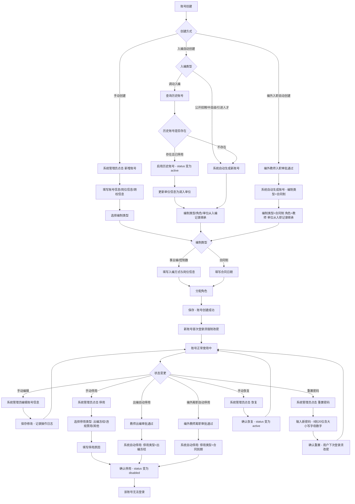
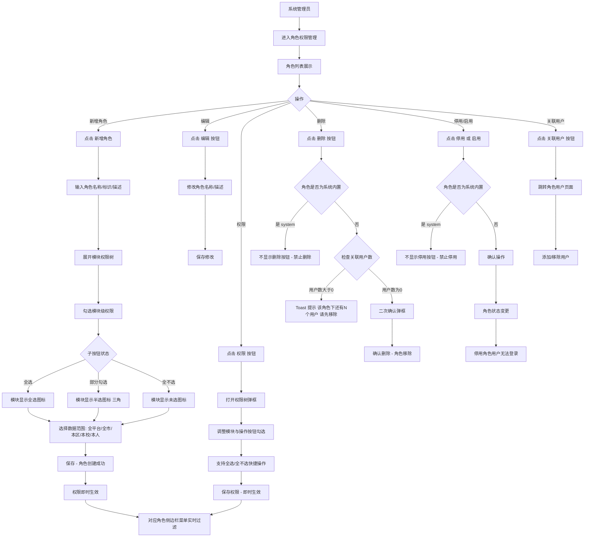
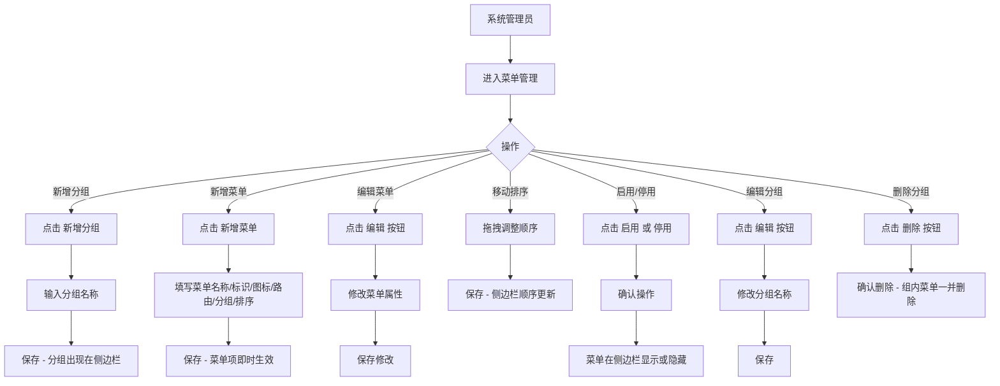
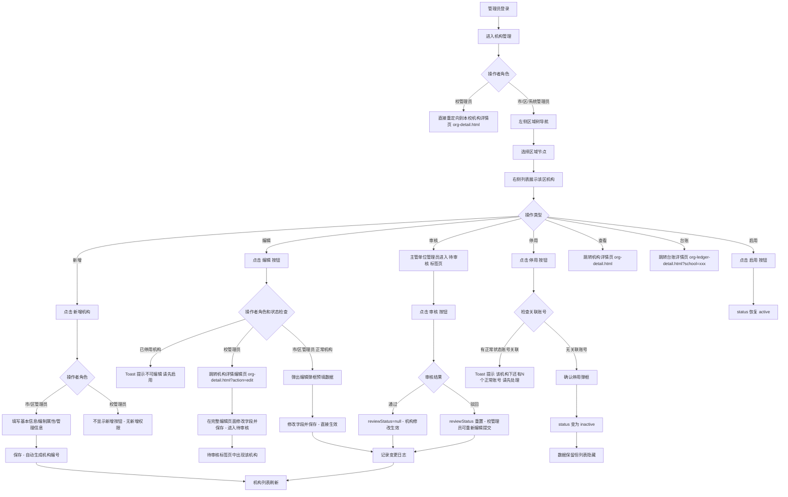
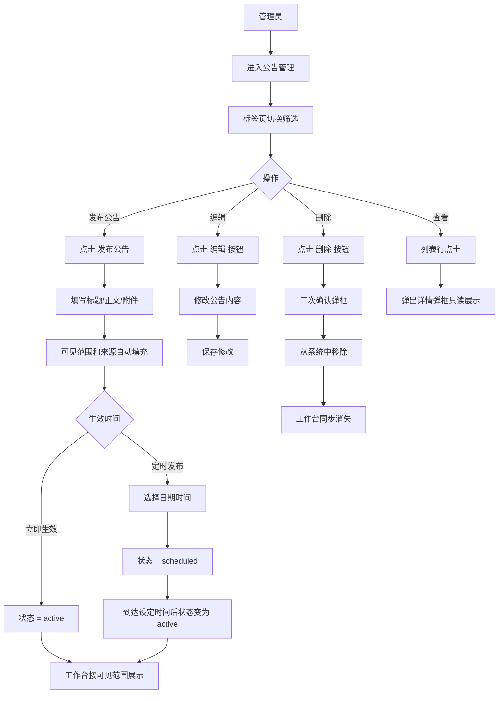
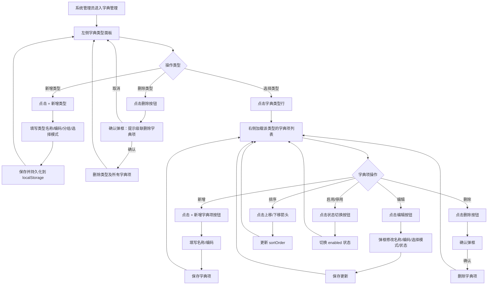

# 系统管理模块

## 产品需求文档

**账号管理 / 机构管理 / 菜单管理 / 角色权限 / 操作日志 / 公告管理 / 字典管理**

---

| 项目 | 内容 |
|------|------|
| 📅 日期 | 2026-08-12 |
| 📌 版本 | Version 1.2（正式版） |
| 📎 父文档 | PRD_总纲_柳州教育人事管理平台.md |

---

## 📑 目录

1. [模块概述](#一模块概述) — 定位、业务背景、核心价值、适用角色
2. [业务流程](#二业务流程) — 账号全生命周期、权限配置、菜单配置、机构管理、公告管理、字典管理（Mermaid 流程图）
3. [功能清单](#三功能清单) — 功能清单列表 + F06.01~F06.21 完整功能点（含前置条件/角色/业务规则/交互规则）
4. [页面字段清单](#四页面字段清单) — 各页面字段定义 + 校验规则表
5. [操作级权限矩阵](#五操作级权限矩阵)
6. [数据模型](#六数据模型) — 本模块数据存储结构
7. [页面清单](#七页面清单)
8. [异常处理](#八异常处理) — 边界情况 + 错误场景
9. [通知触发点](#九通知触发点)
10. [操作日志埋点](#十操作日志埋点)
11. [验收标准](#十一验收标准) — 功能判定 + 关键测试场景
12. [迭代记录](#十二迭代记录)

---

## 一、模块概述

### 1.1 模块定位

系统管理模块是柳州教育人事管理平台的**运维管理基础设施**，承载账号全生命周期管理、机构统一目录管理、菜单配置、角色权限分配、操作日志审计、系统公告管理、字典管理等核心运维能力。写操作权限按功能域分级：账号管理由系统/市/区管理员执行，机构管理由系统/市/区管理员执行，公告管理由全部管理员执行，角色权限、菜单管理、字典管理仅系统管理员执行。为平台提供统一的身份治理、机构数据底座和权限管控能力。

本模块在总纲排期中为 **P3 配套能力层**，与业务模块可并行建设。

### 1.2 业务背景

- **新旧平台共用账号体系**：旧平台（lzjs.eduyunx.com）存量账号保留。新增账号统一在新平台创建后同步至旧平台，管理员权限各自独立维护
- **多角色账号治理**：一个账号可拥有多个角色，账号与角色的关联关系独立管理。角色权限粒度为"模块 + 操作按钮"级
- **菜单可配置化**：侧边栏菜单支持动态分组、排序、启用/停用，管理员可在菜单管理页面对菜单项进行统一配置
- **操作全留痕**：所有关键操作（账号启停、权限变更、菜单变更、角色变更、机构变更、公告发布）均记录至操作日志，日志不可篡改，支持按模块/操作类型/操作人/时间范围多维检索
- **统一机构目录**：全市教育系统所有学校/单位的统一管理入口，作为编制台账、岗位设置等业务模块的机构数据底座。支持区域树形导航和完整字段 CRUD
- **系统公告发布**：支持富文本公告的创建、编辑、定时发布和置顶，可见范围按全平台/全市/本区/本校四级控制，工作台自动按权限展示

### 1.3 核心价值

| 价值 | 说明 |
|------|------|
| 🔐 统一身份治理 | 账号创建、编辑、启停、密码重置一站式管理，支持教师账号和行政账号两种类型 |
| 🔑 细粒度权限 | 模块级 + 操作按钮级权限控制，支持数据范围（全平台/全市/本区/本校/本人）五级隔离 |
| 📋 动态菜单 | 侧边栏菜单分组、排序、启用/停用可在线配置，无需修改代码，刷新即生效 |
| 📊 操作审计 | 全模块操作日志统一归集，支持多维检索和详情查看，日志不可篡改不可删除 |
| 🏫 统一机构目录 | 全市学校统一管理，区域树形导航，22字段完整信息，支持停用/启用和台账关联 |
| 📢 系统公告 | 富文本公告发布与管理，支持定时发布、置顶、附件、可见范围四级控制，工作台自动展示 |
| 📖 字典管理 | 平台所有枚举值的统一配置入口，支持字典类型分组管理和字典项排序、启用/停用、编码管理 |

### 1.4 适用角色

| 角色 | 标识 | 访问权限 |
|------|------|----------|
| 系统管理员 | `system` | 全部功能。可创建/编辑/启停账号、管理机构和区域目录、配置菜单、分配角色权限、查看操作日志、发布和管理公告、管理字典配置 |
| 市管理员 | `city` | 可创建区/校/教师账号；可编辑/停用/恢复全市账号；可新增/编辑/停用全市机构（审核仅限市直属）；可发布和查看全市公告 |
| 区管理员 | `district` | 可创建校管理员和教师账号；可编辑/停用/恢复本区范围内账号；可查看本区机构和公告 |
| 校管理员 | `school` | 可编辑/停用/恢复本校账号（不可创建）；可发布和查看本校公告；进入机构管理时重定向到本校机构详情页 |
| 教师 | `teacher` | 无系统管理模块访问权限 |

### 1.5 模块范围

侧边栏「系统设置」分组下的 **7 个菜单项** 全部纳入本 PRD：

| 功能域 | 核心页面 | 功能点 | 说明 |
|--------|----------|--------|------|
| 账号管理 | `account-management.html` | F06.01-F06.03 | 教师/行政账号的创建、编辑、启停、密码重置 |
| 机构管理 | `org-management.html` | F06.14-F06.17 | 统一学校目录、区域树形导航、22字段 CRUD、管理员映射、停用/启用 |
| 菜单管理 | `menu-management.html` | F06.07 | 侧边栏菜单的分组、排序、新增、编辑、启用/停用 |
| 角色权限 | `perm-management.html` | F06.04-F06.06 | 角色创建、权限树配置、数据范围设置 |
| 操作日志 | `log-management.html` | F06.08 | 全模块操作日志的检索与查看 |
| 公告管理 | `announcement-management.html` | F06.09-F06.13 | 公告发布/编辑/定时/置顶/删除、可见范围配置、附件管理 |
| 字典管理 | `dict-management.html` | F06.18-F06.21 | 字典类型分组管理、字典项增删改查、排序、启用/停用 |

---

## 二、业务流程

### 2.1 账号全生命周期



### 2.2 角色权限配置流程



### 2.3 菜单配置流程



### 2.4 机构管理流程



### 2.5 公告管理流程



### 2.6 字典管理流程



---

## 三、功能清单

> **功能点总览：** 本模块共 **17** 个功能点，覆盖账号管理（3）、角色权限（3）、菜单管理（1）、操作日志（1）、公告管理（5）、机构管理（4）六大功能域。

| 编号 | 功能名称 | 功能 ID | 优先级 | 功能域 | 适用角色 | 页面 |
|------|----------|---------|--------|--------|----------|------|
| 1 | 账号管理列表 | F06.01 | P0 | 账号管理 | 系统/市/区/校管理员 | `account-management.html` |
| 2 | 创建/编辑账号 | F06.02 | P0 | 账号管理 | 系统/市/区（创建+编辑）；校（仅编辑本校） | `account-management.html` |
| 3 | 账号启停与密码重置 | F06.03 | P0 | 账号管理 | 系统/市管理员（全市）；区（本区）；校（本校） | `account-management.html` |
| 4 | 角色列表与状态管理 | F06.04 | P0 | 角色权限 | 系统管理员 | `perm-management.html` |
| 5 | 模块权限配置 | F06.05 | P0 | 角色权限 | 系统管理员 | `perm-management.html` |
| 6 | 角色用户关联管理 | F06.06 | P1 | 角色权限 | 系统管理员 | `role-users.html` |
| 7 | 菜单配置管理 | F06.07 | P0 | 菜单管理 | 系统管理员 | `menu-management.html` |
| 8 | 操作日志查看 | F06.08 | P0 | 操作日志 | 系统管理员 | `log-management.html` |
| 9 | 公告列表管理 | F06.09 | P0 | 公告管理 | 全部管理员 | `announcement-management.html` |
| 10 | 发布/编辑公告 | F06.10 | P0 | 公告管理 | 全部管理员 | `announcement-management.html` |
| 11 | 公告可见范围与状态管理 | F06.11 | P0 | 公告管理 | 全部管理员 | `announcement-management.html` |
| 12 | 公告操作（置顶/删除） | F06.12 | P1 | 公告管理 | 全部管理员（系统可操作全部；其他仅自己发布的） | `announcement-management.html` |
| 13 | 工作台公告展示（消费端） | F06.13 | P0 | 公告管理 | 市/区/校管理员、教师 | `workbench.html` |
| 14 | 机构列表与区域导航 | F06.14 | P0 | 机构管理 | 系统/市/区管理员；校（重定向到本校详情） | `org-management.html` |
| 15 | 新增/编辑机构 | F06.15 | P0 | 机构管理 | 系统/市/区管理员 | `org-management.html` |
| 16 | 机构状态管理（停用/启用） | F06.16 | P1 | 机构管理 | 系统/市/区管理员（仅本区） | `org-management.html` |
| 17 | 机构详情与台账关联 | F06.17 | P0 | 机构管理 | 全部管理员 | `org-detail.html` |

---

### F06.01 账号管理列表 `P0`

- **页面**：`account-management.html`
- **适用角色**：系统管理员、市管理员（全市）；区管理员（本区）；校管理员（本校，不可创建）
- **前置条件**：当前用户已登录，且拥有账号管理模块权限

**核心业务规则**：

1. 列表展示所有教师账号和行政账号，默认按更新时间倒序排列
2. 列表顶部显示统计卡片：总账号数、正常、停用、未首次登录
3. 支持按角色（全部/系统管理员/市管理员/区管理员/校管理员/教师）筛选
4. 支持按账号状态（全部/正常/已停用）筛选
5. 支持按编制类型筛选（多选：事业编/控制数/合同制）
6. 支持按跨校状态筛选（全部/在岗（非跨校）/借调/支教/轮岗）
7. 支持按所属区域筛选
8. 支持按所属单位筛选（可搜索下拉）
9. 支持按姓名、身份证号、手机号模糊搜索
10. 列表字段（13 列）：序号、姓名、身份证号、手机号、编制类型、所属区域、所属角色、所属单位、跨校状态、账号状态、首次登录、更新时间、操作
11. 列表分页显示，每页 10 条
12. 角色列显示用户拥有的所有角色，多角色以顿号分隔
13. 数据范围：展示全平台所有教师账号和行政账号，按角色权限过滤可见范围

**交互规则**：

- 筛选条件变更时自动刷新列表，回到第 1 页
- 列表为空时显示"暂无数据"空状态提示
- 操作列按钮（始终显示）：**查看密码/重置密码**（未首次登录且有入编记录或为合同制教师 → 查看密码；否则 → 重置密码）+ **查看**（打开只读详情弹框）+ **个人详情**（跳转个人中心页）
- 操作列按钮（正常账号 + 有编辑权限）：**编辑** + **停用**
- 操作列按钮（已停用账号 + 有编辑权限）：**恢复**（不显示编辑按钮）

**「查看」按钮 — 账号详情弹框（只读）**：

弹出模态弹框展示账号完整信息，分 7 个区域：
1. 账号信息：姓名、身份证号、手机号、所属角色
2. 归属信息：所属单位、编制类型、入编方式（事业编/控制数）、所属区域
3. 个人档案：性别、民族、出生日期、政治面貌、学历、毕业院校
4. 岗位信息：岗位类别、岗位等级、岗位名称、任职时间、合同期限（合同制）
5. 跨校信息：跨校类型、任职学校、开始日期、结束日期（事业编/控制数/合同制显示）
6. 编制与聘用信息（补录，事业编/控制数/合同制显示）：入编时间、编制本人员名册序号、依据文号、近三年考核（事业编/控制数）；现任职务（全部）；入职时间（合同制）
7. 停用信息（仅已停用账号）：出编信息/离职信息/停用信息卡片
8. 底部状态条：账号状态、首次登录、更新时间

底部仅"关闭"按钮，全部字段只读。

**「个人详情」按钮 — 跳转个人中心**：

- 跳转到个人中心页面，以该账号身份查看完整个人信息
- 可查看该教师的完整个人信息、教育教学信息、证书信息等

---

### F06.02 创建/编辑账号 `P0`

- **页面**：`account-management.html`（新增/编辑弹框）
- **适用角色**：
  - **创建**：系统管理员、市管理员、区管理员。校管理员不可创建账号
  - **编辑**：系统管理员、市管理员、区管理员（全部账号）；校管理员（仅本校账号）
- **前置条件**：当前用户拥有对应角色的创建/编辑权限

**核心业务规则**：

**创建权限分级**：不同角色管理员创建账号时可分配的角色范围不同：
- 系统管理员 → 可创建：系统管理员、市管理员、区管理员、校管理员、教师
- 市管理员 → 可创建：区管理员、校管理员、教师
- 区管理员 → 可创建：校管理员、教师（所属单位仅限本区）
- 校管理员 → 不可创建账号

**编辑权限分级**：
- 系统/市管理员 → 可编辑全市账号
- 区管理员 → 仅可编辑本区账号
- 校管理员 → 仅可编辑本校账号

**新增账号表单（3 组 section）**：
1. **账号信息**：姓名、身份证号、手机号、所属角色（多选，可选范围受创建者角色限制）、所属单位（可搜索下拉）、编制类型、入编方式
2. **岗位信息**：岗位类别（专业技术岗位/管理岗位/工勤技能岗位）、岗位等级（级联下拉）、岗位名称、任职时间（月份）、合同开始日期（合同制）、合同结束日期（合同制）
3. **跨校信息**：跨校类型（无/借调/支教/轮岗）、任职学校（可搜索下拉）、开始日期、结束日期

**编辑账号表单（6 组 section）**：
1. 账号信息：姓名、身份证号（不可修改）、手机号、所属角色
2. 归属信息：所属单位、编制类型、入编方式、所属区域（只读）
3. 个人档案：性别、民族、出生日期、政治面貌、学历、毕业院校
4. 岗位信息：岗位类别、岗位等级、岗位名称、任职时间、合同期限（合同制只读）
5. 编制与聘用信息（补录）：入编时间、编制本人员名册序号、依据文号、近三年考核、现任职务；合同制显示入职时间、合同起始/结束日期
6. 跨校信息：跨校类型、任职学校、开始日期、结束日期

其他规则：
- 身份证号须为 18 位，系统自动校验格式
- 手机号须为 11 位数字
- 编制类型选择"合同制"时，显示合同起止日期字段；选择"事业编"或"控制数"时，显示入编方式、岗位类别/等级（必填）
- 跨校类型选择非"无"时，须填写任职学校、开始日期、结束日期
- 编辑账号时，身份证号不可修改；合同制教师合同期限只读（变更需走续聘审批）
- 保存时校验所有必填字段，未通过校验则阻止提交并高亮缺失字段
- 新增账号状态默认为"正常"（active），系统随机生成强密码（8 位以上，含大小写字母+数字），创建成功后弹窗展示并支持一键复制

**交互规则**：

- 系统/市/区管理员可见"+ 新增账号"按钮，校管理员不可见
- 点击"新增账号"按钮弹出新增弹框，标题为"新增账号"，角色复选框根据创建者权限自动过滤可选项
- 点击"编辑"按钮弹出编辑弹框，预填已有数据，标题为"编辑账号"
- 点击列表行可打开"查看账号"只读详情弹框
- 角色选择为教师或校管理员时，显示编制类型、岗位信息、跨校信息 section
- 编制类型切换时动态显示/隐藏入编方式、合同日期、岗位必填标记
- 岗位类别改变时，岗位等级选项级联更新
- 创建成功后弹窗展示随机密码，支持一键复制，提示"教师首次登录需改密"
- 编辑保存成功后关闭弹框，刷新列表，显示 Toast"账号已更新"

---

### F06.03 账号启停与密码重置 `P0`

- **页面**：`account-management.html`（确认弹框 / 密码重置弹框）
- **适用角色**：系统管理员、市管理员（全市账号）；区管理员（仅本区账号）；校管理员（仅本校账号）
- **前置条件**：当前用户拥有对应角色的操作权限

**核心业务规则**：

1. **账号停用**：
   - ① 点击"停用"按钮弹出停用确认弹框
   - ② 选择停用类型（下拉选择，必选）：出编冻结 / 违规禁用 / 其他
   - ③ 填写停用原因（文本输入，必填）
   - ④ 确认后账号状态变更为"已停用"（disabled），记录停用类型、原因、时间、操作人，该账号无法登录
2. **账号恢复**：
   - ① 点击"恢复"按钮弹出确认弹框
   - ② 确认后账号状态变更为"正常"（active），清除停用信息，恢复登录权限
3. **密码重置**：
   - ① 点击"重置密码"按钮弹出密码重置弹框
   - ② 输入新密码并确认，密码规则：8-20 位，须含大小写字母和数字
   - ③ 实时显示密码强度（弱/中/强）和规则逐条校验（长度/大写字母/小写字母/数字/特殊字符）
   - ④ 重置成功后，用户下次登录须强制修改密码
4. 以上操作均记录操作日志
5. 账号详情弹框中根据停用类型显示不同的信息卡片：
   - 出编冻结（exit）→ 显示"🔒 出编信息"卡片：出编形式（出编冻结）、出编日期、操作人、出编原因
   - 合同到期（contract_end）→ 显示"📋 离职信息"卡片：离职类型（合同到期）、离职日期、操作人、离职原因
   - 违规禁用/手动停用/其他 → 显示"⏸ 停用信息"卡片：停用方式（类型标签）、停用时间、操作人、停用原因

**交互规则**：

- 停用/恢复操作使用二次确认弹框，防止误操作
- 停用弹框中停用类型为下拉选择，停用原因为文本输入
- 密码重置弹框包含新密码和确认密码两个字段，前端校验两次输入一致
- 操作成功后 Toast 提示并刷新列表

---

### F06.04 角色列表与状态管理 `P0`

- **页面**：`perm-management.html`
- **适用角色**：系统管理员
- **前置条件**：当前用户为系统管理员角色

**核心业务规则**：

1. 列表展示所有角色：系统管理员、市管理员、区管理员、校管理员、教师，以及自定义角色
2. 列表字段：序号、角色名称、描述、用户数、状态（正常/已停用）、操作
3. 系统内置角色（system）不可停用、不可删除
4. 角色状态管理：
   - ① 停用角色：停用后该角色下所有用户无法使用该角色登录
   - ② 启用角色：恢复角色使用权限
   - ③ 删除角色：仅当该角色下无关联用户时可删除
5. 自定义角色可创建、编辑、停用、删除
6. 每个角色可配置数据范围：全平台 / 全市 / 本区 / 本校 / 本人

**交互规则**：

- "权限"按钮 → 打开权限配置弹框（角色名称只读展示 + 权限树 + 数据范围），确保管理员在操作前确认当前操作的角色身份
- "关联用户"按钮 → 跳转到角色用户管理页面
- "编辑"按钮 → 打开轻量弹框，仅含角色名称和描述两个字段，快速修改角色基本信息
- "新增角色"按钮 → 打开完整弹框，含角色名称/标识/描述 + 权限树 + 数据范围
- "停用"/"启用"/"删除"使用二次确认弹框
- 删除前校验用户数，大于 0 则阻止并提示"请先移除用户"

---

### F06.05 模块权限配置 `P0`

- **页面**：`perm-management.html`（权限编辑弹框）
- **适用角色**：系统管理员
- **前置条件**：当前用户为系统管理员角色，已打开角色编辑弹框

**核心业务规则**：

1. 权限树分为两级：**模块级**（菜单入口）+ **操作按钮级**（具体操作权限）
2. 模块权限来源：系统预置的模块清单和操作按钮清单，为权限树的唯一权威数据源
3. 模块级勾选 = 该模块所有操作按钮自动勾选；取消模块勾选 = 所有子按钮自动取消
4. 部分勾选子按钮时，模块级显示半选状态（▣）
5. 权限树按模块分组显示（通用 / 编制管理 / 岗位管理 / 聘用管理 / 编外教师管理 / 人事管理 / 系统设置）。通用组包含工作台、编制岗位台账
6. 支持"全选"和"全不选"快捷操作
7. 权限变更即时生效，无需刷新页面
8. 数据范围选择：全平台 / 全市 / 本区 / 本校 / 本人，控制角色可查看的数据范围

**交互规则**：

- 点击分组箭头（▶/▼）展开/折叠模块下的操作按钮列表
- 点击 ☑/☐ 勾选/取消模块或操作按钮
- 半选状态显示 ▣ 图标
- 点击"全选"→ 所有模块+按钮全部勾选；点击"全不选"→ 全部取消
- 保存权限时，已全选的模块仅保留模块级权限（自动去重子按钮）

---

### F06.06 角色用户关联管理 `P1`

- **页面**：`role-users.html`
- **适用角色**：系统管理员
- **前置条件**：从角色权限页点击"关联用户"跳转，页面自动识别当前操作的角色

**核心业务规则**：

1. 页面顶部显示当前角色名称（如"市管理员"）
2. 列表展示所有拥有该角色的用户，字段（5 列）：序号、姓名、所属单位、所属角色、操作
3. 支持"添加用户"：从全部用户列表中勾选并添加到当前角色
4. 支持"移除用户"：从当前角色中移除用户（不删除账号，仅解除角色关联）
5. 用户可同时拥有多个角色
6. 移除和添加操作即时生效

**交互规则**：

- 面包屑导航：首页 / 系统设置 / 角色权限 / 关联用户
- 当前角色下无用户时显示空状态
- "添加用户"弹框中以复选框列表形式展示所有用户
- "移除"使用二次确认弹框

---

### F06.07 菜单配置管理 `P0`

- **页面**：`menu-management.html`
- **适用角色**：系统管理员
- **前置条件**：当前用户为系统管理员角色

**核心业务规则**：

1. **菜单分组管理**：
   - ① 支持新增分组（输入分组名称）
   - ② 支持编辑分组名称
   - ③ 支持删除分组（删除时组内所有菜单一并删除）
   - ④ 分组按配置的显示顺序（排序号从小到大）在侧边栏中自上而下排列
2. **菜单项管理**：
   - ① 新增菜单：填写菜单名称、菜单标识（英文 ID）、图标类型、路由地址、所属分组、排序号
   - ② 编辑菜单：修改以上字段
   - ③ 启用/停用：停用后菜单在所有角色侧边栏中隐藏
   - ④ 排序：通过排序号调整同一分组内菜单的显示顺序
3. 菜单配置数据持久化存储，所有页面共享同一份菜单配置
4. 配置变更后即时生效，各页面刷新侧边栏时自动拉取最新菜单配置并渲染
5. 系统预置一套默认菜单配置（含分组结构和菜单项），首次部署或配置被清空时自动恢复默认值
6. 新增菜单须填写路由地址，点击菜单时跳转到对应页面

**交互规则**：

- 分组以卡片形式展示，每个卡片内显示该分组下的菜单项列表
- 菜单项以表格行形式展示：菜单名称、标识、图标、路由、排序号、状态、操作
- 新增/编辑菜单和分组均为弹框操作
- 启用/停用使用二次确认弹框
- 删除分组弹框明确提示"组内所有菜单将一并删除"

---

### F06.08 操作日志查看 `P0`

- **页面**：`log-management.html`
- **适用角色**：系统管理员
- **前置条件**：当前用户为系统管理员角色

**核心业务规则**：

1. 操作日志统一归集全平台所有模块的操作记录，集中存储和管理
2. 各业务模块在关键操作节点自动写入日志，无需手动干预
3. 列表字段（10 列）：操作时间、操作人、所属单位、功能模块、操作类型、日志类型、操作对象、操作结果、操作 IP、详情
4. 日志支持多维筛选：
   - ① 按模块筛选（全部 / 机构管理 / 账号管理 / 角色权限 / 菜单管理 / 操作日志 / 系统设置 / 编制使用申请 / 教师入编 / 教师出编 / 岗位晋升 / 岗位设置 / 招聘 / 聘用手续 / 退休呈报 / 工资核定 / 师德师风举报 / 荣誉申请），支持多选
   - ② 按操作类型筛选（全部 / 登录 / 登出 / 新增 / 修改 / 删除 / 提交 / 审核通过 / 审核驳回 / 撤回 / 停用 / 启用 / 重置密码 / 导出）
   - ③ 按时间范围筛选（起始日期 ~ 结束日期）
   - ④ 按操作人搜索（姓名模糊匹配）
5. 列表分页显示，每页 10 条
6. 点击"查看详情"弹出详情弹框，展示该条日志的完整信息：操作人（姓名 + 角色）、所属单位 + 所属区域、操作时间 + 操作 IP、功能模块（标签形式）、操作类型（标签形式）、日志类型（操作日志 / 安全日志 / 审计日志）、操作对象（名称 + 类型）、操作结果（成功 ✅ / 失败 ❌，失败时附带失败原因）、操作详情描述
7. 日志数据只读，不可编辑、不可删除
8. 每条日志记录包含以下完整字段：日志 ID、操作时间、操作人（姓名+账号 ID+角色）、所属单位、所属区域、操作 IP、功能模块、操作类型、日志类型（操作日志/安全日志/审计日志）、操作对象（名称+类型）、操作结果（成功/失败+失败原因）、操作详情描述、变更前后内容（可选）

**交互规则**：

- 筛选条件变更时自动刷新列表，回到第 1 页
- 日志为空时显示"暂无操作记录"空状态
- 点击某条日志行展开详情面板，再次点击收起
- 支持日志导出（后续版本实现）

---

### F06.09 公告列表管理 `P0`

- **页面**：`announcement-management.html`
- **适用角色**：全部管理员角色（系统/市/区/校管理员均可发布公告，各角色发布的公告可见范围不同）
- **前置条件**：当前用户已登录，且拥有公告管理模块权限

**核心业务规则**：

1. 列表展示所有公告，默认按发布时间倒序排列
2. 状态标签页切换：全部 / 生效中 / 定时待发 / 已过期
3. 列表字段（6 列）：可见范围、标题、发布来源、状态、发布时间、操作
4. 可见范围标签：全平台（蓝色）/ 全市（蓝色）/ 本区（黄色）/ 本校（绿色）
5. 状态标签：生效中（绿色）、定时待发（黄色）、已过期（灰色）
6. 列表分页显示，每页 10 条
7. "定时待发"标签页全部管理员角色可见
8. 支持按可见范围筛选（全部 / 全平台 / 全市 / 本区 / 本校）
9. 数据范围：展示全平台公告，按发布者角色和可见范围过滤

**交互规则**：

- 标签页切换筛选 + 统计数显示
- 列表为空时显示"暂无公告"空状态
- 全部管理员角色均可见"发布公告"按钮和"定时待发"标签页
- 操作列按钮根据发布者判断：系统管理员可编辑/删除全部公告；其他管理员仅可编辑/删除自己发布的公告；已过期公告不显示编辑按钮仅可删除
- 教师角色仅可查看可见范围内的公告，无发布和操作权限

---

### F06.10 发布/编辑公告 `P0`

- **页面**：`announcement-management.html`（发布/编辑弹框）
- **适用角色**：全部管理员角色（系统/市/区/校管理员）
- **前置条件**：当前用户为管理员角色

**核心业务规则**：

1. **公告表单字段**：
   - ① 标题（text，限 100 字，必填）
   - ② 正文（富文本编辑器，必填）：支持段落/标题、加粗/斜体/下划线、有序/无序列表、链接、字体颜色/背景色
   - ③ 附件（file，可选）：支持 PDF/Word/Excel/图片（JPG/PNG/GIF/BMP）/压缩包（ZIP/RAR/7Z），单文件 ≤ 20MB，最多 5 个
   - ④ 可见范围（只读，自动填充）：根据发布者角色自动设置为 全平台/全市/本区/本校
   - ⑤ 发布来源（只读，自动填充）：发布者所属单位名称
   - ⑥ 生效时间：立即生效 / 定时发布。定时发布需选择日期+时间
   - ⑦ 置顶：是 / 否
2. 截止时间默认为发布时间 + 30 天，到期自动标记为"已过期"
3. 定时发布：到达设定时间后状态自动从"定时待发"变为"生效中"
4. 编辑公告时预填所有已有数据，包括富文本内容和附件列表
5. 编辑公告时，已上传的附件可单独删除

**交互规则**：

- 点击"发布公告"按钮弹出新增弹框
- 点击列表行跳转到公告详情独立页面（`announcement-detail.html`），仅查看公告内容
- 编辑和删除操作仅在列表页操作列进行，详情页不提供操作按钮
- 富文本编辑器提供工具栏，支持常用排版操作
- 选择"定时发布"时展开日期时间选择器，提示"公告将于 X 年 X 月 X 日 XX:XX 自动发布"
- 发布成功后 Toast 提示并刷新列表

---

### F06.11 公告可见范围与状态管理 `P0`

- **页面**：`announcement-management.html`
- **适用角色**：全部管理员角色
- **前置条件**：当前用户为管理员角色

**核心业务规则**：

1. **可见范围规则**（发布时根据发布者角色自动确定，不可手动修改）：
   - 系统管理员发布 → 全平台（所有人可见）
   - 市管理员发布 → 全市（全市所有用户可见）
   - 区管理员发布 → 本区（本区所有用户可见）
   - 校管理员发布 → 本校（本校所有用户可见）
2. **公告状态流转**：
   - 立即发布 → 状态为"生效中"（active）
   - 定时发布 → 状态为"定时待发"（scheduled），到达发布时间后自动变为"生效中"
   - 发布时间 + 30 天后 → 状态自动变为"已过期"（expired）
3. 定时待发公告在工作台所有角色不可见。列表页中，发布人和系统管理员可见定时待发公告，其他管理员不可见
4. 已过期公告不在工作台展示，在列表页可查看但不可编辑（仅可删除）

**交互规则**：

- 可见范围和发布来源在表单中为只读灰色输入框，明确告知发布者不可修改
- 定时待发公告在列表中显示黄色"定时待发"标签
- 列表页和详情弹框均显示公告的完整状态信息

---

### F06.12 公告操作（置顶/删除） `P1`

- **页面**：`announcement-management.html`
- **适用角色**：全部管理员角色。系统管理员可操作全部公告；其他管理员仅可操作自己发布的公告
- **前置条件**：当前用户为管理员角色

**核心业务规则**：

1. **置顶**：发布或编辑时可设置"置顶 = 是"。工作台中置顶公告排在最前。同一公告取消置顶需编辑并设为"否"
2. **删除公告**：
   - ① 已过期公告仅显示"删除"按钮，不显示"编辑"按钮
   - ② 点击"删除"弹出二次确认弹框
   - ③ 确认后从系统中移除，工作台同步不再展示
   - ④ 删除操作不可恢复
3. **操作权限**：系统管理员可编辑/删除全部公告；其他管理员仅可编辑/删除自己发布的公告
4. 删除操作记录操作日志

**交互规则**：

- 删除使用二次确认弹框，提示"删除后不可恢复"
- 编辑和删除按钮仅在列表页操作列展示，公告详情页为纯查看模式

---

### F06.13 工作台公告展示（消费端） `P0`

- **页面**：`workbench.html`
- **适用角色**：市/区/校管理员、教师。系统管理员无工作台
- **前置条件**：公告管理中存在状态为"生效中"的公告，且可见范围覆盖当前用户
- **跨模块说明**：本功能点属于公告管理的**消费端**，落地在系统基础模块的 `workbench.html`。公告的**生产端**（发布/编辑/删除）见本模块 F06.10-F06.12。工作台展示详细规则另见系统基础模块 PRD F02.10

**核心业务规则**：

1. 数据来源：公告管理（本模块 F06.10）发布的公告数据
2. 可见范围过滤：按公告可见范围 + 用户所属组织匹配
3. 定时待发公告：工作台不可见，仅在公告管理列表页可见
4. 已过期公告：不在工作台展示
5. 置顶优先排列，同组内按发布时间倒序
6. 最多展示 5 条，超出部分点击"查看全部 →"跳转公告管理列表页
7. 公告和消息通知为两条独立通道，发布公告不在消息铃铛中产生通知

**交互规则**：

- 单行均匀布局：蓝色圆点（3 天内发布）+ 标题（自适应宽度，超出省略号）+ 可见范围标签 + 新/已过期标签 + 发布时间 + 来源
- 置顶公告标题旁显示"置顶"标识
- 3 天内发布的公告标题旁显示绿色"新"标签
- 点击公告行 → 跳转公告详情页
- 暂无公告时显示"暂无公告"空状态

---

### F06.14 机构列表与区域导航 `P0`

- **页面**：`org-management.html`
- **适用角色**：系统管理员、市管理员（查看全市）、区管理员（仅查看本区）、校管理员（重定向到本校台账）
- **前置条件**：当前用户已登录且拥有机构管理模块权限

**核心业务规则**：

1. 左侧区域目录树：展示柳州市 + 11 个区县节点，每节点显示机构数量。点击节点筛选右侧列表
2. 右侧列表（10 列）：序号、单位编号、统一社会信用代码、单位名称、所属区域、组织类型、单位管理员、更新时间、状态、操作
3. 标签页筛选：全部 / 待审核 / 正常 / 已停用（含统计数）。待审核标签页用于校管理员提交机构修改后的主管单位审核流程
4. 支持按单位名称或编号模糊搜索
5. 支持按组织类型筛选（学校/行政管理部门/局属二层机构）
6. 列表分页显示，每页 10 条
7. 待审核状态：校管理员提交机构修改后进入待审核，列表"待审核"标签页中出现该机构。主管单位管理员可进行"审核"操作（通过或驳回）：
   - 系统管理员 → 可审核全平台所有待审核机构
   - 市管理员 → 可审核"市直属"的待审核机构，可查看全市数据
   - 区管理员 → 仅可审核本区的待审核机构
8. 区管理员仅可查看本区机构，点击其他区节点时显示"无权查看"提示
9. 校管理员自动重定向到本校机构详情页（`org-detail.html?orgId=xxx`）
10. 数据范围：展示机构目录中全部机构，按角色管辖范围过滤

**交互规则**：

- 区域树节点点击后高亮选中，列表实时过滤
- 标签页切换时列表和统计数同步更新
- 列表为空时显示"暂无匹配的机构数据"空状态
- 页面副标题动态显示当前筛选项的机构数量

---

### F06.15 新增/编辑机构 `P0`

- **页面**：`org-management.html`（新增/编辑弹框）
- **适用角色**：系统管理员、市管理员、区管理员（仅本区）
- **前置条件**：当前用户为系统/市/区管理员角色。已停用机构不允许编辑

**核心业务规则**：

1. **新增/编辑弹框包含 3 个信息分组**：
   - ① **基本信息**：单位名称、单位简称、所属区域、单位级别（副厅级/正处级/副处级/正科级/副科级/其他未定级）
   - ② **编制属性**：组织类型（学校/行政管理部门/局属二层机构）、学校类型（小学/初中/高中/完中/九年一贯制/十二年一贯制/中职/幼儿园/特殊教育/专门学校）、岗位设置分类（自治区示范高中/自治区特色高中/普通高中/初中/小学/幼儿园/普通事业单位）、是否小高地学校（下拉单选：是/否）、单位性质（事业单位/参公事业单位/机关单位/其他）、单位类型（公益一类/公益二类/行政部门）、经费类型（全额拨款/差额拨款/自收自支）、统一社会信用代码（18位）
   - ③ **管理信息**：单位管理员（从管理员列表中选择）、单位地址、联系电话、邮编
2. 组织类型联动规则：
   - 选"学校"时：显示学校类型、岗位设置分类、是否小高地学校、单位类型
   - 选"局属二层机构"时：隐藏学校类型，显示岗位设置分类、是否小高地学校、单位类型
   - 选"行政管理部门"时：隐藏学校类型、岗位设置分类、是否小高地学校、单位类型，经费类型自动锁定"全额拨款"
3. 单位类型选"公益一类"时经费锁定"全额拨款"，"公益二类"锁定"差额拨款"
4. 编辑时所属区域（区管理员锁定）、身份证号不可修改
5. 区管理员不可操作其他区的机构（跨区操作弹 Toast 警告）
6. 新增时自动生成机构编号（gxlzh-{区域编码}-{序号}）
7. 编辑保存时自动记录变更日志，校管理员提交后进入待审核状态

**交互规则**：

- 市/区管理员新增/编辑均为模态弹框
- 校管理员点击"编辑"→ 跳转到 `org-detail.html?orgId=xxx&action=edit` 完整编辑页面，而非弹框
- 组织类型切换时动态显隐学校类型字段
- 单位类型切换时自动联动经费类型
- 编辑弹框（或编辑页面）预填所有已有数据
- 市/区管理员保存后直接生效；校管理员保存后进入待审核
- 保存成功后关闭弹框/返回查看模式，刷新列表和树，Toast 提示

---

### F06.16 机构状态管理（停用/启用） `P1`

- **页面**：`org-management.html`（确认弹框）
- **适用角色**：系统管理员、市管理员、区管理员（仅本区）
- **前置条件**：当前用户为管理员角色，且拥有管辖权限

**核心业务规则**：

1. **停用机构**：
   - ① 点击"停用"弹出二次确认弹框："确定要停用机构 XXX 吗？停用后该机构将从活动列表中隐藏，但数据保留"
   - ② **前置校验**：检查该机构下是否有关联的正常状态账号（teacher_accounts + admin_accounts），若有则 Toast 提示"该机构下还有 N 个正常账号，请先处理后再停用"并阻止操作
   - ③ 确认后状态设为已停用，记录停用时间和操作人
   - ④ 已停用机构不允许编辑，仅显示"查看""台账""启用"按钮
2. **启用机构**：
   - ① 点击"启用"弹出二次确认弹框
   - ② 确认后状态恢复为正常
3. 区管理员不可操作其他区的机构
4. 停用/启用操作记录操作日志和机构变更日志

**交互规则**：

- 正常机构操作列：查看 / 台账 / 编辑 / 停用
- 已停用机构操作列：查看 / 台账 / 启用（不显示编辑）
- 停用和启用均使用二次确认弹框，防止误操作

---

### F06.17 机构详情与台账关联 `P0`

- **页面**：`org-detail.html`（独立的机构详情页，与编制岗位台账的 `org-ledger-detail.html` 分离）
- **适用角色**：全部管理员角色
- **前置条件**：从机构列表点击"查看"，或校管理员进入机构管理时自动重定向

**核心业务规则**：

1. 机构详情页展示机构的完整信息（查看/编辑两种模式，通过 `?action=edit` 切换）
2. **查看模式**（默认）：只读展示机构全部字段（基本信息 + 编制属性 + 管理信息）
3. **编辑模式**（`?action=edit`）：允许修改机构信息，与机构管理弹框字段一致
4. 机构详情与机构管理共享同一份机构目录数据
5. 机构变更历史按时间倒序展示，每次编辑保存时自动记录变更内容和操作人
6. 列表"台账"按钮跳转编制岗位台账详情页（`org-ledger-detail.html?school=xxx&mode=view`），为独立页面
7. 列表"查看"按钮跳转本页查看模式（只读）
8. 校管理员"编辑"按钮跳转本页编辑模式（`?action=edit`）

**交互规则**：

- 页面顶部展示机构名称作为标题
- 变更日志区域在页面右侧边栏，左侧为主体信息区，右侧按时间线展示更改记录
- 编辑模式保存后自动返回查看模式并刷新数据

### F06.18 字典类型管理 `P1`

- **前置条件**：用户角色为 `system`
- **功能描述**：系统管理员在字典管理页面左侧面板管理字典类型（分组），支持按分组查看、搜索、新增、编辑和删除类型
- **业务规则**：
  1. 字典类型按 7 个分组组织：机构与编制、入编与出编、岗位设置、岗位晋升、退休呈报、师德师风、系统配置
  2. 每个字典类型包含：编码（唯一标识）、名称、分组、选择模式（单选/多选/树形）
  3. 删除类型时，该类型下的所有字典项一并删除
  4. 字典类型编码唯一，不可重复
  5. 编辑字典类型时，编码不可修改（input 置灰）
- **交互规则**：
  1. 左侧面板按分组折叠展示字典类型，点击分组标题展开/收起
  2. 顶部搜索框支持按名称模糊搜索类型
  3. 点击类型行选中，右侧加载该类型的字典项列表
  4. 当前选中类型高亮显示
  5. 删除类型需确认弹框，显示类型名称及字典项数量
  6. 编辑类型：鼠标悬停时显示编辑按钮（✎），点击弹出编辑弹框（编码不可修改）
  7. 面板底部显示"新增类型"按钮

### F06.19 字典项列表查看 `P1`

- **前置条件**：用户角色为 `system`，已选中一个字典类型
- **功能描述**：右侧表格展示所选字典类型下的所有字典项，支持排序、搜索和状态筛选
- **业务规则**：
  1. 字典项字段：序号、名称、编码、选择模式、状态（启用/停用）、更新时间、操作
  2. 停用的字典项在业务模块中不可选择，但保留数据
  3. 字典项按 sortOrder 升序排列
- **交互规则**：
  1. 列表顶部显示类型名称、选中类型信息
  2. 未选中类型时，右侧显示"请选择字典类型"空状态
  3. 表格按序号→名称→编码→选择模式→状态→更新时间→操作排列

### F06.20 新增/编辑/删除字典项 `P1`

- **前置条件**：用户角色为 `system`，已选中一个字典类型
- **功能描述**：对字典项进行增删改操作
- **业务规则**：
  1. 新增字典项：填写名称、编码，选择模式继承自类型，默认启用
  2. 编辑字典项：可修改名称、编码、选择模式、启用/停用状态
  3. 删除字典项需确认弹框，提示"此操作不可恢复"
  4. 编码在同一个字典类型内唯一
- **交互规则**：
  1. 点击"新增字典项"按钮弹出新增弹框
  2. 点击字典项行的编辑按钮（✎）弹出编辑弹框
  3. 点击删除按钮（✕）弹出确认弹框
  4. 所有操作结果以 Toast 提示

### F06.21 字典项排序与状态切换 `P1`

- **前置条件**：用户角色为 `system`，已选中一个字典类型
- **功能描述**：调整字典项的显示顺序和启用/停用状态
- **业务规则**：
  1. 上移：将当前项与上一项交换 sortOrder
  2. 下移：将当前项与下一项交换 sortOrder
  3. 第一项不可上移，最后一项不可下移
  4. 停用后该字典项在业务模块下拉框中不可见
- **交互规则**：
  1. 操作列包含上移（↑）、下移（↓）按钮，不可用时置灰
  2. 操作列包含启用/停用按钮（⏸ 停用 / ▶ 启用），点击弹出二次确认弹框
  3. 排序操作实时更新表格行顺序
  4. 停用项显示灰色"停用"标签，启用项显示绿色"启用"标签

---

## 四、页面字段清单

### 4.1 账号管理 — 列表页字段

| # | 字段 Label | 字段 Key | 类型 | 说明 |
|---|-----------|----------|------|------|
| 1 | 姓名 | `name` | text | 用户真实姓名 |
| 2 | 身份证号 | `idCard` | text | 18 位 |
| 3 | 手机号 | `phone` | text | 11 位手机号 |
| 4 | 编制类型 | `staffingType` | enum | 事业编 / 控制数 / 合同制 |
| 5 | 所属区域 | `district` | text | 从机构目录中关联得到的所属区域 |
| 6 | 所属角色 | `roles` | array | 用户拥有的角色列表，多角色以顿号分隔显示 |
| 7 | 所属单位 | `school` | text | 用户所属学校或单位名称 |
| 8 | 跨校状态 | `crossSchoolType` | enum | 在岗（非跨校）/ 借调 / 支教 / 轮岗 |
| 9 | 账号状态 | `status` | enum | 正常（active）/ 已停用（disabled） |
| 10 | 首次登录 | `firstLogin` | bool | 是否已完成首次登录（false 表示未登录过） |
| 11 | 更新时间 | `updatedAt` | datetime | 最后操作时间 |
| 12 | 操作 | — | actions | 查看密码/重置密码、查看、个人详情；正常账号：编辑/停用；已停用账号：恢复 |

### 4.2 账号管理 — 新增表单字段

| # | 字段分组 | 字段 Label | 字段 Key | 类型 | 必填 | 校验规则 |
|---|---------|-----------|----------|------|------|----------|
| 1 | 账号信息 | 姓名 | `name` | text | 是 | — |
| 2 | 账号信息 | 身份证号 | `idCard` | text | 是 | 18 位，编辑时不可修改 |
| 3 | 账号信息 | 手机号 | `phone` | text | 是 | 11 位数字 |
| 4 | 账号信息 | 所属角色 | `roles` | checkbox | 是 | 市管理员/区管理员/校管理员/教师，至少选一个 |
| 5 | 账号信息 | 所属单位 | `school` | searchable-select | 是 | 可搜索下拉，从机构目录中选择 |
| 6 | 账号信息 | 编制类型 | `staffingType` | select | 条件 | 事业编/控制数/合同制；角色含教师或校管理员时显示 |
| 7 | 账号信息 | 入编方式 | `entryMethod` | select | 条件 | 统一公开招聘/单位自主实施招聘/中高级人才招聘/引进高层次人才/调动/其他；事业编/控制数时必填 |
| 8 | 岗位信息 | 岗位类别 | `categoryName` | select | 条件 | 专业技术岗位/管理岗位/工勤技能岗位；事业编/控制数时必填 |
| 9 | 岗位信息 | 岗位等级 | `postLevel` | select | 条件 | 随岗位类别级联变化；事业编/控制数时必填 |
| 10 | 岗位信息 | 岗位名称 | `assignPosition` | text | 条件 | 如"语文教师"；角色含教师或校管理员时必填 |
| 11 | 岗位信息 | 任职时间 | `appointTime` | month | 条件 | 月份选择器；角色含教师或校管理员时必填 |
| 12 | 岗位信息 | 合同开始日期 | `contractStart` | date | 条件 | 合同制时必填，保存后只读 |
| 13 | 岗位信息 | 合同结束日期 | `contractEnd` | date | 条件 | 合同制时必填，须晚于开始日期 |
| 14 | 跨校信息 | 跨校类型 | `crossSchoolType` | select | 否 | 无（在岗）/借调/支教/轮岗 |
| 15 | 跨校信息 | 任职学校 | `crossSchool` | searchable-select | 条件 | 跨校类型非"无"时必填 |
| 16 | 跨校信息 | 开始日期 | `crossStartDate` | date | 条件 | 跨校类型非"无"时必填 |
| 17 | 跨校信息 | 结束日期 | `crossEndDate` | date | 条件 | 跨校类型非"无"时必填 |

> 注：编辑表单另含 ③ 个人档案（性别/民族/出生日期/政治面貌/学历/毕业院校）和 ⑤ 编制与聘用信息补录（入编时间/编制本名册序号/依据文号/近三年考核/现任职务等），详见功能点规则。

### 4.3 角色权限 — 角色表单字段

| # | 字段 Label | 字段 Key | 类型 | 必填 | 说明 |
|---|-----------|----------|------|------|------|
| 1 | 角色名称 | `label` | text | 是 | 如"市管理员" |
| 2 | 角色标识 | `roleId` | text | 是 | 英文标识，如"city"，新增时自动生成，编辑时不可修改 |
| 3 | 描述 | `description` | text | 否 | 角色职责描述 |
| 4 | 模块权限 | `permissions` | tree | 是 | 权限树：模块级 + 操作按钮级 |
| 5 | 数据范围 | `dataScope` | select | 是 | 全平台 / 全市 / 本区 / 本校 / 本人 |
| 6 | 状态 | `status` | enum | — | 正常（active）/ 已停用（inactive） |

### 4.4 菜单管理 — 菜单项字段

| # | 字段 Label | 字段 Key | 类型 | 必填 | 说明 |
|---|-----------|----------|------|------|------|
| 1 | 菜单名称 | `label` | text | 是 | 侧边栏显示的文字 |
| 2 | 菜单标识 | `id` | text | 是 | 英文 ID，如"workbench"，用于路由匹配和权限控制 |
| 3 | 图标类型 | `icon` | select | 是 | 从预设 SVG 图标库中选择 |
| 4 | 路由地址 | `route` | text | 否 | 如"workbench.html"，空值表示仅作分组展示 |
| 5 | 所属分组 | `group` | select | 是 | 从已有分组中选择 |
| 6 | 排序号 | `order` | number | 是 | 同分组内按此值升序排列 |
| 7 | 状态 | `status` | enum | — | 正常（active）/ 已停用（inactive） |

### 4.5 公告管理 — 列表页字段

| # | 字段 Label | 字段 Key | 类型 | 说明 |
|---|-----------|----------|------|------|
| 1 | 可见范围 | `scope` | enum | 全平台（system）/ 全市（city）/ 本区（district）/ 本校（school），自动根据发布者角色确定 |
| 2 | 标题 | `title` | text | 限 100 字 |
| 3 | 发布来源 | `source` | text | 发布者所属单位名称 |
| 4 | 状态 | `status` | enum | 生效中（active）/ 定时待发（scheduled）/ 已过期（expired） |
| 5 | 发布时间 | `publishTime` | datetime | 立即发布时为创建时间，定时发布时为设定的时间 |
| 6 | 操作 | — | actions | 公告发布者：查看 / 编辑 / 删除；非发布者：仅查看 |

### 4.6 公告管理 — 发布/编辑表单字段

| # | 字段 Label | 字段 Key | 类型 | 必填 | 说明 |
|---|-----------|----------|------|------|------|
| 1 | 标题 | `title` | text | 是 | 限 100 字 |
| 2 | 正文 | `content` | richtext | 是 | 富文本编辑器，支持加粗/斜体/下划线/列表/链接/字体颜色/背景色 |
| 3 | 附件 | `attachments` | file[] | 否 | PDF/Word/Excel/JPG/PNG/GIF/BMP/ZIP/RAR/7Z，单文件 ≤ 20MB，最多 5 个 |
| 4 | 可见范围 | `scope` | text | 只读 | 根据发布者角色自动填充，不可修改 |
| 5 | 发布来源 | `source` | text | 只读 | 发布者所属单位名称，自动填充 |
| 6 | 生效时间 | `publishType` | select | 是 | 立即生效 / 定时发布。选"定时发布"时需补充日期+时间 |
| 7 | 置顶 | `isPinned` | select | 是 | 是 / 否 |

### 4.7 机构管理 — 列表页字段

| # | 字段 Label | 字段 Key | 类型 | 说明 |
|---|-----------|----------|------|------|
| 1 | 单位编号 | `orgId` | text | 格式 gxlzh-{区域编码}-{序号} |
| 2 | 统一社会信用代码 | `creditCode` | text | 18 位 |
| 3 | 单位名称 | `orgName` | text | 全站统一的单位标识 |
| 4 | 所属区域 | `district` | text | 市直属/各区县名 |
| 5 | 组织类型 | `orgType` | enum | 学校/行政管理部门/局属二层机构 |
| 6 | 单位管理员 | `schoolAdminName` | text | 已配置/未配置 |
| 7 | 更新时间 | `updatedAt` | datetime | 最后操作时间 |
| 8 | 状态 | `status` | enum | 正常（active）/ 已停用（inactive）/ 待审核（pending） |
| 9 | 操作 | — | actions | 查看/台账/编辑/停用（启用） |

### 4.8 机构管理 — 新增/编辑表单字段

> 机构完整字段清单（21 字段）详见 `docs/产品方案_机构管理.md` §3.2。以下为本 PRD 覆盖的核心字段：

| # | 字段分组 | 字段 Label | 字段 Key | 类型 | 必填 | 说明 |
|---|---------|-----------|----------|------|------|------|
| 1 | 基本信息 | 单位名称 | `orgName` | text | 是 | 全站统一的单位标识 |
| 2 | 基本信息 | 单位简称 | `orgShortName` | text | 否 | 列表辅助显示 |
| 3 | 基本信息 | 所属区域 | `district` | select | 是 | 市直属/城中区/鱼峰区/柳南区/柳北区/柳江区/柳城县/鹿寨县/融安县/融水县/三江县 |
| 4 | 基本信息 | 单位级别 | `orgLevel` | select | 是 | 副厅级/正处级/副处级/正科级/副科级/其他未定级 |
| 5 | 编制属性 | 组织类型 | `orgType` | select | 是 | 学校/行政管理部门/局属二层机构 |
| 6 | 编制属性 | 学校类型 | `schoolType` | select | 条件 | 组织类型=学校时必填 |
| 7 | 编制属性 | 岗位设置分类 | `schoolCategory` | select | 是 | 自治区示范高中/自治区特色高中/普通高中/初中/小学/幼儿园 |
| 8 | 编制属性 | 单位性质 | `orgNature` | select | 是 | 事业单位/参公事业单位/机关单位/其他 |
| 9 | 编制属性 | 单位类型 | `unitType` | select | 是 | 公益一类/公益二类/行政部门；联动经费类型 |
| 10 | 编制属性 | 经费类型 | `fundType` | select | 是 | 全额拨款/差额拨款/自收自支 |
| 11 | 编制属性 | 统一社会信用代码 | `creditCode` | text | 是 | 18 位 |
| 12 | 管理信息 | 单位管理员 | `schoolAdminId` | select | 是 | 从管理员列表选择 |
| 13 | 管理信息 | 单位地址 | `address` | text | 是 | 详细地址 |
| 14 | 管理信息 | 联系电话 | `phone` | text | 是 | — |
| 15 | 管理信息 | 邮编 | `postcode` | text | 是 | — |

### 4.9 机构管理 — 机构详情页（查看模式）

机构详情页查看模式（`org-detail.html?orgId=xxx`）展示以下只读字段，分为基本信息/编制属性/管理信息三个区域：

| # | 字段分组 | 字段 Label | 字段 Key | 类型 | 说明 |
|---|---------|-----------|----------|------|------|
| 1 | 基本信息 | 单位名称 | `orgName` | text | 只读展示 |
| 2 | 基本信息 | 单位简称 | `orgShortName` | text | 只读展示，无数据时显示"—" |
| 3 | 基本信息 | 所属区域 | `district` | text | 只读展示 |
| 4 | 基本信息 | 单位级别 | `orgLevel` | text | 只读展示 |
| 5 | 编制属性 | 组织类型 | `orgType` | text | 只读展示 |
| 6 | 编制属性 | 学校类型 | `schoolType` | text | 组织类型=学校时显示 |
| 7 | 编制属性 | 岗位设置分类 | `schoolCategory` | text | 组织类型=学校时显示 |
| 8 | 编制属性 | 单位性质 | `orgNature` | text | 只读展示 |
| 9 | 编制属性 | 单位类型 | `unitType` | text | 组织类型≠行政管理部门时显示 |
| 10 | 编制属性 | 经费类型 | `fundType` | text | 只读展示 |
| 11 | 编制属性 | 统一社会信用代码 | `creditCode` | text | 只读展示 |
| 12 | 管理信息 | 单位管理员 | `schoolAdminName` | text | 未配置时显示"未配置" |
| 13 | 管理信息 | 单位地址 | `address` | text | 只读展示 |
| 14 | 管理信息 | 联系电话 | `phone` | text | 只读展示 |
| 15 | 管理信息 | 邮编 | `postcode` | text | 只读展示 |
| 16 | 状态 | 机构状态 | `status` | enum | 正常 / 已停用 / 待审核 |
| 17 | 状态 | 单位编号 | `orgId` | text | 标题区展示 |

### 4.9a 机构管理 — 审核页面

审核页面（`org-detail.html?orgId=xxx&action=review`）与查看模式字段相同，额外包含以下审核专属元素：

| 审核专属元素 | 说明 |
|-------------|------|
| **本次提交变更卡片** | 黄色背景卡片，展示校管理员本次提交的所有字段变更（字段名 + 旧值 → 新值），含提交人和提交时间 |
| **审核操作按钮** | 页面底部显示「审核通过」和「审核驳回」两个按钮。通过后机构修改立即生效；驳回后校管理员可重新编辑提交 |
| **状态标识** | 页面标题显示"审核"字样 + 黄色「🟡 待审核」状态标签 |

### 4.10 操作日志 — 列表页字段

| # | 字段 Label | 字段 Key | 类型 | 说明 |
|---|-----------|----------|------|------|
| 1 | 操作时间 | `createdAt` | datetime | 精确到秒 |
| 2 | 操作人 | `operatorName` | text | 操作人姓名 |
| 3 | 所属单位 | `orgName` | text | 操作人所属单位 |
| 4 | 功能模块 | `module` | enum | 标签形式展示 |
| 5 | 操作类型 | `actionType` | enum | 标签形式展示（新增/修改/审核通过等） |
| 6 | 日志类型 | `logType` | enum | 操作日志 / 安全日志 / 审计日志 |
| 7 | 操作对象 | `targetName` | text | 被操作的对象名称 |
| 8 | 操作结果 | `result` | enum | 成功 ✅ / 失败 ❌ |
| 9 | 操作 IP | `ip` | text | 客户端 IP 地址 |
| 10 | 详情 | — | button | "查看"按钮，点击弹出详情弹框 |

### 4.11 角色权限 — 列表页字段

| # | 字段 Label | 字段 Key | 类型 | 说明 |
|---|-----------|----------|------|------|
| 1 | 角色名称 | `label` | text | 如"系统管理员""市管理员" |
| 2 | 描述 | `description` | text | 角色职责描述 |
| 3 | 用户数 | — | number | 该角色下关联的用户数量 |
| 4 | 状态 | `status` | enum | 正常（active）/ 已停用（inactive） |
| 5 | 操作 | — | actions | 权限 / 关联用户 / 编辑 / 停用（启用）/ 删除 |

### 4.12 角色用户 — 列表页字段

| # | 字段 Label | 字段 Key | 类型 | 说明 |
|---|-----------|----------|------|------|
| 1 | 姓名 | `name` | text | 用户姓名 |
| 2 | 所属单位 | `school` | text | 用户所属学校或单位名称 |
| 3 | 所属角色 | `roles` | array | 用户拥有的所有角色，多角色以顿号分隔 |
| 4 | 操作 | — | actions | 移除（从当前角色中移除该用户） |

### 4.13 公告详情 — 详情页字段

| # | 字段 Label | 字段 Key | 类型 | 说明 |
|---|-----------|----------|------|------|
| 1 | 标题 | `title` | text | 公告标题 |
| 2 | 正文 | `content` | richtext | HTML 富文本内容 |
| 3 | 发布来源 | `source` | text | 发布者所属单位 |
| 4 | 可见范围 | `scope` | enum | 全平台 / 全市 / 本区 / 本校 |
| 5 | 发布时间 | `publishTime` | datetime | 发布日期和时间 |
| 6 | 截止时间 | `expireTime` | datetime | 发布时间 + 30 天 |
| 7 | 状态 | `status` | enum | 生效中 / 定时待发 / 已过期 |
| 8 | 置顶 | `isPinned` | bool | 是否置顶 |
| 9 | 附件 | `attachments` | file[] | 附件列表（文件名、大小、类型） |

### 4.14 字典管理 — 字典类型字段

| 字段标识 | 字段名称 | 字段类型 | 必填 | 说明 |
|----------|----------|----------|------|------|
| `code` | 类型编码 | 文本 | ✅ | 唯一标识，如 `biz_status`、`edu_level` |
| `name` | 类型名称 | 文本 | ✅ | 如"编制状态"、"学历层次" |
| `group` | 所属分组 | 下拉选择 | ✅ | 7 个分组：机构与编制、入编与出编、岗位设置、岗位晋升、退休呈报、师德师风、系统配置 |
| `selectMode` | 选择模式 | 下拉选择 | ✅ | 单选 / 多选 / 树形 |
| `items` | 字典项列表 | 数组 | — | 该类型下的所有字典项 |

### 4.15 字典管理 — 字典项字段

| 字段标识 | 字段名称 | 字段类型 | 必填 | 说明 |
|----------|----------|----------|------|------|
| `code` | 项编码 | 文本 | ✅ | 同一类型内唯一 |
| `name` | 项名称 | 文本 | ✅ | 如"小学"、"在编" |
| `selectMode` | 选择模式 | 文本 | — | 继承类型设置，可在单项级别覆盖 |
| `enabled` | 是否启用 | 布尔 | ✅ | 默认 `true`，停用后业务模块不展示 |
| `sortOrder` | 排序号 | 数字 | — | 数字越小越靠前，新增项默认追加到末尾 |
| `updatedAt` | 更新时间 | 日期时间 | — | 格式 `YYYY-MM-DD HH:mm` |

---

## 五、操作级权限矩阵

> 账号管理：系统/市/区管理员可创建和编辑，校管理员仅可编辑本校账号。角色权限/菜单管理/字典管理：仅系统管理员可写。公告管理：全部管理员均可发布，可见范围按发布者角色自动确定。机构管理：系统/市/区管理员可写。查看权限按角色分级。

| 操作 | 系统管理员 | 市管理员 | 区管理员 | 校管理员 | 教师 |
|------|-----------|----------|----------|----------|------|
| 查看账号列表 | ✅ | ✅ 全市 | ✅ 本区 | ✅ 本校 | — |
| 创建账号 | ✅ | ✅ | ✅ | — | — |
| 编辑账号 | ✅ | ✅ | 🔸 仅本区 | 🔸 仅本校 | — |
| 停用/恢复账号 | ✅ | ✅ | 🔸 仅本区 | 🔸 仅本校 | — |
| 重置密码 | ✅ | ✅ 全市 | 🔸 仅本区 | 🔸 仅本校 | — |
| 角色权限配置 | ✅ | — | — | — | — |
| 菜单配置 | ✅ | — | — | — | — |
| 查看操作日志 | ✅ | — | — | — | — |
| 发布公告 | ✅ | ✅ | ✅ | ✅ | — |
| 编辑/删除公告 | ✅ 全部 | 🔸 仅自己发布的 | 🔸 仅自己发布的 | 🔸 仅自己发布的 | — |
| 查看公告列表 | ✅ | ✅ | ✅ | ✅ | — |
| 新增/编辑/停用机构 | ✅ 全平台 | ✅ 全市 | ✅ 本区 | — | — |
| 查看机构列表 | ✅ | ✅ 全市 | ✅ 本区 | 🔸 仅本校机构详情 | — |
| 字典类型管理（新增/删除） | ✅ | — | — | — | — |
| 字典项管理（增删改查/排序/启停） | ✅ | — | — | — | — |

---

## 六、数据模型

### 6.0 存储阶段说明

> **当前阶段（Demo）**：数据以 `localStorage` key-value 形式存储于浏览器端，无后端、无数据库。本文档中所有 `localStorage` 引用均指 Demo 阶段实现。
>
> **正式阶段（规划）**：将迁移至 Vue 3 + Spring Boot + PostgreSQL，对应关系如下：

| Demo（localStorage Key） | 正式版（数据库表 / API） | 说明 |
|--------------------------|------------------------|------|
| `teacher_accounts` | `t_account` 表 / `/api/accounts` | 教师账号 |
| `admin_accounts` | `t_account` 表（role=admin） / `/api/accounts` | 行政账号（与教师账号合并为统一账号表） |
| `role_permissions` | `t_role` + `t_role_permission` 表 / `/api/roles` | 角色权限配置 |
| `menu_config` | `t_menu` 表 / `/api/menus` | 菜单配置 |
| `operation_logs` | `t_operation_log` 表 / `/api/logs` | 操作日志 |
| `org_directory` | `t_org` 表 / `/api/orgs` | 机构目录 |
| `announcements` | `t_announcement` 表 / `/api/announcements` | 系统公告 |
| `currentUser` | JWT Token / Session | 当前登录用户信息 |

### 6.1 数据存储（Demo 阶段）

| Key | 用途 | 数据结构 | 读写模块 |
|-----|------|----------|----------|
| `teacher_accounts` | 教师账号列表 | Array\<Object\> | 账号管理 |
| `admin_accounts` | 行政账号列表 | Array\<Object\> | 账号管理 |
| `role_permissions` | 角色权限配置 | Object\<roleId, RoleConfig\> | 角色权限 |
| `menu_config` | 菜单配置 | { groupOrder: string[], menus: MenuItem[] } | 菜单管理 |
| `operation_logs` | 操作日志列表 | Array\<LogEntry\> | 各业务模块（写入）+ 操作日志页（查看） |
| `currentUser` | 当前登录用户 | { role, name, id, district, schoolName } | 系统基础模块（登录） |
| `org_directory` | 机构目录 | Array\<OrgObject\> | 机构管理模块 |
| `announcements` | 公告列表 | Array\<Announcement\> | 公告管理 |

### 6.2 教师账号数据结构（teacher_accounts[i]）

```json
{
  "accountId": "450201199001011234",
  "name": "陈明辉",
  "idCard": "450201199001011234",
  "phone": "13807720004",
  "gender": "男",
  "birthDate": "1990-01-01",
  "school": "柳州市第八中学",
  "district": "鱼峰区",
  "staffingType": "事业编",
  "entryMethod": "统一公开招聘",
  "categoryName": "专业技术岗位",
  "postLevel": "专技十二级",
  "assignPosition": "语文教师",
  "appointTime": "2025-09",
  "entryDate": "2025-01-01",
  "contractStart": "",
  "contractEnd": "",
  "crossSchoolType": "normal",
  "crossSchool": "",
  "crossStartDate": "",
  "crossEndDate": "",
  "roles": ["teacher"],
  "status": "active",
  "firstLogin": false,
  "disableType": "",
  "disableReason": "",
  "disableDate": "",
  "disableOperator": "",
  "initialPassword": "Edu@20250101",
  "password": "Edu@20250101",
  "forcePwdChange": true,
  "createdAt": "2025-01-01 10:00:00",
  "updatedAt": "2026-06-15 14:30:00"
}
```

> 注：性别和出生日期在新增时根据身份证号自动解析，编辑时可在个人档案中修改。

### 6.3 角色权限数据结构（role_permissions）

```json
{
  "city": {
    "label": "市管理员",
    "description": "全市教育人事业务管理",
    "status": "active",
    "dataScope": "city",
    "permissions": [
      "workbench",
      "ledger.查看", "ledger.审核",
      "staffing.查看列表", "staffing.查看详情", "staffing.审核",
      "entry.查看列表", "entry.查看详情",
      "exit.查看列表", "exit.查看详情", "exit.审批通过", "exit.审批驳回"
    ]
  },
  "system": { },
  "district": { },
  "school": { },
  "teacher": { }
}
```

### 6.4 菜单配置数据结构（menu_config）

```json
{
  "groupOrder": ["", "编制管理", "岗位管理", "聘用管理", "编外教师管理", "人事管理", "系统设置"],
  "menus": [
    {
      "id": "workbench",
      "label": "工作台",
      "icon": "home",
      "group": "",
      "order": 1,
      "route": "workbench.html",
      "status": "active"
    },
    {
      "id": "account",
      "label": "账号管理",
      "icon": "user",
      "group": "系统设置",
      "order": 1,
      "route": "account-management.html",
      "status": "active"
    }
  ]
}
```

### 6.5 操作日志数据结构（operation_logs[i]）

```json
{
  "id": "log_20260713_001",
  "createdAt": "2026-07-13 14:30:00",
  "operatorName": "赵建国",
  "operatorId": "13807720000",
  "operatorRole": "系统管理员",
  "orgName": "柳州市教育局",
  "orgDistrict": "市直属",
  "ip": "192.168.1.100",
  "module": "account",
  "actionType": "disable",
  "actionName": "停用",
  "logType": "操作日志",
  "targetType": "account",
  "targetId": "450201199001011234",
  "targetName": "陈明辉",
  "detail": "停用账号",
  "changes": [
    { "field": "状态", "from": "正常", "to": "已停用" }
  ],
  "result": "success",
  "failReason": ""
}
```

### 6.6 公告数据结构（announcements[i]）

```json
{
  "id": "ann_001",
  "title": "平台系统升级维护通知",
  "content": "<p>各位老师：……</p>",
  "source": "柳州市教育局",
  "publisherId": "13807720000",
  "publisherName": "赵建国",
  "publisherRole": "system",
  "scope": "system",
  "scopeOrgId": "",
  "isPinned": false,
  "publishTime": "2026-07-01 09:00",
  "expireTime": "2026-07-31 09:00",
  "status": "active",
  "attachments": [
    { "name": "通知附件.pdf", "size": 1048576, "type": "application/pdf" }
  ]
}
```

### 6.7 机构目录数据结构（org_directory[i]）

```json
{
  "orgId": "gxlzh-08-001",
  "orgName": "柳州市第八中学",
  "orgShortName": "柳州八中",
  "district": "鱼峰区",
  "orgType": "学校",
  "schoolType": "初中",
  "schoolCategory": "初中",
  "orgLevel": "正科级",
  "orgNature": "事业单位",
  "unitType": "公益一类",
  "fundType": "全额拨款",
  "creditCode": "12450200MB01234574",
  "status": "active",
  "reviewStatus": null,
  "schoolAdminId": "13807720003",
  "schoolAdminName": "王玉兰",
  "districtAdminId": "D001",
  "districtAdminName": "李振华",
  "address": "柳州市鱼峰区东环大道120号",
  "phone": "0772-3830001",
  "postcode": "545005",
  "createdAt": "2025-01-01",
  "updatedAt": "2026-06-12",
  "changeLog": []
}
```

### 6.8 字典数据结构（sys_dict_data）

存储于 `localStorage.sys_dict_data`，完整 JSON 结构：

```json
{
  "edu_level": {
    "code": "edu_level",
    "name": "学历层次",
    "group": "岗位晋升",
    "selectMode": "single",
    "items": [
      { "code": "high_school", "name": "高中", "sortOrder": 1, "enabled": true, "selectMode": "single", "updatedAt": "2026-08-12 10:30" },
      { "code": "bachelor", "name": "本科", "sortOrder": 2, "enabled": true, "selectMode": "single", "updatedAt": "2026-08-12 10:30" },
      { "code": "master", "name": "硕士研究生", "sortOrder": 3, "enabled": true, "selectMode": "single", "updatedAt": "2026-08-12 10:30" },
      { "code": "doctor", "name": "博士研究生", "sortOrder": 4, "enabled": true, "selectMode": "single", "updatedAt": "2026-08-12 10:30" }
    ]
  },
  "biz_status": {
    "code": "biz_status",
    "name": "编制状态",
    "group": "机构与编制",
    "selectMode": "single",
    "items": [
      { "code": "active", "name": "在编", "sortOrder": 1, "enabled": true, "selectMode": "single", "updatedAt": "2026-08-12 10:30" },
      { "code": "vacant", "name": "空缺", "sortOrder": 2, "enabled": true, "selectMode": "single", "updatedAt": "2026-08-12 10:30" },
      { "code": "frozen", "name": "冻结", "sortOrder": 3, "enabled": true, "selectMode": "single", "updatedAt": "2026-08-12 10:30" }
    ]
  }
}
```

> 共 39 个字典类型，覆盖平台所有硬编码枚举值的 7 个分组。

---

## 七、页面清单

| # | 页面名称 | 页面文件 | 页面类型 | 功能说明 | 权限控制 |
|---|---------|----------|----------|----------|----------|
| 1 | 账号管理 | `account-management.html` | 列表 + 弹框 | 账号列表查看、搜索筛选、新增/编辑账号弹框、停用/恢复、密码重置 | 系统/市/区：全部操作；校管理员：仅本校操作 |
| 2 | 角色权限 | `perm-management.html` | 列表 + 弹框 | 角色列表、新增/编辑角色、权限树配置、数据范围设置、角色停用/启用/删除 | 仅系统管理员 |
| 3 | 角色用户 | `role-users.html` | 列表 + 弹框 | 角色关联用户列表、添加用户、移除用户 | 仅系统管理员 |
| 4 | 菜单管理 | `menu-management.html` | 列表 + 弹框 | 菜单分组管理、菜单项 CRUD、排序、启用/停用 | 仅系统管理员 |
| 5 | 操作日志 | `log-management.html` | 列表 | 操作日志检索、筛选、详情查看 | 仅系统管理员 |
| 6 | 公告管理 | `announcement-management.html` | 列表 + 弹框 | 公告列表（含标签页筛选/可见范围筛选）、发布/编辑/删除公告弹框（含富文本编辑器+附件上传） | 全部管理员：发布；仅可编辑/删除自己的公告 |
| 7 | 公告详情 | `announcement-detail.html` | 详情 | 公告内容完整展示（含附件下载），发布者可编辑/删除 | 全部管理员（按可见范围过滤） |
| 8 | 机构管理 | `org-management.html` | 左侧树 + 右侧列表 + 弹框 | 区域目录树导航、机构列表（含标签页筛选/搜索/类型过滤）、新增/编辑机构弹框、停用/启用 | 系统/市管理员：全部操作；区管理员：仅本区；校管理员：重定向到本校机构详情页 |
| 9 | 机构详情 | `org-detail.html` | 详情 + 编辑 | 机构详情查看/编辑、变更日志展示。通过 `?orgId=xxx` 指定机构，`?action=edit` 进入编辑模式 | 全部管理员角色 |
| 10 | 字典管理 | `dict-management.html` | 左侧分组 + 右侧表格 + 弹框 | 字典类型分组管理（7组39个类型）、字典项 CRUD、排序、启用/停用 | 仅系统管理员 |

---

## 八、异常处理

### 8.1 边界情况

- **账号列表为空**：显示"暂无账号数据"空状态，引导管理员点击"新增账号"创建第一个账号
- **角色权限为空**：首次加载时自动恢复系统预置的默认角色权限配置
- **菜单配置为空**：首次加载时自动恢复系统预置的默认菜单配置（含分组和菜单项）
- **操作日志为空**：显示"暂无操作记录"空状态。当没有业务模块写入日志时，列表自然为空
- **删除有用户的角色**：校验角色关联用户数 > 0，弹出 Toast "该角色下还有 N 个用户，请先移除用户后再删除"，阻止删除
- **删除有菜单的分组**：弹出确认弹框，明确告知"组内所有菜单将一并删除"，确认后执行级联删除
- **身份证号重复**：新增账号时校验身份证号是否已存在于 teacher_accounts 或 admin_accounts，重复则提示"该身份证号已注册"

### 8.2 错误场景

- **存储不可用**：浏览器隐私模式或存储空间满时，页面显示"存储不可用，请联系管理员"错误提示
- **权限配置损坏**：如果角色权限数据损坏或无法解析，自动回退至系统预置的默认角色权限配置
- **非系统管理员访问**：账号管理页允许市/区管理员创建和编辑账号、校管理员编辑本校账号。角色权限、菜单管理、操作日志页面对非系统管理员显示"无权访问"提示。公告管理全部管理员均可发布
- **菜单配置错误导致路由失效**：如果菜单项的 route 为空或配置错误，点击菜单时 sidebarClick 会 fallback 到 Toast"页面开发中"提示，不会导致页面崩溃
- **并发编辑冲突**：同一配置被多个管理员同时编辑时，后保存者覆盖前者。需引入乐观锁版本号机制确保数据一致性
- **定时公告未触发**：页面加载时遍历 announcements 中 scheduled 状态的公告，检查是否到达发布时间，到达则自动切换为 active。若页面未刷新，公告保持 scheduled 直到下次页面加载
- **公告附件上传失败**：单文件超过 20MB 或总数超过 5 个时，弹出 Toast 提示并阻止上传。不支持的文件格式在文件选择对话框中过滤
- **区管理员跨区操作机构**：区管理员试图编辑/停用非本区机构时，弹 Toast"无权操作其他区的学校"并阻止操作
- **已停用机构编辑**：已停用机构不显示编辑按钮，openEditModal() 内加状态校验，弹 Toast"已停用的机构不可编辑，请先启用"
- **字典数据为空**：首次加载时从页面内置的默认字典数据（39个类型）初始化到 localStorage，确保字典数据始终可用
- **字典类型编码重复**：新增字典类型时校验编码唯一性，重复则 Toast "该编码已存在，请更换"
- **字典项编码重复**：新增/编辑字典项时校验同一类型下编码唯一性，重复则 Toast "该编码在当前类型下已存在"
- **字典项排序边界**：第一项不显示上移按钮（置灰），最后一项不显示下移按钮（置灰）
- **删除字典类型**：确认弹框显示"该类型下的 N 个字典项也将一并删除"，确认后级联删除
- **非系统管理员访问**：字典管理页面仅 system 角色可访问，其他角色显示"无权访问"提示

---

## 九、通知触发点

> 本模块作为运维管理模块，不直接触发面向教师的通知。以下为系统级通知场景：

| 触发操作 | 通知对象 | 通知内容 | 渠道 |
|----------|----------|----------|------|
| 账号被停用 | 被停用账号用户 | "您的账号已被停用，原因：{原因}。如有疑问请联系管理员" | 站内消息 |
| 密码被管理员重置 | 被重置账号用户 | "您的账号密码已被管理员重置，下次登录须修改密码" | 站内消息 |
| 账号被恢复 | 被恢复账号用户 | "您的账号已恢复使用，可正常登录" | 站内消息 |
| 角色被停用 | 该角色下所有用户 | "您所属的角色「{角色名}」已被停用，该角色权限暂时不可用" | 站内消息 |

> 注：公告发布不产生消息铃铛通知——公告和消息为两条独立通道（详见 F06.13），用户在工作台公告卡片区查看公告。通知需对接消息推送服务实现实时触达。

---

## 十、操作日志埋点

> 遵循总纲 4.7 操作日志规范，本模块以下操作须自动记录日志：

| 功能域 | 操作类型 | 记录内容 |
|--------|----------|----------|
| 账号管理 | 创建账号（create） | 操作人、被创建账号姓名+身份证号、角色、所属学校 |
| 账号管理 | 编辑账号（update） | 操作人、被编辑账号姓名+身份证号、变更字段及新旧值 |
| 账号管理 | 停用账号（disable） | 操作人、被停用账号姓名+身份证号、停用类型+原因 |
| 账号管理 | 恢复账号（restore） | 操作人、被恢复账号姓名+身份证号 |
| 账号管理 | 重置密码（reset_pwd） | 操作人、被重置账号姓名+身份证号 |
| 角色权限 | 创建角色（create） | 操作人、新角色名称+标识 |
| 角色权限 | 编辑角色（update） | 操作人、角色名称、变更的权限项 |
| 角色权限 | 停用/启用角色（disable/enable） | 操作人、角色名称、操作类型 |
| 角色权限 | 删除角色（delete） | 操作人、被删除角色名称+标识 |
| 菜单管理 | 创建/编辑/删除菜单（create/update/delete） | 操作人、菜单名称+标识、变更内容 |
| 菜单管理 | 启用/停用菜单（enable/disable） | 操作人、菜单名称+标识、操作类型 |
| 菜单管理 | 分组操作（create/update/delete） | 操作人、分组名称、操作类型 |
| 公告管理 | 发布公告（create） | 操作人、公告标题、可见范围、是否置顶 |
| 公告管理 | 编辑公告（update） | 操作人、公告标题、变更内容 |
| 公告管理 | 删除公告（delete） | 操作人、被删除公告标题 |
| 机构管理 | 创建机构（create） | 操作人、机构名称+编号 |
| 机构管理 | 编辑机构（update） | 操作人、机构名称、变更字段及新旧值 |
| 机构管理 | 停用/启用机构（disable/enable） | 操作人、机构名称、操作类型 |
| 字典管理 | 新增/删除字典类型（create/delete） | 操作人、类型名称+编码、操作类型 |
| 字典管理 | 新增/编辑/删除字典项（create/update/delete） | 操作人、字典项名称+编码、所属类型、操作类型 |
| 字典管理 | 启用/停用字典项（enable/disable） | 操作人、字典项名称+编码、操作类型 |
| 字典管理 | 字典项排序（sort） | 操作人、字典项名称、移动方向 |

---

## 十一、验收标准

### 11.1 功能判定标准

1. 系统管理员可正常访问账号管理、机构管理、机构详情、角色权限、角色用户、菜单管理、操作日志、公告管理、公告详情 9 个页面
2. 非系统管理员访问角色权限/菜单管理/操作日志页面时，显示"无权访问"提示
3. 市/区/校管理员在账号管理页面仅可查看各自管辖范围内的账号
4. 新增账号时，身份证号自动解析性别和出生日期
5. 编制类型切换时，关联字段组正确显示/隐藏
6. 停用账号后，该账号无法登录系统
7. 密码重置后，用户下次登录须强制修改密码
8. 角色权限配置保存后，权限即时生效
9. 菜单启用/停用后，刷新页面侧边栏可见性正确更新
10. 操作日志记录不可编辑、不可删除
11. 系统管理员可发布/编辑/删除公告，非系统管理员仅可查看
12. 公告发布后工作台按可见范围正确展示（系统基础模块 F02.10）
13. 定时公告到达发布时间后自动变为"生效中"
14. 公告到期（发布 + 30 天）后自动标记为"已过期"
15. 区域树导航可正常筛选机构列表
16. 已停用机构不允许编辑，仅可查看和启用
17. 区管理员不可操作非本区机构
18. 字典类型按分组折叠展示，支持搜索筛选
19. 字典项支持新增、编辑、删除、排序、启用/停用操作
20. 删除字典类型时，其下所有字典项一并删除
21. 字典项操作列包含上移、下移、启用/停用、编辑、删除共 5 个操作按钮

### 11.2 关键测试场景

| # | 测试场景 | 预期结果 |
|---|----------|----------|
| 1 | 系统管理员创建新教师账号（事业编） | 账号创建成功，状态为"正常"，出现在列表中。操作日志记录创建操作 |
| 2 | 系统管理员停用某账号（违规禁用） | 账号状态变为"已停用"，该账号无法登录。操作日志记录停用操作 |
| 3 | 系统管理员重置某账号密码 | 密码重置成功。该账号下次登录时弹出强制改密页面 |
| 4 | 系统管理员编辑"校管理员"角色权限，取消其"入编申请"模块 | 保存后，校管理员侧边栏不再显示"入编申请"菜单项 |
| 5 | 系统管理员停用"编外教师管理"分组下某菜单 | 菜单状态变为"已停用"，所有角色侧边栏中该菜单隐藏 |
| 6 | 系统管理员删除有 3 个关联用户的角色 | 弹出错误提示"该角色下还有 3 个用户，请先移除用户后再删除"，删除被阻止 |
| 7 | 校管理员访问账号管理页面 | 仅显示本校教师账号列表，不显示"新增账号"按钮和操作按钮 |
| 8 | 教师访问角色权限页面 | 显示"无权访问"提示 |
| 9 | 系统管理员在操作日志页面按模块/操作类型/时间筛选 | 列表正确过滤，分页正常 |
| 10 | 系统管理员新增菜单分组并添加菜单项 | 分组创建成功，菜单项显示在对应分组下。刷新其他页面侧边栏可见 |
| 11 | 系统管理员发布立即生效公告（全市可见） | 公告创建成功，状态为"生效中"。工作台中全市用户可见该公告 |
| 12 | 系统管理员发布定时公告（3 天后发布） | 公告状态为"定时待发"，工作台中所有角色不可见。3 天后刷新变为"生效中" |
| 13 | 系统管理员编辑公告并设为置顶 | 公告保存成功。工作台中该公告排在最前 |
| 14 | 系统管理员删除公告 | 弹框确认后公告移除，工作台对应公告消失。操作日志记录删除操作 |
| 15 | 校管理员查看公告列表 | 仅显示本校和上级可见公告，无发布/编辑/删除按钮 |
| 16 | 市管理员在机构管理中新增一所学校 | 填写完整信息，保存后出现在列表中。操作日志记录创建操作 |
| 17 | 区管理员尝试编辑其他区的机构 | 操作列无编辑按钮（或被 Toast 阻止）。access 校验通过 |
| 18 | 系统管理员停用某机构后尝试编辑 | 操作列不显示编辑按钮，仅显示"启用"按钮。openEditModal 校验阻止 |
| 19 | 校管理员访问机构管理页面 | 自动重定向到本校机构详情页（org-detail.html?orgId=xxx） |
| 20 | 系统管理员点击区域树中"鱼峰区"节点 | 右侧列表仅显示鱼峰区的机构，副标题显示"鱼峰区 · 共 N 所机构" |
| 21 | 系统管理员新增字典类型 | 填写名称/编码/分组/选择模式，保存后左侧列表刷新，新类型出现 |
| 22 | 系统管理员删除字典类型 | 确认弹框显示字典项数量，确认后类型及所有字典项被删除 |
| 23 | 系统管理员新增字典项 | 在已选中类型下，填写名称/编码，保存后表格刷新，新项追加到末尾 |
| 24 | 系统管理员编辑字典项 | 修改名称/编码/状态，保存后表格即时更新 |
| 25 | 系统管理员删除字典项 | 确认弹框提示"此操作不可恢复"，确认后字典项被移除 |
| 26 | 系统管理员上移/下移字典项 | 首项上移按钮置灰，末项下移按钮置灰，排序即时生效 |
| 27 | 系统管理员停用字典项 | 点击停用按钮，字典项状态变为"停用"，按钮变为启用图标 |
| 28 | 非系统管理员访问字典管理页面 | 显示"无权访问"提示 |

---

## 十二、迭代记录

| 版本 | 日期 | 变更内容 | 变更人 |
|------|------|----------|--------|
| v1.2 | 2026-08-12 | 新增字典管理（F06.18-F06.21）4 个功能点：字典类型管理、字典项列表查看、新增/编辑/删除字典项、字典项排序与状态切换。功能点总数 17→21。新增字典数据结构（sys_dict_data）、页面清单 +1（dict-management.html）、权限矩阵 +2 行、异常处理 +3 条、操作日志埋点 +4 条、验收标准 +4 条、测试场景 +8 条。更新模块范围：侧边栏「系统设置」6→7 个菜单项。新增 2.6 字典管理流程 Mermaid 图。 | 产品 |
| v1.1 | 2026-07-13 | 新增公告管理（F06.09-F06.13）5 个功能点：公告列表管理、发布/编辑公告、可见范围与状态管理、公告操作（置顶/删除）、工作台公告展示（消费端）。功能点总数 8→13。新增公告数据结构（announcements）、页面清单 +1（announcement-management.html）、权限矩阵 +2 行、异常处理 +2 条、操作日志埋点 +3 条、验收标准 +5 条、测试场景 +5 条。新增机构管理（F06.14-F06.17）4 个功能点：机构列表与区域导航（F06.14）、新增/编辑机构（F06.15）、机构状态管理（F06.16）、机构详情与台账关联（F06.17）。功能点总数 13→17。修正模块范围表：机构管理、公告管理均纳入本 PRD，侧边栏「系统设置」6 个菜单项全部覆盖。 | 产品 |
| v1.0 | 2026-07-13 | 初始版本，创建系统管理模块 PRD。覆盖 8 个功能点：账号管理列表（F06.01）、创建/编辑账号（F06.02）、账号启停与密码重置（F06.03）、角色列表与状态管理（F06.04）、模块权限配置（F06.05）、角色用户关联管理（F06.06）、菜单配置管理（F06.07）、操作日志查看（F06.08）。包含 5 个页面、完整数据模型（teacher_accounts / role_permissions / menu_config / operation_logs）、Mermaid 流程图、异常处理规范。 | 产品 |

---

> 柳州教育人事管理平台 · 系统管理模块 PRD · Version 1.2（正式版） · 2026-08-12
>
> 父文档：PRD_总纲_柳州教育人事管理平台.md · 内部文档
