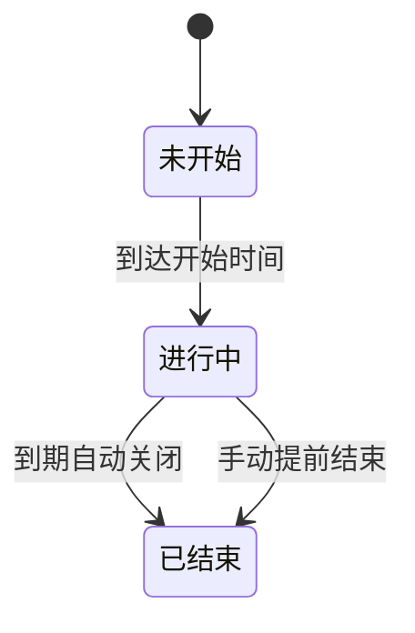
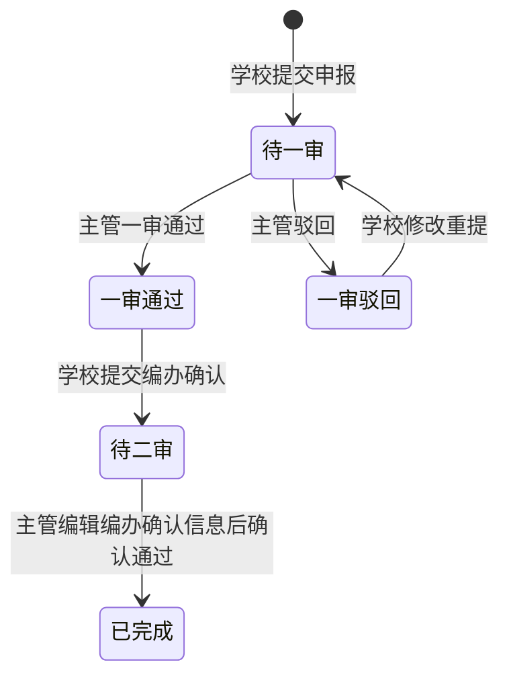
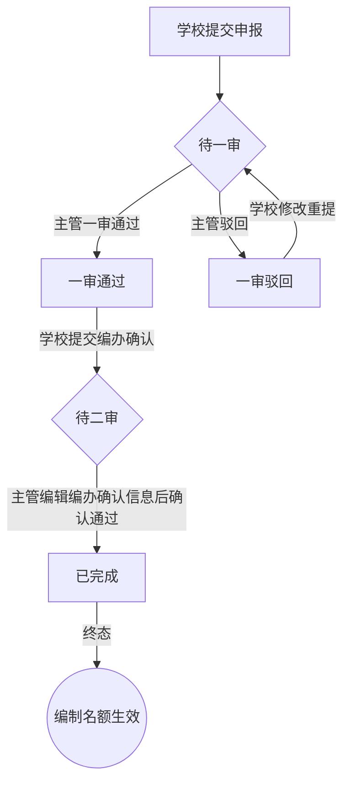
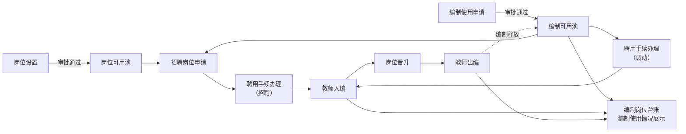
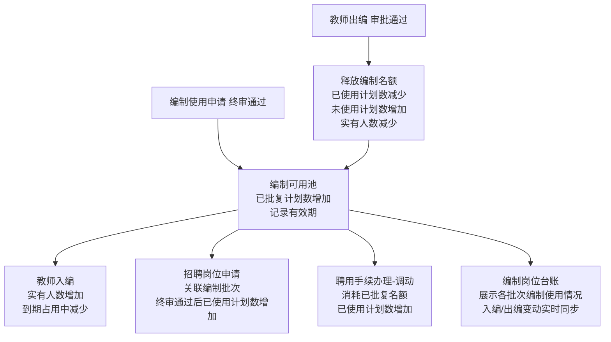

# 编制使用申请模块 — 产品需求文档

**版本：** v6.3 | **更新日期：** 2026-08-11 | **父文档：** PRD_柳州教育人事管理平台_总纲 | **状态：** 已发布

---

## 目录

1. [模块概述](#1-模块概述) — 业务背景、产品目标、核心特征、双轨说明、使用形式、角色权限、术语定义、审批路径
2. [业务流程](#2-业务流程) — 整体审批流程、批次/申请状态流转图、审核流程总图、编制池联动
3. [功能清单](#3-功能清单) — 功能总览 + 批次管理/申报提交/审核管理详细规格
4. [页面清单与字段定义](#4-页面清单与字段定义) — 页面清单、各页面字段表、附件上传规则
5. [权限矩阵](#5-权限矩阵) — 角色权限 + 操作按钮矩阵
6. [数据模型](#6-数据模型) — Batch / Submission / History / Reminder
7. [异常处理](#7-异常处理) — 申报/审核/批次/通用/并发冲突
8. [通知触发点](#8-通知触发点)
9. [操作日志埋点](#9-操作日志埋点)
10. [验收标准](#10-验收标准)
11. [非功能性需求](#11-非功能性需求)
12. [附录](#12-附录)

---

## 1. 模块概述

### 1.1 业务背景

学校在招聘教师或调动人员前，须向机构编制委员会办公室（编办）提交编制使用计划申请。编办线下审批通过后，学校方可使用编制名额。本模块实现申请提交、主管审核、编办结果确认的全流程线上化。

### 1.2 产品目标

| 目标 | 说明 |
|------|------|
| 线上化申报 | 替代传统的纸质编制使用计划申报，学校在线填写、上传附件、提交申请 |
| 分级审批 | 市/区管理员分别审核管辖范围内的学校申请，实现两级审批闭环 |
| 双轨并行 | 同时支持事业编（附件2）和控制数（附件9）两种编制类型的申报和审批 |
| 批次管理 | 支持管理员创建定向申报批次，控制申报窗口期和适用范围 |
| 数据联动 | 审批通过的编制名额自动进入编制可用池，供下游模块（入编、招聘）引用 |

### 1.3 核心特征

| 特征 | 说明 |
|------|------|
| 双轨制 | 事业编（附件2，实名制）+ 控制数（附件9，备案制），各有独立的字段和计算公式 |
| 两级审批 | 一审（主管单位材料审核）+ 学校提交编办确认 + 二审（主管单位终审确认） |
| 批次模式 | 定向批次限每校每类型 1 次申报；自主申报批次（后续版本规划）不限次数 |
| 无草稿 | 提交即生效，不支持保存草稿功能，不设草稿状态 |
| 驳回可重提 | 被驳回后，学校可修改申请并重新提交，重新进入审批流程 |
| 编制类型锁定 | 修改重提时编制类型不可更改，仅允许修改人数、条件、附件等字段 |
| 权限隔离 | 市管理员仅审市直属学校，区管理员仅审本区学校，互不越权 |
| 申请单位情况快照 | 提交时冻结申请单位情况数据为快照，详情和审核以快照为准；审核页自动比对台账差异并提示；修改重提时从台账拉取最新数据 |
| 数据一致性 | 各页面共享同一数据源，确保状态同步 |

### 1.4 双轨说明

| 轨道 | 表单依据 | 编制类型 | 管理模式 |
|------|----------|----------|----------|
| 事业编 | 附件2（事业单位编制使用计划申报表） | 实名制事业编制 | 核定编制数 − 实有在编人数 − 已批复计划数 |
| 控制数 | 附件9（中小学聘用教师控制数使用计划申报表） | 备案制聘用教师控制数 | 控制数核定数 − 实有控制数人数 − 已批复控制数 |

### 1.5 使用形式（6 种）

| 序号 | 名称 | 适用编制类型 |
|------|------|-------------|
| 1 | 统一公开招聘 | 事业编 / 控制数 |
| 2 | 单位自主实施招聘 | 事业编 / 控制数 |
| 3 | 中高级人才招聘 | 事业编 / 控制数 |
| 4 | 引进高层次人才 | 事业编 / 控制数 |
| 5 | 调动 | 事业编 / 控制数 |
| 6 | 其他 | 事业编 / 控制数 |

### 1.6 角色与权限

| 角色 | 权限范围 | 核心操作 |
|------|----------|----------|
| 市管理员 | 查看全市数据；仅可审核市直属学校 | 批次管理、审核（一审+二审）、导出数据、查看全部 |
| 区管理员 | 查看本区数据；仅可审核本区属学校 | 批次管理、审核（一审+二审）、导出数据 |
| 校管理员 | 仅可查看和操作本校数据 | 新建申报、修改重提、提交编办确认、导出 |
| 教师 | 无权限 | 不可访问本模块 |
| 系统管理员 | 无权限 | 不可访问本模块（仅负责系统配置功能，不接触业务数据） |

### 1.7 术语定义

| 术语 | 说明 |
|------|------|
| 定向批次 | 由市/区管理员手动创建的申报批次，设定申报起止时间和适用范围，每校每种编制类型限申报 1 次 |
| 自主申报批次 | 由系统自动生成的全年有效批次，不限申报次数，用于紧急或零星需求（后续版本规划） |
| 学校提交编办确认 | 学校将主管单位一审通过的申请表导出，线下报送市委编办审批后，将审批结果（批复人数、有效期）回录到平台的操作 |
| 使用形式 | 编制名额的使用方式分类，包括统一公开招聘、单位自主实施招聘、中高级人才招聘、引进高层次人才、调动、其他共 6 种 |
| 一审：材料审核 | 主管单位对学校提交的申报材料进行的初次审核，审核通过后学校方可进行学校提交编办确认 |
| 二审：编办确认 | 学校提交编办确认材料后，主管单位进行的最终审核，确认通过后编制名额正式生效；主管可编辑编办确认信息后确认通过 |
| 修改重提 | 申请被驳回后，学校修改申请内容并重新提交的操作，重新进入一审流程，申报编号保持不变 |

### 1.8 审批路径

本模块采用**两级审批**模式：

| 学校归属 | 审批路径 | 终审人 |
|----------|----------|--------|
| 市直属学校 | 学校提交 → 市管理员一审 → 学校编办确认 → 市管理员二审：编办确认 | 市管理员 |
| 区属学校 | 学校提交 → 区管理员一审 → 学校编办确认 → 区管理员二审：编办确认 | 区管理员 |

审批过程中任一环节驳回，申请回到"一审驳回"状态，学校修改后可重新提交。二审环节仅支持确认通过，或编辑编办确认信息后确认通过，不支持驳回。

---

## 2. 业务流程

### 2.1 整体审批流程

本模块采用**两级审批**模式：学校提交 → 主管单位一审 → 学校提交编办确认 → 主管单位二审确认通过。市直属学校由市管理员审核，区属学校由区管理员审核。审批过程中一审可驳回，学校修改重提后重新进入一审流程。

### 2.2 批次状态流转



### 2.3 申请状态流转



### 2.4 审核流程总图



### 2.5 编制池联动机制

编制使用申请模块是编制生命周期的**入口**。申请终审通过后，批复的编制名额进入"编制可用池"，供教师入编、招聘岗位申请、聘用手续办理（调动）、编制岗位台账等下游模块关联和消耗。

#### 模块间数据联动表

| 上游模块 | 触发事件 | 联动数据 | 下游模块 | 影响 |
|----------|----------|----------|----------|------|
| 编制使用申请 | 二审确认通过 | 批复编制数、有效期、编制类型 | 教师入编 | 入编时可选择该批次的编制名额；入编后已使用计划数增加、未使用计划数减少、实有人数增加 |
| 编制使用申请 | 二审确认通过 | 批复编制数、有效期、编制类型 | 招聘岗位申请 | 招聘申请可关联该编制批次，终审通过后已使用计划数累加 |
| 编制使用申请 | 二审确认通过 | 批复编制数、有效期、编制类型 | 聘用手续办理（调动） | 办理调动聘用手续时可选择该批次的编制名额，完成后已使用计划数累加 |
| 编制使用申请 | 二审确认通过 | 批复编制数、有效期、编制类型、已使用计划数、未使用计划数 | 编制岗位台账 | 台账展示各批次的编制使用情况（已批复/已使用/未使用），入编、出编等变动实时同步更新台账数据 |
| 教师出编 | 出编审批通过 | 释放的编制数 | 编制使用申请 | 已使用计划数减少、未使用计划数增加、实有人数减少，释放对应数量编制回可用池 |

#### 业务时序约束

编制使用申请与岗位设置可**并行**进行。招聘岗位申请和聘用手续办理（调动）均需要关联已批复的编制批次。



#### 编制池数据流



#### 关键指标

| 指标 | 计算逻辑 | 说明 |
|------|----------|------|
| 已批复计划数 | 所有已完成申请的编办确认数累计 | 仅已完成状态计入 |
| 已使用计划数 | 入编通过人数 + 招聘终审通过人数 + 调动完成人数 | 实际占用的编制数 |
| 未使用计划数 | 已批复计划数 − 已使用计划数 | 剩余可用的编制名额 |
| 实有人数 | 当前在编实际人数（入编后增加、出编后减少） | 在编教师实际数量，不同于已使用计划数（含招聘在途） |

#### 编制有效期对下游的影响

| 有效期状态 | 下游行为 |
|------------|----------|
| 有效期内 | 入编/招聘/台账可正常关联此编制批次 |
| 已过期 | 入编/招聘页面的批次下拉列表中不显示或标记"已过期"，不可选择；台账仍可查看历史数据 |
| 即将到期（≤30 天） | 显示黄色警告标签，仍可选择但提示即将到期。即将到期提醒由 **编制岗位台账模块** 统一管理，各模块引用台账的到期状态标记 |

#### 过期名额释放规则

| 规则 | 说明 |
|------|------|
| 自动释放 | 编制有效期到期后，该批复中**未使用的名额自动释放**，已使用计划数和未使用计划数相应调减，可申请编制数相应回升 |
| 已占用不受影响 | 到期前已占用（招聘在途）或已入编的名额不受释放影响，仅释放未使用的剩余名额 |
| 有效期延长 | 暂不支持，后续版本迭代 |

---

## 3. 功能清单

### 3.1 功能总览

| 编号 | 功能 | 优先级 | 角色 | 说明 |
|------|------|--------|------|------|
| F01.01 | 创建批次 | P0 | 市/区管理员 | 弹框填写 → 确认创建 → 列表刷新 |
| F01.02 | 编辑批次 | P1 | 市/区管理员 | 根据批次状态有条件可编辑 |
| F01.03 | 关闭/删除批次 | P1 | 市/区管理员 | 进行中关闭（不可恢复）；未开始删除 |
| F01.04 | 查看批次详情 | P1 | 全部 | 弹框展示完整信息及统计 |
| F01.05 | 年份筛选 | P1 | 全部 | 下拉选择年份或全部年份 |
| F02.01 | 查看申报列表 | P0 | 全部 | 管理员：批次卡片区 + 申报记录列表；校管理员：本校申报记录列表，支持筛选和分页 |
| F03.01 | 提醒未提交学校 | P2 | 市/区管理员 | 每天每校每批次限 1 次 |
| F04.01 | 单条导出 | P1 | 校管理员 | 按模板导出附件2（事业编）或附件9（控制数），仅一审通过和已完成状态可导出 |
| F04.02 | 批次汇总导出 | P1 | 市/区管理员 | 按模板导出附件3（事业编）或附件10（控制数）批次汇总 |
| F04.03 | 年度汇总导出 | P1 | 市/区管理员 | 按模板附件4导出年度编制使用情况报告 |
| F05.01 | 按状态筛选 | P1 | 全部 | 标签按钮组切换；管理员额外有"未提交" |
| F05.02 | 按编制类型筛选 | P1 | 市/区管理员 | 全部/事业编/控制数 |
| F05.03 | 按申请单位筛选 | P1 | 市/区管理员 | 可搜索下拉单选，支持模糊匹配 |
| F05.04 | 列表分页 | P1 | 全部 | 每页 10 条，分页栏始终显示 |
| F06.01 | 新建申请 | P0 | 校管理员 | 进入表单页；定向批次检查重复 |
| F06.02 | 申请单位情况自动填充 | P0 | 校管理员 | 系统自动带出，只读，按编制类型展示不同字段集 |
| F06.03 | 填写使用形式及数量 | P0 | 校管理员 | 6 行，人数>0 时学历必填，实时汇总 |
| F06.04 | 上传附件 | P0 | 校管理员 | 拖拽/点击，格式+大小校验，禁止压缩包 |
| F06.05 | 提交申请 | P0 | 校管理员 | 校验 → 生成编号 → 捕获快照 → 保存数据 → 跳转 |
| F06.06 | 提交编办确认 | P0 | 校管理员 | 填写确认数+有效期+上传批复文件 → 待二审 |
| F06.07 | 修改重提 | P0 | 校管理员 | 编制类型锁定，其他可改 → 编号不变 → 重置为待一审 |
| F07.01 | 查看审核页面 | P0 | 市/区管理员 | 进入审核页查看申报详情，比对台账快照差异，执行审核操作 |
| F08.01 | 一审通过 | P0 | 市/区管理员 | 待一审 → 一审通过 |
| F08.02 | 一审驳回 | P0 | 市/区管理员 | 待一审 → 一审驳回（必填原因） |
| F08.03 | 二审通过 | P0 | 市/区管理员 | 待二审 → 已完成（终态）；可编辑确认信息后确认通过 |
| F09.01 | 查看申报详情信息 | P0 | 全部 | 申报进度+单位情况+限额汇总+使用形式+附件，申报基本信息+申报履历 |
| F09.02 | 查看申报履历 | P0 | 全部 | 时间线展示申报全流程操作记录：提交申报→一审驳回→修改重提→一审通过→提交编办确认→二审通过 |
| F09.03 | 下载/预览附件 | P1 | 全部 | 每个附件支持预览和下载两种操作 |

### 3.2 批次管理

#### 批次类型与状态

| 类型 | 创建方式 | 提交限制 | 典型场景 |
|------|----------|----------|----------|
| **定向批次** | 市/区管理员手动创建 | 每校每种编制类型限 **1 次** | 年度集中申报 |
| **自主申报批次** | 系统自动生成，全年存在 | **不限次数** | 紧急/零星需求（后续版本规划） |

> **⚠️ 自主申报批次（后续版本规划）：** 一期范围包含定向批次。自主申报批次的自动创建、自动关闭、不限次数提交等能力将在后续版本中实现。生命周期：每年 1/1 自动生成、12/31 自动关闭；可见范围按学校归属区分；不限提交次数。

#### 批次状态说明

| 状态 | 含义 | 学校操作 | 主管操作 |
|------|------|----------|----------|
| 未开始 | 已创建但尚未到达申报开始时间 | 仅可查看 | 可编辑、可删除 |
| 进行中 | 处于开放申报窗口期 | 可申报、驳回可重提、导出 | 审核、编辑、手动关闭、导出 |
| 已结束 | 申报窗口已关闭 | 仅可查看历史记录 | 审核、导出、可编辑 |

#### 批次字段定义

| 字段 | 输入方式 | 必填 | 编辑规则 |
|------|----------|------|----------|
| 批次编号 | 系统自动生成 | — | 只读展示，不可修改；新建弹框不展示（创建成功后自动生成） |
| 批次类型 | 系统默认 | — | 固定为"定向批次" / "自主申报批次"，只读展示，不允许编辑 |
| 批次名称 | 文本输入 | 是 | 随时可改，最多 50 字 |
| 年度 | 下拉选择 | 是 | 创建后永久锁定 |
| 申报开始日期 | 日期选择 | 是 | 仅"未开始"可修改；从当天 00:00:00 起 |
| 申报截止日期 | 日期选择 | 是 | 所有状态均可修改，截止到当天 23:59:59；已结束批次仅可往后延长（不可提前）。若"已结束"批次的截止日期延长后晚于当前时间，批次状态自动恢复为"进行中" |
| 适用范围 | 级联选择 | 是 | 创建后永久锁定。市管理员：全市 / 指定区（可多选）+ 区下所有学校 / 指定学校（精确到校）；区管理员：本区 / 指定学校（本区下部分学校） |
| 备注说明 | 文本域 | 否 | 随时可改，最多 200 字 |

#### F01.01 创建批次

| 属性 | 内容 |
|------|------|
| 优先级 | P0 |
| 角色 | 市管理员、区管理员 |
| 触发条件 | 点击列表页"新建批次"按钮 |
| 前置条件 | 无 |
| 后置条件 | 新批次出现在列表中 |
| 业务规则 | 1. 批次名称不可重复；2. 截止日期不可早于开始日期；3. 市管理员可选择"全市"（覆盖所有区及所有学校）、"指定区"（选择一个或多个区，自动覆盖该区下所有学校）或"指定学校"（精确到学校级别）；区管理员仅可选择"本区"（覆盖本区下所有学校）或"指定学校"（选择本区下的部分学校）；4. 年度创建后不可修改；5. 备注最多 200 字；6. 开始日期从当天 00:00:00 起，截止日期到当天 23:59:59 止；7. 弹框展示「批次类型」字段（固定"定向批次"，只读）；不展示「批次编号」（创建成功后系统自动生成） |
| 交互规则 | 弹出模态框 → 填写 → 确认创建 → 校验 → 列表刷新 |

#### F01.02 编辑批次

| 属性 | 内容 |
|------|------|
| 优先级 | P1 |
| 角色 | 市管理员、区管理员 |
| 触发条件 | 点击批次卡片"编辑" |
| 前置条件 | 非自主申报批次 |
| 后置条件 | 批次信息更新 |
| 业务规则 | 1. 名称随时可改；2. 年度永久锁定；3. 开始日期：仅"未开始"可改；4. 截止日期：未开始/进行中可自由修改，已结束批次仅可往后延长（不可提前）；若"已结束"批次延长后晚于当前时间，状态自动恢复为"进行中"；5. 适用范围永久锁定；6. 备注随时可改；7. 批次编号、批次类型只读展示，不允许修改 |
| 交互规则 | 弹出模态框（预填当前值）→ 锁定字段置灰 → 保存 → 刷新 |

#### F01.03 关闭/删除批次

| 属性 | 内容 |
|------|------|
| 优先级 | P1 |
| 角色 | 市管理员、区管理员 |
| 触发条件 | 点击"关闭"（进行中）或"删除"（未开始） |
| 前置条件 | 关闭：进行中；删除：未开始 |
| 后置条件 | 关闭：状态变为已结束；删除：批次移除 |
| 业务规则 | 1. 关闭后不可恢复；2. 已提交申请不受批次关闭影响，已关闭的批次不可新建申报但可继续审核；3. 自主申报批次不可手动关闭；4. 已关闭批次允许编辑截止日期（仅可往后延长，不可提前）：若新截止日期晚于当前时间，批次状态自动恢复为"进行中"，学校可重新申报 |
| 交互规则 | 点击"关闭"/"删除" → 弹出二次确认对话框（提示操作后果：关闭后学校不可再提交新申请、操作不可恢复）→ 确认 → 执行 → 刷新 |

#### F01.04 查看批次详情与卡片统计

| 属性 | 内容 |
|------|------|
| 优先级 | P1 |
| 角色 | 全部（除教师、系统管理员） |
| 触发条件 | 点击批次名称 |
| 前置条件 | 无 |
| 后置条件 | 弹出批次详情弹框 |

**业务规则 — 基本信息区：**

| 字段 | 说明 |
|------|------|
| 批次名称 | 创建时填写，可编辑修改，最多 50 字 |
| 批次编号 | 系统自动生成，格式见附录 A，不可修改 |
| 批次类型 | 定向批次 / 自主申报批次，只读展示 |
| 年度 | 创建时选定，创建后锁定不可修改 |
| 发布单位 | 创建该批次的市/区管理员的所属单位名称，系统自动记录 |
| 申报起止日期 | 格式"YYYY-MM-DD ~ YYYY-MM-DD"，所有状态均可编辑截止日期 |
| 适用范围 | 展示批次覆盖的区划/学校完整范围 |
| 状态 | 未开始（灰）/ 进行中（蓝）/ 已结束（灰），根据当前时间与起止日期自动判定 |
| 备注说明 | 创建时填写，最多 200 字，过长时悬停展示全文 |

**业务规则 — 申报统计区：**

| 指标 | 说明 |
|------|------|
| 申报单位 | 已申报学校数 / 覆盖学校总数。已申报数为去重后的学校数量（同一学校多次提交仅计 1 所），覆盖学校总数由系统根据批次适用范围自动计算 |
| 待一审 | 当前处于"待一审"状态的申请数量 |
| 一审通过 | 一审审核通过、等待学校提交编办确认的申请数量 |
| 一审驳回 | 一审被驳回的申请数量 |
| 待二审 | 当前处于"待二审"状态的申请数量 |
| 已完成 | 二审确认通过、编制名额生效的申请数量 |

统计指标按编制类型（事业编/控制数）分别展示。

| 属性 | 内容 |
|------|------|
| 交互规则 | 点击批次名称 → 弹出模态框展示 |

#### F01.05 年份筛选

| 属性 | 内容 |
|------|------|
| 优先级 | P1 |
| 角色 | 全部（除教师、系统管理员） |
| 触发条件 | 点击批次卡片区顶部的年份下拉选择器 |
| 前置条件 | 无 |
| 后置条件 | 批次卡片区仅显示选中年份的批次 |
| 业务规则 | 1. 下拉列表包含"全部年份"和所有有批次的年份；2. 默认选中当前年份（如当前无批次则选中"全部年份"）；3. 切换年份时同步刷新右侧申请列表和统计 |
| 交互规则 | 点击下拉框 → 选择年份 → 批次卡片区和列表同步刷新 |

### 3.3 查看申报列表

申报列表页（`staffing-application.html`）是编制使用申请模块的核心入口页面。不同角色看到的列表内容和操作按钮不同。

#### F02.01 查看申报列表

| 属性 | 内容 |
|------|------|
| 优先级 | P0 |
| 角色 | 市管理员、区管理员、校管理员 |
| 触发条件 | 从工作台侧边栏点击"编制使用申请"菜单进入列表页 |
| 前置条件 | 当前用户已登录且具有本模块访问权限（系统管理员和教师不可访问） |
| 后置条件 | 展示批次列表和对应批次的申报记录列表，默认选中最新年份的第一个批次 |

**业务规则：**

1. **页面内容**：列表页包含批次卡片区和申报记录列表区，切换选中批次后列表区展示对应的申报记录
2. **批次卡片区（通用）**：顶部为年份筛选下拉框（默认选中当前年份，支持查看全部年份）；按发布时间倒序排列批次卡片，每张卡片展示批次名称、编号、年度、发布单位、起止日期、适用范围、状态标签（未开始/进行中/已结束）；自主申报批次有绿色边框标识
3. **批次卡片区（管理员）**：市/区管理员可见"+ 新建批次"按钮；每张定向批次卡片提供编辑、关闭/删除操作；提供年度汇总模式切换入口；每张卡片展示事业编和控制数各自的已申报学校数/覆盖学校总数
4. **数据权限隔离**：市管理员可查看全市数据但仅可审核市直属学校的申报；区管理员仅可查看和审核本区数据
5. **管理员列表**：展示当前批次名称和导出数据按钮；状态筛选标签栏（全部/待审核/已通过/已驳回，管理员额外有"未提交"）；筛选栏含单位名称可搜索下拉框和编制类型下拉框；表格列：申报编号（不可点击）、申报批次、编制类型、单位名称、所属区域、事业编核定数、实有在编人数、控制数核定数、实有控制数人数、申请数、6种使用形式、状态、提交时间、操作；每页10条
6. **校管理员列表**：状态筛选标签栏；筛选栏含批次下拉框；表格列：申报编号、申报批次、编制类型、申请数、6种使用形式、状态、提交时间、操作；每页10条
7. **未提交视图**：管理员点击"未提交"标签切换至未提交学校列表（序号、单位名称、所属区域、最近提醒、状态、操作），每校每批次每天限提醒1次
8. **空状态处理**：批次未开始时显示申报时间提示；批次进行中且无申报记录时校管理员视图显示空状态引导并提供申报入口按钮
9. **缺失类型提示条**：定向批次下仅提交一种编制类型时显示提示条及快捷申报按钮，两种类型均提交后消失
10. **自主申报批次**：不限提交次数，校管理员始终可见申报按钮；定向批次每校每种编制类型限提交1次
11. **操作入口**：列表操作按钮根据角色和记录状态动态展示（查看/审核/提交编办确认/导出数据/修改重提）

| 属性 | 内容 |
|------|------|
| 交互规则 | 点击批次卡片 → 选中批次、刷新列表并重置筛选条件；点击"新建批次"→ 创建批次弹框；点击"查看"→ 详情页；点击"审核"→ 审核页；点击"提交编办确认"→ 编办确认弹框；点击"修改重提"→ 表单页预填数据 |

### 提醒功能

#### F03.01 提醒未提交学校

| 属性 | 内容 |
|------|------|
| 优先级 | P2 |
| 角色 | 市管理员、区管理员 |
| 触发条件 | 在批次卡片的"未提交"视图，点击某学校的"提醒申报"按钮 |
| 前置条件 | 批次为进行中；该学校尚未提交该编制类型的申请 |
| 后置条件 | 提醒已发送，该学校当日该批次不可再次提醒，按钮变为"今日已提醒"并置灰 |
| 业务规则 | 1. 每校每批次每天限提醒 1 次；2. 提醒记录持久化到系统数据库，含提醒时间、被提醒学校、累计提醒次数；3. 当天已提醒的学校，按钮显示"今日已提醒"并置灰不可点击；4. 次日 00:00 起自动重置，可再次提醒 |
| 交互规则 | 点击"提醒申报"按钮 → 弹出"提醒申报确认"对话框（正文："将向{学校名称}发送编制使用申请提醒通知。每个学校每日最多提醒一次。"）→ 点击"确认发送"→ 系统记录提醒日志 → 按钮变为"今日已提醒"（置灰）→ Toast 提示"已向「{学校名称}」发送申报提醒" |

### 导出功能

#### F04.01 单条导出

| 属性 | 内容 |
|------|------|
| 优先级 | P1 |
| 角色 | 校管理员 |
| 触发条件 | 列表页点击某条记录的"导出数据"按钮 |
| 前置条件 | 记录状态为一审通过或已完成 |
| 后置条件 | 下载导出文件 |
| 业务规则 | 1. 仅一审通过和已完成状态的记录可导出；2. 按编制类型匹配对应模板：**事业编 → 附件2**（事业单位编制使用计划申报表），**控制数 → 附件9**（中小学聘用教师控制数使用计划申报表）；3. 导出文件格式与原始模板一致，系统填充已知字段，签章/签字区留空供打印后手写；4. 导出文件名格式：`{申报编号}_附件2_事业单位编制使用计划申报表.xlsx`（事业编）或 `{申报编号}_附件9_中小学聘用教师控制数使用计划申报表.xlsx`（控制数）；5. 导出内容以提交时的快照数据为准 |

**模板字段映射 — 附件2（事业编 — 事业单位编制使用计划申报表）：**

| 模板区域 | 模板字段 | 数据来源 | 是否系统填充 |
|----------|----------|----------|-------------|
| 申请单位情况 | 单位全称 | 快照 → orgName（单位名称） | ✅ |
| 申请单位情况 | 机构级别 | 快照 → orgLevel（单位级别） | ✅ |
| 申请单位情况 | 单位性质（勾选） | 快照 → orgNature（单位性质） | ✅ |
| 申请单位情况 | 核定编制数（名） | 快照 → 事业编核定数 | ✅ |
| 申请单位情况 | 在编人数（人） | 快照 → 实有在编人数 | ✅ |
| 申请单位情况 | 未使用计划数 | 快照 → 未使用计划数 | ✅ |
| 申请单位情况 | 核定单位领导职数 / 实配单位领导人数 / 实配单位其他领导人数 | 编制岗位台账实时数据 | ✅ |
| 用编形式（6行） | 使用编制数（名） | 申请记录 → useForms.{code}.num | ✅ |
| 用编形式（6行） | 学历/专业/资格等、备注 | 申请记录 → useForms.{code}.edu / cond / note | ✅ |
| 签章区 | 使用编制单位意见 | 公章 + 日期 | 留空 |
| 签章区 | 主管部门意见 | 公章 + 日期 | 留空 |
| 签章区 | 市委编办审批意见 | — | 留空 |
| 签字行 | 申报单位负责人签字 | — | 留空 |
| 签字行 | 填报人 | — | 留空 |
| 签字行 | 联系电话 | — | 留空 |

**模板字段映射 — 附件9（控制数 — 中小学聘用教师控制数使用计划申报表）：**

| 模板区域 | 模板字段 | 数据来源 | 是否系统填充 |
|----------|----------|----------|-------------|
| 申请单位情况 | 单位全称 | 快照 → orgName（单位名称） | ✅ |
| 申请单位情况 | 核定编制数（名）/ 在编人数（人）/ 未使用计划数 | 快照 → 事业编核定数 / 实有在编人数 / 未使用计划数 | ✅ |
| 申请单位情况 | 核定聘用教师控制数（名） | 快照 → 控制数核定数 | ✅ |
| 申请单位情况 | 聘用教师控制数实有数（人） | 快照 → 实有控制数人数 | ✅ |
| 申请单位情况 | 未使用控制数计划数 | 快照 → 未使用控制数 | ✅ |
| 使用形式（6行） | 使用控制数（名） | 申请记录 → useForms.{code}.num | ✅ |
| 使用形式（6行） | 学历/专业/资格等、备注 | 申请记录 → useForms.{code}.edu / cond / note | ✅ |
| 签章区 | 单位意见 | 公章 + 日期 | 留空 |
| 签章区 | 主管部门意见 | 公章 + 日期 | 留空 |
| 签章区 | 市委编办审批意见 | — | 留空 |
| 签字行 | 申报单位负责人签字 | — | 留空 |
| 签字行 | 填报人 | — | 留空 |
| 签字行 | 联系电话 | — | 留空 |

| 属性 | 内容 |
|------|------|
| 交互规则 | 点击"导出数据"→ 按编制类型匹配模板 → 生成文件（UTF-8 BOM）→ 触发浏览器下载 → Toast 提示"已导出：{文件名}" |

#### F04.02 批次汇总导出

| 属性 | 内容 |
|------|------|
| 优先级 | P1 |
| 角色 | 市管理员、区管理员 |
| 触发条件 | 在批次卡片操作区点击"📥 导出数据"按钮 |
| 前置条件 | 批次下至少有一条申请记录 |
| 后置条件 | 按模板导出批次汇总文件（事业编→附件3，控制数→附件10） |
| 业务规则 | 1. 汇总该批次下所有已完成（终审通过）的申请记录；2. 按编制类型匹配对应模板：**事业编 → 附件3**（机关事业单位编制使用计划汇总表），**控制数 → 附件10**（中小学聘用教师控制数使用计划汇总表）；3. 事业编和控制数分别导出为独立文件；4. 同单位同类型有多次申请的，按单位合并为一行展示；5. 导出文件名格式：`{批次名称}_附件3_事业编汇总_{导出日期}.xlsx` 或 `{批次名称}_附件10_控制数汇总_{导出日期}.xlsx`；6. 模板表头含"主管部门（盖章）"和日期，留空供管理员打印后手写 |

**模板字段映射 — 附件3（机关事业单位编制使用计划汇总表 — 事业编）：**

| 模板列 | 模板字段 | 数据来源 | 是否系统填充 |
|--------|----------|----------|-------------|
| 1 | 序号 | 系统自动编号，从 1 递增 | ✅ |
| 2 | 单位 | 快照 → orgName（单位名称） | ✅ |
| 3 | 单位性质 | 快照 → orgNature（单位性质） | ✅ |
| 4 | 机构规格 | 快照 → orgLevel（单位级别） | ✅ |
| 5 | 编制数 | 快照 → 事业编核定数 | ✅ |
| 6 | 实有人员 | 快照 → 实有在编人数 | ✅ |
| 7 | 核定部门领导职数 | 编制岗位台账实时数据 | ✅ |
| 8 | 已配备部门领导 | 编制岗位台账实时数据 | ✅ |
| 9 | 已批计划数 | 快照 → 已批复计划数 | ✅ |
| 10 | 可用空编数 | 快照 → 可申请编制数 | ✅ |
| 11 | 用编形式 — 合计 | 各用编形式人数之和（系统计算） | ✅ |
| 12-17 | 用编形式 — 调动 / 统一公开招聘 / 单位自主实施招聘 / 中高级人才(含高层次人才引进) / 其他 | 申请记录 → useForms.{code}.num。模板中"考录/选调/遴选/聘用教师控制数考核入实名编制"列不属于本模块范围，留空 | ✅（6种中有数据的列填充，其余留空） |
| 18 | 学历、专业、资格等相关条件 | 申请记录 → useForms.{code}.edu / cond（多行合并） | ✅ |
| 19 | 备注 | 申请记录 → useForms.{code}.note | ✅ |
| — | 主管部门（盖章）/ 日期 | — | 留空 |
| — | 合计行 | 系统自动汇总各列合计 | ✅ |

**模板字段映射 — 附件10（中小学聘用教师控制数使用计划汇总表 — 控制数）：**

| 模板列 | 模板字段 | 数据来源 | 是否系统填充 |
|--------|----------|----------|-------------|
| 1 | 序号 | 系统自动编号，从 1 递增 | ✅ |
| 2 | 单位 | 快照 → orgName（单位名称） | ✅ |
| 3 | 核定总量 — 编制数 | 快照 → 事业编核定数 | ✅ |
| 4 | 核定总量 — 控制数 | 快照 → 控制数核定数 | ✅ |
| 5 | 实有人员 — 在编人数 | 快照 → 实有在编人数 | ✅ |
| 6 | 实有人员 — 控制数人数 | 快照 → 实有控制数人数 | ✅ |
| 7 | 已批计划数 — 编制数 | 快照 → 已批复计划数 | ✅ |
| 8 | 已批计划数 — 控制数 | 快照 → 已批复控制数 | ✅ |
| 9 | 空缺情况 — 编制数 | max(0, 事业编核定数 − 实有在编人数) | ✅ |
| 10 | 空缺情况 — 控制数 | max(0, 控制数核定数 − 实有控制数人数) | ✅ |
| 11 | 申请使用数 — 编制数 | 申请记录 → 事业编申请合计 | ✅ |
| 12 | 申请使用数 — 控制数 | 申请记录 → 控制数申请合计 | ✅ |
| 13 | 用编形式 — 合计 | 各用编形式人数之和（系统计算） | ✅ |
| 14-18 | 用编形式 — 调动 / 统一公开招聘 / 单位自主实施招聘 / 中高级人才(含高层次人才引进) / 其他 | 申请记录 → useForms.{code}.num | ✅（6种中有数据的列填充，其余留空） |
| 19 | 学历、专业、资格等相关条件 | 申请记录 → useForms.{code}.edu / cond（多行合并） | ✅ |
| 20 | 备注 | 申请记录 → useForms.{code}.note | ✅ |
| — | 主管部门（盖章）/ 日期 | — | 留空 |
| — | 合计行 | 系统自动汇总各列合计 | ✅ |

| 属性 | 内容 |
|------|------|
| 交互规则 | 1. 点击"📥 导出数据"→ 弹出"批次汇总导出"模态框（标题含"共 X 条"）；2. 模态框内提供筛选条件：所属区域（下拉）、编制类型（下拉：全部/事业编/控制数）、状态（下拉：全部/已完成，默认已完成）；3. 表格展示所有匹配申请（含复选框），支持全选/单选，每页 10 条并分页；4. 底部显示"已选 N 条 / 共 N 条"；5. 点击"📥 导出选中"→ 校验至少勾选 1 条（否则 Toast "请至少勾选一条数据"）→ 按编制类型匹配对应模板生成文件 → 触发浏览器下载 → 关闭弹框 → Toast 提示"已导出 N 条记录" |

#### F04.03 年度汇总导出

| 属性 | 内容 |
|------|------|
| 优先级 | P1 |
| 角色 | 市管理员、区管理员 |
| 触发条件 | 切换到"年度汇总"模式，勾选一个或多个批次后点击"汇总导出" |
| 前置条件 | 至少勾选 1 个批次 |
| 后置条件 | 按附件4模板导出年度编制使用情况报告 |
| 业务规则 | 1. 可勾选同一年度的多个批次进行跨批次汇总；2. 按模板 **附件4 — XXXX年度编制使用情况报告表** 格式导出；3. 汇总该年度下所有已完成（终审通过）的申请记录，按单位+编制使用计划（用编形式）逐行展示，同一单位的多条计划相邻排列；4. 导出文件名格式：`{年度}年度_编制使用情况报告_{导出日期}.xlsx`；5. 模板表头含"填报单位（盖章）"和日期，留空供管理员打印后手写；签字行（主要领导、联系人、联系电话）留空 |

**模板字段映射 — 附件4（XXXX年度编制使用情况报告表）：**

| 模板列 | 模板字段 | 数据来源 | 是否系统填充 |
|--------|----------|----------|-------------|
| 1 | 序号 | 系统自动编号，从 1 递增 | ✅ |
| 2 | 部门（单位）名称 | 快照 → orgName（单位名称） | ✅ |
| 3 | 主管部门 | 机构信息 → 学校所属区教育局 / 市教育局 | ✅ |
| 4 | 编制使用计划单号 | 申请记录 → id（申报编号） | ✅ |
| 5 | 计划类型 | 申请记录 → 该行对应的用编形式名称（统一公开招聘 / 单位自主实施招聘 / 中高级人才招聘 / 引进高层次人才 / 调动 / 其他） | ✅ |
| 6 | 数量 | 申请记录 → 该计划的编办确认数（二审通过时确认的人数） | ✅ |
| 7 | 已办理入编手续（人） | 跨模块数据 — 来源于教师入编模块，已完成入编的人数。编制使用申请模块导出时此列留空 | 留空（跨模块） |
| 8 | 未办理入编 — 增人材料已报 — 姓名 | 跨模块数据 — 来源于教师入编模块，增人材料已报送至组织人社部门的入编申请人姓名 | 留空（跨模块） |
| 9 | 未办理入编 — 增人材料已报 — 报送材料日期 | 跨模块数据 — 来源于教师入编模块，材料报送日期 | 留空（跨模块） |
| 10 | 未办理入编 — 增人材料未报 — 人数 | 跨模块数据 — 来源于教师入编模块。编制使用申请模块导出时此列留空 | 留空（跨模块） |
| 11 | 备注 | 申请记录 → useForms.{code}.note | ✅ |
| — | 填报单位（盖章）/ 日期 | — | 留空 |
| — | 主要领导签字 / 联系人 / 联系电话 | — | 留空 |

> **💡 跨模块数据说明：** 附件4为年度编制使用全流程跟踪报告，"已办理入编手续"和"未办理入编"列的数据来源于下游教师入编模块。编制使用申请模块导出时，第 1-6 列和备注列由本模块填充，第 7-10 列入编相关数据留空，待入编模块后续补充后合并为完整报告。

| 属性 | 内容 |
|------|------|
| 交互规则 | 切换到"年度汇总"模式 → 勾选同一年度的一个或多个批次（复选框）→ 点击"汇总导出"→ 系统汇总所选批次下所有已完成申请，按单位+计划类型逐行展开 → 按模板生成文件 → 触发浏览器下载 → Toast 提示"已导出：{文件名}" |

### 筛选与分页

#### F05.01 按状态筛选

| 属性 | 内容 |
|------|------|
| 优先级 | P1 |
| 角色 | 全部（除教师、系统管理员） |
| 触发条件 | 点击列表上方状态标签按钮组中的任一标签 |
| 前置条件 | 无 |
| 后置条件 | 列表仅显示对应状态的记录，标签高亮 |
| 业务规则 | 1. 校管理员可见标签：全部、待审核、已通过、已驳回；2. 市/区管理员额外可见"未提交"标签，切换后展示未申报学校列表；3. 切换标签时重置分页到第 1 页 |
| 交互规则 | 点击标签 → 标签高亮 → 列表刷新 → 显示"共 X 条" |

#### F05.02 按编制类型筛选

| 属性 | 内容 |
|------|------|
| 优先级 | P1 |
| 角色 | 市管理员、区管理员 |
| 触发条件 | 点击列表上方的编制类型筛选标签 |
| 前置条件 | 无 |
| 后置条件 | 列表仅显示对应编制类型的记录 |
| 业务规则 | 1. 选项：全部（默认）、事业编、控制数；2. 切换时重置状态筛选和分页到默认值 |
| 交互规则 | 点击标签 → 标签高亮 → 列表刷新 |

#### F05.03 按申请单位筛选

| 属性 | 内容 |
|------|------|
| 优先级 | P1 |
| 角色 | 市管理员、区管理员 |
| 触发条件 | 在申请单位搜索下拉框中输入关键词或选择学校 |
| 前置条件 | 无 |
| 后置条件 | 列表仅显示匹配学校的记录 |
| 业务规则 | 1. 支持模糊匹配（输入部分学校名称即可筛选）；2. 下拉列表根据当前角色权限范围过滤（市管理员看全市，区管理员看本区）；3. 切换批次/年份/角色时自动重置为"全部"；4. 单选模式，一次只能选一所学校 |
| 交互规则 | 输入关键词 → 下拉列表实时过滤 → 选中学校 → 列表刷新 |

#### F05.04 列表分页

| 属性 | 内容 |
|------|------|
| 优先级 | P1 |
| 角色 | 全部（除教师、系统管理员） |
| 触发条件 | 列表加载后自动分页，点击分页栏切换页码 |
| 前置条件 | 无 |
| 后置条件 | 列表展示当前页数据 |
| 业务规则 | 1. 每页固定 10 条；2. 分页栏始终显示（即使只有 1 页）；3. 包含：上一页、页码、下一页，页码过多时显示省略号；4. 显示"共 Y 页 / Z 条"；5. 切换筛选条件时自动回到第 1 页；6. 当前页码高亮显示 |
| 交互规则 | 点击页码/导航按钮 → 列表切换对应页数据 → 滚动条回到列表顶部 |

### 3.4 申报提交

#### 申请状态说明

| 状态 | 印章颜色 | 含义 |
|------|----------|------|
| 待一审 | 蓝色 | 学校已提交申请，等待主管单位进行一审：材料审核 |
| 一审通过 | 绿色 | 主管单位一审通过，等待学校提交编办确认材料 |
| 待二审 | 橙色 | 学校已提交编办批复文件，等待主管单位进行二审：编办确认 |
| 已完成 | 绿色 | 二审确认通过，编制名额生效（终态） |
| 一审驳回 | 红色 | 申请被驳回，学校可修改后重新提交 |

> **⚠️ 注意：** 本模块不支持"保存草稿"功能。表单提交后直接进入"待一审"状态。

#### 各状态下角色操作矩阵

| 状态 | 校管理员 | 区/市管理员（有权限） |
|------|----------|----------------------|
| 待一审 | 查看 | 审核（一审通过 / 驳回） |
| 一审通过 | 查看、提交编办确认、导出 | 查看 |
| 待二审 | 查看 | 审核（确认通过 / 编辑后确认通过） |
| 已完成 | 查看、导出 | 查看、导出 |
| 一审驳回 | 查看、修改重提 | 查看 |

#### F06.01 新建申请

| 属性 | 内容 |
|------|------|
| 优先级 | P0 |
| 角色 | 校管理员 |
| 触发条件 | 分三种场景：① 定向批次未申报时，点击列表空状态区的"申报事业编"/"申报控制数"按钮；② 定向批次仅提交一种编制类型时，点击缺失类型提示条中的"申报{类型}"按钮；③ 自主申报批次，点击列表上方"申报事业编"/"申报控制数"按钮 |
| 前置条件 | 批次为进行中；定向批次下该编制类型未提交过（自主申报批次不限次数） |
| 后置条件 | 进入表单页，携带批次和编制类型参数 |
| 业务规则 | 定向批次每校每种编制类型限 1 次，重复时阻止并提示；自主申报批次不限次数，同一学校可多次提交 |
| 交互规则 | 点击 → 检查重复 → 如有则提示 → 如无则跳转表单页 |

#### F06.02 申请单位情况自动填充

| 属性 | 内容 |
|------|------|
| 优先级 | P0 |
| 角色 | 校管理员 |
| 触发条件 | 进入新建申报表单页时自动触发 |
| 前置条件 | 当前登录用户已有学校归属 |
| 后置条件 | 申请单位情况字段自动填充且置灰不可编辑 |

**业务规则：**

1. 根据当前登录学校自动带出：单位名称、单位级别、单位性质
2. 根据编制类型展示不同字段集：

| 编制类型 | 展示字段 |
|----------|----------|
| 事业编 | 事业编核定数、实有在编人数、已批复计划数、已使用计划数、未使用计划数、到期占用中、可申请编制数 |
| 控制数 | 控制数核定数、实有控制数人数、已批复控制数、已使用控制数、未使用控制数、到期占用中、可申请控制数 |

3. 编制数据从编制岗位台账实时拉取
4. 修改重提时从台账拉取最新数据（不使用上次提交的快照）

**限额汇总统计规则：**

| 指标 | 事业编 | 控制数 | 说明 |
|------|--------|--------|------|
| 核定数 | 事业编核定数 | 控制数核定数 | 机构编制部门核定的编制总数，从台账读取 |
| 实有人数 | 实有在编人数 | 实有控制数人数 | 当前实际在编/在岗人数，从台账读取 |
| 已批复计划数 | 已批复计划数 | 已批复控制数 | 仅统计**有效期内**的编制批复计划累计，已到期的不计入 |
| 已使用计划数 | 已使用计划数 | 已使用控制数 | 已占用 + 已入编的人数之和，仅统计有效期内计划 |
| 未使用计划数 | 已批复 − 已使用 | 已批复 − 已使用 | 剩余可用的已批复名额，已到期的不计入 |
| 到期占用中 | 已过期但仍有人员占用的计划中，尚未入编的人数 | 同左 | 占用名额仍有效，应尽快为占用人员办理入编手续。入编完成后相关计划将自动标记为"已用完"。该字段仅当值 > 0 时显示，橙色文字标注 |
| 可申请数 | max(0, 核定数 − 实有人数 − 已批复计划数 − 到期占用中人数) | max(0, 控制数核定数 − 实有控制数人数 − 已批复控制数 − 到期占用中人数) | 还可向编办申请的编制名额。≤0 表示编制已满或超额。已过期但仍有占用的计划，其占用人数会扣减可申请数 |

每个指标旁显示 ℹ 图标，悬停展示指标说明。可申请数为核心校验指标，申请合计超过可申请数时显示红色警告。

| 属性 | 内容 |
|------|------|
| 交互规则 | 进入页面 → 自动加载 → 字段填充 → 只读灰色背景显示 |

#### F06.03 填写使用形式及数量

| 属性 | 内容 |
|------|------|
| 优先级 | P0 |
| 角色 | 校管理员 |
| 触发条件 | 在表单页的使用形式明细区域逐行填写 |
| 前置条件 | 已选定编制类型 |
| 后置条件 | 实时显示申请合计和剩余可申请数 |
| 业务规则 | 1. 共 6 行使用形式：统一公开招聘、单位自主实施招聘、中高级人才招聘、引进高层次人才、调动、其他；2. 每行填写人数（≥0 的整数）；3. 人数 > 0 时，该行的"学历/专业（大类）/从业资格等""相关条件"两个字段变为必填，"备注"为选填；均为文本框输入，每字段最多 200 字；4. 人数 = 0 时，三个字段均选填；5. 页面顶部**限额汇总区**实时展示可申请数验算公式（单行）：**可申请编制数 X 名 − 本次申请合计 Y 名 = 剩余可申请数 Z 名**。剩余 ≥ 0 时绿色背景显示，剩余 < 0 时红色背景显示（表示超出可申请额度）。在审核页（编办确认阶段）公式切换为：**可申请编制数 − 学校申请 → 学校编办确认 → 主管确认通过 = 剩余可申请编制数**；6. 申请合计可超过可用编制数，但显示红色警告提示"申请数超过可用数" |
| 交互规则 | 输入人数 → 人数 > 0 时该行三个条件字段（学历/专业/从业资格等、相关条件、备注）高亮为必填 → 实时更新顶部限额汇总区的可申请数验算公式（可申请数 − 本次申请合计 = 剩余可申请数）→ 剩余可申请数为负时红色警告 |

#### F06.04 上传附件

| 属性 | 内容 |
|------|------|
| 优先级 | P0 |
| 角色 | 校管理员 |
| 触发条件 | 在表单页附件上传区点击或拖拽文件 |
| 前置条件 | 无 |
| 后置条件 | 附件列表展示已选文件，支持预览和删除 |
| 业务规则 | 1. 支持的文件格式：PDF、JPG、PNG、DOC、DOCX；2. 单文件大小限制 ≤ 10MB；3. 禁止上传压缩包（ZIP、RAR、7Z 等）；4. 支持多文件上传；5. 支持拖拽至上传区或点击选择文件；6. 附件为选填项；7. 文件校验不通过时提示具体原因：压缩包：`不支持压缩包格式（.zip），请上传 PDF、Word、Excel 或图片文件`；格式不符：`不支持的文件格式（.xxx），仅支持 PDF、Word、Excel、图片`；超限：`文件大小 X.X MB 超过 10MB 上限，请减小文件后重新上传` |
| 交互规则 | 拖拽文件至上传区 → 显示虚线高亮 → 松手 → 校验格式和大小 → 加入附件列表（显示文件名、大小、删除按钮）。点击上传区 → 弹出文件选择器 → 选择 → 同上。点击删除 → 移除该文件 |

#### F06.05 提交申请

| 属性 | 内容 |
|------|------|
| 优先级 | P0 |
| 角色 | 校管理员 |
| 触发条件 | 表单页点击"提交申报" |
| 前置条件 | ① 申请合计 > 0；② 有使用人数的行已填必填字段（学历/专业、相关条件） |
| 后置条件 | 生成申报编号 → 状态设为待一审 → 捕获单位信息快照 → 持久化存储 → 自动跳转列表页 |
| 业务规则 | 1. 提交后不可撤回，不支持保存草稿；2. 附件选填；3. 修改重提时申报编号不变、编制类型锁定，其他字段可修改；4. 修改重提后状态重置为待一审，重新进入审批流程 |

**校验规则（点击"提交申报"后按顺序校验，不通过则阻止提交）：**

| # | 校验项 | 条件 | 提示文案 | 阻止方式 |
|---|--------|------|----------|----------|
| 1 | 单位信息完整性 | 单位名称未加载或为空 | `单位信息未加载，请刷新页面` | Toast，终止提交 |
| 2 | 申请合计 > 0 | 申请合计 ≤ 0 | `请填写使用形式及数量（合计必须大于0）` | Toast，终止提交 |
| 3 | 超额提醒 | 申请合计 > 可申请数 | `申请数量(X)超过可申请编制数(Y)，超出部分可能无法获批，确认继续提交吗？` | Alert 二次确认，确认后继续 |
| 4 | 学历/专业必填 | 人数 > 0 的行未填"学历/专业（大类）/从业资格等" | `"{使用形式名称}" 人数 > 0，请填写学历、专业、资格要求` | Toast，终止提交 |
| 5 | 相关条件必填 | 人数 > 0 的行未填"相关条件" | `"{使用形式名称}" 人数 > 0，请填写相关条件` | Toast，终止提交 |
| 6 | 定向批次防重复 | 定向批次下该编制类型已提交过（修改重提除外） | `该批次已存在{编制类型}申报记录，定向批次每类型只能申报一次` | Toast，终止提交 |

修改重提时跳过校验项 6（防重复校验）。

**异常处理：**

| 异常场景 | 处理方式 |
|----------|----------|
| 编号生成冲突 | 自动递增序号重试，最多 99 次，超出则提示"编号生成失败，请联系管理员" |
| 网络连接失败 | 提示"网络连接失败，请检查网络后重试"，停留在当前页面，已填写数据不丢失 |
| 快照数据获取异常 | 使用空值占位，标记快照不完整，提交后提示"部分数据未获取到，请确认后联系管理员" |

| 属性 | 内容 |
|------|------|
| 交互规则 | 点击"提交申报"→ 按顺序执行校验 1→2→3→4→5→6 → 校验 1/2/4/5/6 不通过则弹出 Toast（warning 样式，2.5s 自动消失）并终止；校验 3 不通过则弹出 Alert 二次确认弹框，确认后继续 → 全部通过后保存数据 → Toast 提示"申报已提交，待主管单位审核"（修改重提时提示"修改重提已提交，待主管单位审核"）→ 自动跳转列表页 |

#### F06.06 提交编办确认

| 属性 | 内容 |
|------|------|
| 优先级 | P0 |
| 角色 | 校管理员 |
| 触发条件 | 列表页点击一审通过记录的"提交编办确认" |
| 前置条件 | 记录状态为一审通过 |
| 后置条件 | 状态变为待二审，编办确认数据（逐行核定数、有效期、批复文档）存入记录 |
| 业务规则 | 1. 仅展示申请人数 > 0 的使用形式行，未申请的行不显示；2. 编办核定数默认填入学校申请数，可手动修改；3. 编办核定数范围：0 ≤ 核定数 ≤ 学校申请数；4. 确认总数可小于申请总数（编办可能核减）；5. 有效期起止日期必填，起始日 00:00:00 至截止日 23:59:59；6. 编办确认文档为必填项（PDF/Word/Excel/图片，≤10MB，不支持压缩包）；7. 确认总数 = 0 时仍允许提交（编办未批复任何名额） |

**校验规则：**

| # | 校验项 | 条件 | 提示文案 | 阻止方式 |
|---|--------|------|----------|----------|
| 1 | 核定数范围 | 任一行的核定数 < 0 或 > 学校申请数 | `请正确填写编办核定数（0 ≤ 核定数 ≤ 学校申请数）` | Toast，终止提交 |
| 2 | 有效期必填 | 有效期起止日期未填写 | `请选择编制有效期起止日期` | Toast，终止提交 |
| 3 | 有效期逻辑 | 结束日期 < 开始日期 | `有效期结束日期不能早于开始日期` | Toast，终止提交 |
| 4 | 批复文档必填 | 未上传编办确认文档 | `请上传编办确认文档（必填）` | Toast，终止提交 |
| 5 | 文档格式校验 | 文件格式不在允许范围内 | `不支持的文件格式（.xxx），请上传 PDF、Word、Excel 或图片文件` | Toast，终止上传 |
| 6 | 文档大小校验 | 文件大小 > 10MB | `文件大小 X.X MB 超过 10MB 上限，请减小文件后重新上传` | Toast，终止上传 |

校验项 5、6 在文件选择/拖拽时即时校验，校验项 1~4 在点击"确认提交"时依次校验。

| 属性 | 内容 |
|------|------|
| 交互规则 | 点击"提交编办确认"→ 弹出模态框 → 仅显示申请人数 > 0 的行 → 逐行填写编办核定数 → 选择有效期 → 上传批复文档 → 点击"确认提交"→ 依次校验 1→2→3→4 → 通过后保存数据 → 关闭弹框 → Toast 提示"编办确认已提交，待主管单位二审确认"→ 列表刷新 |

#### F06.07 修改重提

| 属性 | 内容 |
|------|------|
| 优先级 | P0 |
| 角色 | 校管理员 |
| 触发条件 | 列表页点击一审驳回记录的"修改重提" |
| 前置条件 | 记录状态为一审驳回 |
| 后置条件 | 状态重置为待一审，编号不变，重新进入一审：材料审核 |
| 业务规则 | 1. 编制类型锁定；2. 其他字段均可修改；3. 从台账拉取最新编制数据；4. 驳回原因在申报履历可见 |
| 交互规则 | 跳转表单页（带编号）→ 预填原数据 → 类型卡片锁定 → 修改 → 提交 |

### 3.5 查看审核页面

#### F07.01 查看审核页面

| 属性 | 内容 |
|------|------|
| 优先级 | P0 |
| 角色 | 市管理员（仅市直属学校）、区管理员（仅本区学校） |
| 触发条件 | 在申报列表页点击待审核记录的"审核"按钮 |
| 前置条件 | 当前用户具有该申报记录的审核权限 |
| 后置条件 | 展示申报完整信息、台账差异比对结果和审核操作区 |
| 业务规则 | 见下方拆分 |

**页面内容：** 审核页包含审批进度、单位信息及快照比对、差异比对横幅、使用形式及数量、上传材料、限额汇总、申报履历时间线、审核操作按钮。

**审批进度：** 展示5步流程节点（学校提交 → 一审：材料审核 → 学校提交编办确认 → 二审：编办确认 → 审核完成），当前节点高亮，驳回时展示"一审退回"分支节点。

**单位信息：** 按编制类型展示字段集（与详情页一致），数据来源于申报提交时的台账快照，标注快照徽标和时间戳，同时实时读取当前台账数据进行比对。

**差异比对横幅：** 系统自动比对申报时快照与当前台账数据——关键数据变化显示黄色警告横幅及审核建议；非关键变化显示灰色提示横幅；无变化不显示。横幅仅供参考，审核以快照数据为准。

**使用形式及数量：** 展示6种使用形式明细表（仅显示人数>0的行），含使用人数、学历专业资格条件、相关条件、备注。

**上传材料：** 展示申报时上传的附件列表（附件2/附件9），支持预览和下载。

**限额汇总：** 展示可申请数验算卡片，已通过状态展示学校申请→编办确认流转卡片。

**申报履历：** 展示申报全流程操作时间线。

**审核操作区（一审）：** 待一审状态提供通过和退回两个操作——通过后状态变为一审通过；退回须填写退回原因（必填），确认后状态变为一审驳回。

**审核操作区（二审）：** 待二审状态提供编办确认操作——逐行编辑确认通过人数（0 ≤ 确认数 ≤ 学校申请数），编辑编制有效期，确认通过合计须>0，确认后状态变为已完成，触发编制池联动。

**权限控制：** 市管理员仅可审核市直属学校，区管理员仅可审核本区属学校；越权记录仅显示查看按钮；一审通过和已完成状态不显示审核操作。

| 属性 | 内容 |
|------|------|
| 交互规则 | 点击"审核"→ 进入审核页加载完整申报详情及差异比对结果；点击"一审通过"→ 确认弹框→状态更新；点击"审核退回"→ 填写原因→确认→状态变为驳回；点击"二审：编办确认"→ 弹出确认弹框→编辑确认数及有效期→确认通过→状态变为已完成 |

### 3.6 审核管理

#### F08.01 一审通过

| 属性 | 内容 |
|------|------|
| 优先级 | P0 |
| 角色 | 市管理员（仅市直属）、区管理员（仅本区） |
| 触发条件 | 审核页点击"✓ 一审通过"按钮 |
| 前置条件 | 状态为待一审；有审核权限 |
| 后置条件 | 状态变为一审通过，申报履历追加事件 |
| 业务规则 | 权限隔离：市管理员仅审市直属，区管理员仅审本区属 |
| 交互规则 | 弹出确认 → 确认通过 → 状态更新 → 提示 → 返回列表 |

#### F08.02 一审驳回

| 属性 | 内容 |
|------|------|
| 优先级 | P0 |
| 角色 | 市管理员（仅市直属）、区管理员（仅本区） |
| 触发条件 | 审核页点击"✗ 审核退回"按钮 |
| 前置条件 | 状态为待一审；有审核权限 |
| 后置条件 | 状态变为一审驳回，申报履历追加驳回事件（含原因） |
| 业务规则 | 驳回原因必填，不可为空 |
| 交互规则 | 弹出驳回弹框 → 填写原因 → 确认驳回 → 校验非空 → 提示 → 返回列表 |

#### F08.03 二审通过

| 属性 | 内容 |
|------|------|
| 优先级 | P0 |
| 角色 | 市管理员（仅市直属）、区管理员（仅本区） |
| 触发条件 | 审核页对"待二审"记录点击"✓ 二审：编办确认"按钮 |
| 前置条件 | 状态为待二审；学校已提交编办批复文件 |
| 后置条件 | 状态变为已完成（终态），编制名额进入可用池 |
| 业务规则 | 1. 主管可逐行调整每条使用形式的确认通过人数，范围 0 ≤ 确认数 ≤ 学校申请数；2. 确认通过总数可小于学校申请总数（编办可能砍额度）；3. 可编辑编制额度生效起止日期，预填学校提交的日期；4. 学校提交的编办批复文件以只读方式展示，支持预览；5. 确认通过后编制名额进入可用池（触发编制池联动，见 §2.5） |

**校验规则：**

| # | 校验项 | 触发时机 | 提示文案 | 阻止方式 |
|---|--------|----------|----------|----------|
| 1 | 确认通过合计 > 0 | 点击"确认通过"时 | 请至少确认通过 1 名 | Toast |

| 属性 | 内容 |
|------|------|
| 交互规则 | 点击"✓ 二审：编办确认"→ 弹出模态框 → 逐行显示使用形式（学校申请数 + 编办提交确认数）→ 每行可编辑"确认通过"输入框 → 实时计算确认通过合计 → 可编辑有效期起止日期 → 可预览学校批复文件 → 点击"确认通过"→ 校验合计 > 0 → 保存数据 → 关闭弹框 → Toast 提示 → 刷新当前页 |

### 3.7 申报详情

详情页（`staffing-detail.html`）采用左右两栏布局，集中展示申报全貌。入口：列表页点击申报编号、或点击"查看"按钮。

#### F09.01 查看申报详情信息

| 属性 | 内容 |
|------|------|
| 优先级 | P0 |
| 角色 | 全部（市/区/校管理员） |
| 触发条件 | 列表页点击"查看"按钮 |
| 前置条件 | 申请记录已提交 |
| 后置条件 | 展示申请完整信息 |

**业务规则：**

1. **申报进度条**：顶部展示流程节点（学校提交 → 一审：材料审核 → 学校提交编办确认 → 二审：编办确认 → 审核完成；驳回时展示"一审退回"分支），当前节点高亮
2. **申请单位情况**：按编制类型展示对应字段集——事业编（单位名称、单位级别、单位性质、事业编核定数、实有在编人数、已批复计划数、已使用计划数、未使用计划数、到期占用中、可申请编制数）、控制数（单位名称、单位级别、单位性质、控制数核定数、实有控制数人数、已批复控制数、已使用控制数、未使用控制数、到期占用中、可申请控制数）；已批复计划数/已批复控制数旁提供"查看明细"链接，可查看批复计划明细（来源、批复数、占用、入编、有效期、状态）
3. **指标说明**：申请单位情况各指标旁提供 ℹ 图标，点击弹出该指标的计算公式与说明弹窗：

| 指标 | 计算公式 | 说明 |
|------|----------|------|
| 已批复计划数 | 有效期内编制批复计划累计 | 仅统计**有效期内**的编制批复计划，已到期的批复名额不计入。数据来源：计划明细自动汇总，不可手动修改。示例：有 3 条计划记录，其中 1 条已到期 → 已批复计划数 = 仅 2 条有效计划之和 |
| 已使用计划数 | = 已占用 + 已入编 | 有效期内计划中已占用（招聘途中）和已入编（正式落编）的人数之和。已到期计划中的使用数不计入。数据来源：计划明细自动汇总，不可手动修改 |
| 未使用计划数 | = 已批复 − 已使用 | 已到期的剩余名额不计入此数字 |
| 可申请编制数 | = 核定数 − 实有数 − 已批复计划数 − 到期占用中人数 | 编制余额，还可向编办申请的编制名额数量。结果 ≤ 0 表示编制已满或超额。⚠️ 已过期但仍有占用的计划，其占用人数会扣减可申请数 |
| 到期占用中 | 已过期计划中尚未入编的人数 | 已过期但仍有人员占用的计划中，尚未入编的人数。占用名额仍有效，应尽快为占用人员办理入编手续。入编完成后相关计划将自动标记为"已用完" |

4. **限额汇总**：展示可视化验算卡片（可申请数 − 本次申请合计 = 剩余可申请数），已通过状态展示"学校申请 → 编办确认"流转卡片（数量对比），待二审状态展示"学校申请 → 编办确认"卡片
5. **申报基本信息**：右侧栏顶部卡片，展示申报编号、单位名称、所属区域、申报批次、编制类型、提交时间
6. **单位情况快照**：单位情况区底部展示"📸 以上数据为申报时快照 · 快照时间"，提示数据来源于提交时的台账快照，与台账实时数据可能不同
7. **使用形式及数量**：6 行使用形式表格，仅显示人数 > 0 的行；已提交编办确认后增加"编办确认数"列
8. **编制有效期**：已提交编办确认后，在表格下方展示有效期起止日期
9. **附件上传**：展示已上传的附件列表（文件名 + 预览/下载链接），申报阶段附件为选填，编办确认阶段批复文档为必填
10. 不同状态下展示的字段集可能不同（仅审批通过的记录才展示编办确认信息）

| 属性 | 内容 |
|------|------|
| 交互规则 | 从列表页点击进入 → 加载数据 → 渲染各信息区 → 支持返回列表 |

#### F09.02 查看申报履历

| 属性 | 内容 |
|------|------|
| 优先级 | P0 |
| 角色 | 全部（市/区/校管理员） |
| 触发条件 | 进入详情页自动加载 |
| 前置条件 | 申请记录已提交 |
| 后置条件 | 右侧栏渲染操作时间线 |
| 业务规则 | 1. 按时间正序展示，最早操作在最上方；2. 每条履历记录包含：操作步骤标题（提交申报/一审通过/一审驳回/修改重提/学校提交编办确认/二审通过）、操作时间（精确到分钟）、操作人姓名、操作详情描述；涉及驳回的操作还需展示驳回原因；3. 驳回原因需突出展示，与正常操作记录有明显视觉区分；4. 左侧信息区滚动时，履历卡片保持可见不随滚动移出视野 |
| 交互规则 | 页面加载 → 读取 history[] → 渲染时间线；各步骤节点按操作类型区分展示样式 |

#### F09.03 下载附件

| 属性 | 内容 |
|------|------|
| 优先级 | P1 |
| 角色 | 全部（市/区/校管理员） |
| 触发条件 | 点击附件名称或下载图标 |
| 前置条件 | 该申请存在已上传的附件 |
| 后置条件 | 浏览器触发文件下载 |
| 业务规则 | 1. 支持格式：PDF、Word、Excel、图片（JPG/PNG）；2. 附件以实际文件名展示，点击即可下载；3. 如附件不存在，显示"暂无附件" |
| 异常处理 | 附件文件丢失或路径无效时提示"附件文件不存在或已被删除" |
| 交互规则 | 点击附件 → 浏览器下载或新窗口预览 |

---

## 4. 页面清单与字段定义

### 4.1 页面清单

| 页面 | 文件名 | 角色 | 功能 |
|------|--------|------|------|
| 申报审核页 | `staffing-application.html` | 市/区/校管理员 | 批次管理、申请列表查看、审核操作入口、数据导出、状态筛选 |
| 新建/编辑页 | `staffing-form.html` | 校管理员 | 填写申请表单、上传附件、修改重提 |
| 详情页 | `staffing-detail.html` | 市/区/校管理员 | 查看申请全貌、审批进度、申报履历、附件下载 |
| 审核页 | `审核编制使用申请页（主管单位视角）.html` | 市/区管理员 | 一审和二审的审核操作、查看申请详情 |

**页面导航关系：**

- 列表页 → "新建申报" → 表单页（携带批次和编制类型参数）
- 列表页 → "查看"/申报编号 → 详情页（携带申请编号）
- 列表页 → "审核" → 审核页（携带申请编号和角色参数）
- 列表页 → "修改重提" → 表单页（携带申请编号，预填原数据）
- 详情页/审核页 → "返回列表" → 列表页

### 4.2 列表页字段定义

#### 4.2.1 批次卡片区

| 元素 | 字段标识 | 类型 | 数据来源 |
|------|----------|------|----------|
| 批次名称 | name | 文本（可点击） | 管理员创建批次时填写，不可重复 |
| 批次编号 | id | 文本 | 系统自动生成，格式 B{年度}-{序号} |
| 年度 | year | 文本 | 创建批次时选定，创建后锁定 |
| 发布单位 | org | 文本 | 系统自动记录创建该批次的单位名称 |
| 申报起止日期 | startDate / deadline | 日期 | 管理员创建批次时设定 |
| 适用范围 | scope | 文本 | 管理员创建时选择（全市/指定区/指定学校） |
| 状态标签 | status | 标签 | 系统根据当前时间与起止日期自动判定（未开始/进行中/已结束） |
| 申报统计 | — | 数字 | 系统实时计算：已申报学校数（去重）/ 覆盖学校总数，按事业编/控制数分别展示 |
| 年份筛选 | — | 下拉框 | 系统根据已有批次的年度动态生成选项 |
| 新建批次按钮 | — | 按钮 | 仅市/区管理员可见 |
| 卡片操作按钮 | — | 按钮组 | 定向批次：编辑、关闭（进行中）/ 删除（未开始）；自主申报批次不可手动关闭 |
| 年度汇总模式 | — | 切换开关 | 可切换年度汇总模式，多选批次后生成汇总统计并导出 |

#### 4.2.2 列表字段（管理员视图 — 市/区）

| # | 列名 | 字段标识 | 类型 | 数据来源 |
|---|------|----------|------|----------|
| 1 | 申报编号 | id | 文本 | 系统自动生成，不可点击跳转，通过"查看"按钮进入详情页 |
| 2 | 申报批次 | batchName | 文本 | 关联的批次名称，提交时冗余存储 |
| 3 | 编制类型 | staffingType | 标签 | 用户在表单页选择（事业编 / 控制数），提交后不可变更 |
| 4 | 单位名称 | orgName | 文本 | 系统根据当前登录学校自动带出 |
| 5 | 所属区域 | district | 文本 | 系统根据学校所属行政区域自动判定（市直属 / 所属区） |
| 6 | 事业编核定数 | totalStaff | 数字 | 申报提交时从机构编制台账快照读取，事业编专用 |
| 7 | 实有在编人数 | currentStaff | 数字 | 申报提交时从机构编制台账快照读取，事业编专用 |
| 8 | 控制数核定数 | controlNum | 数字 | 申报提交时从机构编制台账快照读取，控制数专用 |
| 9 | 实有控制数人数 | controlActual | 数字 | 申报提交时从机构编制台账快照读取，控制数专用 |
| 10 | 申请数 | —（计算） | 数字 | 各使用形式人数之和，系统实时计算 |
| 11-16 | 6 种使用形式 | useForms.{code}.num | 数字 | 用户填写（统一公开招聘/单位自主实施招聘/中高级人才招聘/引进高层次人才/调动/其他） |
| 17 | 状态 | status | 标签 | 系统根据审批流程自动更新（待一审/一审通过/待二审/已完成/一审驳回） |
| 18 | 提交时间 | submitTime | 日期时间 | 系统自动记录提交时刻，格式 YYYY-MM-DD HH:mm:ss |
| 19 | 操作 | — | 按钮组 | 根据角色和记录状态动态展示（查看/审核/导出），详见权限矩阵 |

#### 4.2.3 列表字段（学校视图）

| # | 列名 | 字段标识 | 类型 | 数据来源 |
|---|------|----------|------|----------|
| 1 | 申报编号 | id | 文本 | 系统自动生成，不可点击跳转，通过"查看"按钮进入详情页 |
| 2 | 申报批次 | batchName | 文本 | 关联的批次名称，提交时冗余存储 |
| 3 | 编制类型 | staffingType | 标签 | 用户在表单页选择（事业编 / 控制数） |
| 4 | 申请数 | —（计算） | 数字 | 各使用形式人数之和，系统实时计算 |
| 5-10 | 6 种使用形式 | useForms.{code}.num | 数字 | 用户填写（统一公开招聘/单位自主实施招聘/中高级人才招聘/引进高层次人才/调动/其他） |
| 11 | 状态 | status | 标签 | 系统根据审批流程自动更新（待一审/一审通过/待二审/已完成/一审驳回） |
| 12 | 提交时间 | submitTime | 日期时间 | 系统自动记录提交时刻，精确到秒，格式 YYYY-MM-DD HH:mm:ss |
| 13 | 操作 | — | 按钮组 | 根据记录状态动态展示（查看/提交编办确认/导出数据/修改重提），详见权限矩阵 |

#### 4.2.4 列表筛选栏

| 筛选项 | 适用角色 | 说明 |
|--------|----------|------|
| 状态筛选 | 全部 | 全部/待审核/已完成/已驳回。管理员额外有"未提交" |
| 单位名称 | 市/区管理员 | 可搜索下拉单选，支持模糊匹配。切换批次/年份/角色时自动重置 |
| 编制类型 | 市/区管理员 | 全部/事业编/控制数。校管理员无此筛选项 |
| 批次 | 校管理员 | 下拉选择当前角色可见的批次 |

#### 4.2.5 未提交学校视图

管理员在状态筛选中选择"未提交"时，列表切换为未提交学校视图，按批次展示所有未完成申报的学校。

| # | 列名 | 字段标识 | 类型 | 数据来源 |
|---|------|----------|------|----------|
| 1 | 序号 | — | 数字 | 系统自动编号，从 1 递增 |
| 2 | 单位名称 | schoolName | 文本 | 从机构管理（org_directory）读取，筛选批次适用范围内的学校 |
| 3 | 所属区域 | district | 文本 | 从机构管理读取学校所属行政区域（市直属 / 所属区） |
| 4 | 申报状态 | submitStatus | 标签 | 系统根据该学校在该批次下的申报情况自动判定：**未提交**（事业编和控制数均未申报）、**仅提交事业编**（已提交事业编，控制数未申报，定向批次）、**仅提交控制数**（已提交控制数，事业编未申报，定向批次） |
| 5 | 最近提醒 | lastRemindTime | 日期时间 | 从提醒日志（§6.4）读取该批次+学校的最新提醒时间，格式 YYYY-MM-DD HH:mm:ss；从未提醒过则显示"—" |
| 6 | 操作 | — | 按钮组 | 提醒按钮：每校每批次每天限提醒 1 次；当日已提醒则按钮变为"今日已提醒"并置灰。点击后更新提醒日志（时间+累计次数），发送站内消息通知校管理员 |

#### 4.2.6 其他列表元素

| 元素 | 说明 |
|------|------|
| 缺失类型提示条 | 定向批次下仅提交一种编制类型时，列表顶部显示提示条，提供快捷申报入口 |
| 分页 | 每页 10 条，分页栏始终显示。含上一页/下一页/页码，显示"共 Y 页 / Z 条" |
| 导出功能 | 单条导出（按模板导出附件2/附件9格式）、批次汇总导出、年度汇总导出。模板字段映射详见 §3 导出功能 |

### 4.3 表单页字段定义

#### 4.3.1 选择申报类型

页面顶部两个选项卡片：事业编（附件2）和控制数（附件9），点击切换。修改重提模式下类型锁定不可更改。

> **💡 快照机制：** 提交申报时，系统自动捕获当前时刻的单位编制信息作为快照存入申请记录。详情和审核以快照为准。修改重提时忽略快照，从台账拉取最新数据。

#### 4.3.2 申请单位情况（事业编 — 只读）

| # | 字段名 | 台账字段标识 | 类型 | 必填 | 数据来源 |
|---|--------|-------------|------|------|----------|
| 1 | 单位名称 | orgName | 文本（只读） | 是 | 从机构信息表读取 |
| 2 | 单位级别 | orgLevel | 文本（只读） | 是 | 从机构信息表读取 |
| 3 | 单位性质 | orgNature | 文本（只读） | 是 | 从机构信息表读取 |
| 4 | 事业编核定数 | careerQuota | 数字（只读） | 是 | 从编制岗位台账读取 |
| 5 | 实有在编人数 | careerActual | 数字（只读） | 是 | 从编制岗位台账读取 |
| 6 | 已批复计划数 | careerApprovedPlan | 数字（只读） | 是 | 从编制岗位台账读取，旁有 ℹ 图标和"查看明细"链接 |
| 7 | 已使用计划数 | careerUsedPlan | 数字（只读） | 是 | 从编制岗位台账读取，旁有 ℹ 图标 |
| 8 | 未使用计划数 | careerUnusedPlan | 数字（只读） | 是 | 从编制岗位台账读取（台账内已计算：已批复 − 已使用） |
| 9 | 到期占用中 | expiredOccupiedPlan | 数字（只读） | 否 | 从编制岗位台账读取，仅当值 > 0 时展示 |
| 10 | 可申请编制数 | careerAvailable | 数字（只读） | 是 | 从编制岗位台账读取（台账内已计算：核定 − 实有 − 已批复 − 到期占用中） |

#### 4.3.3 申请单位情况（控制数 — 只读）

| # | 字段名 | 台账字段标识 | 类型 | 必填 | 数据来源 |
|---|--------|-------------|------|------|----------|
| 1 | 单位名称 | orgName | 文本（只读） | 是 | 从机构信息表读取 |
| 2 | 单位级别 | orgLevel | 文本（只读） | 是 | 从机构信息表读取 |
| 3 | 单位性质 | orgNature | 文本（只读） | 是 | 从机构信息表读取 |
| 4 | 控制数核定数 | controlQuota | 数字（只读） | 是 | 从编制岗位台账读取 |
| 5 | 实有控制数人数 | controlActual | 数字（只读） | 是 | 从编制岗位台账读取 |
| 6 | 已批复控制数 | controlApprovedPlan | 数字（只读） | 是 | 从编制岗位台账读取，旁有 ℹ 图标和"查看明细"链接 |
| 7 | 已使用控制数 | controlUsedPlan | 数字（只读） | 是 | 从编制岗位台账读取，旁有 ℹ 图标 |
| 8 | 未使用控制数 | controlUnusedPlan | 数字（只读） | 是 | 从编制岗位台账读取（台账内已计算：已批复 − 已使用） |
| 9 | 到期占用中 | expiredOccupiedControlPlan | 数字（只读） | 否 | 从编制岗位台账读取，仅当值 > 0 时展示 |
| 10 | 可申请控制数 | controlAvailable | 数字（只读） | 是 | 从编制岗位台账读取（台账内已计算：核定 − 实有 − 已批复 − 到期占用中） |

#### 4.3.4 使用形式及数量

| # | 字段名 | 字段标识 | 类型 | 必填 | 校验规则 | 数据来源 |
|---|--------|----------|------|------|----------|----------|
| 1 | 使用形式 | type | 文本（只读） | — | 固定值，共6种 | 系统预设 |
| 2 | 使用人数 | num | 数字（输入框） | 否 | ≥ 0 的整数；全部6行合计须 > 0 | 用户手动输入 |
| 3 | 学历/专业/资格 | edu | 文本（输入框） | 条件必填 | 当该行人数 > 0 时必须填写 | 用户手动输入 |
| 4 | 相关条件 | cond | 文本（输入框） | 条件必填 | 当该行人数 > 0 时必须填写 | 用户手动输入 |
| 5 | 备注 | note | 文本（输入框） | 否 | — | 用户手动输入（选填） |

汇总行实时计算各使用形式人数总和。限额汇总栏实时显示可申请数、本次合计、剩余（≥0 绿色，<0 红色）。

#### 4.3.5 限额汇总栏

表单页顶部实时展示限额验算卡片：**可申请数 − 本次申请合计 = 剩余可申请数**。剩余 ≥ 0 时正常显示，剩余 < 0 时表示超出可申请额度（允许提交但显示警告）。修改重提时从台账拉取最新数据重新计算。

#### 4.3.6 提交流程

1. 选择编制类型 → 系统自动填充申请单位情况 → 填写使用形式明细 → 上传附件
2. 点击"提交申报"，系统按顺序执行校验规则（详见 F06.05 提交申请，含单位信息完整性、申请合计>0、超额警告二次确认、学历/专业必填、相关条件必填、定向批次防重复共 6 项校验）
3. 校验通过 → 生成申报编号 → 状态设为待一审 → 捕获单位信息快照 → 保存数据 → 提示成功 → 跳转至列表页
4. 校验不通过 → 阻止提交并提示具体未通过项

#### 4.3.7 修改重提模式

| 属性 | 说明 |
|------|------|
| 触发条件 | 列表页点击"修改重提" |
| 数据预填 | 自动填充原申请数据 |
| 编制类型 | 锁定不可修改 |
| 其他字段 | 全部可编辑；申请单位情况从台账拉取最新数据 |
| 提交后 | 状态重置为待一审，编号不变，追加"修改重提"事件 |

### 4.4 详情页字段定义

#### 4.4.1 基本信息卡片

| 字段 | 字段标识 | 类型 | 数据来源 |
|------|----------|------|----------|
| 申报编号 | id | 文本 | 系统自动生成 |
| 单位名称 | orgName | 文本 | 提交申报时的单位名称 |
| 所属区域 | district | 文本 | 学校所属行政区域 |
| 申报批次 | batchName | 文本 | 关联的批次名称 |
| 编制类型 | staffingType | 标签 | 用户在表单页选择（事业编/控制数） |
| 提交时间 | submitTime | 日期时间 | 系统自动记录，精确到秒，格式 YYYY-MM-DD HH:mm:ss |

#### 4.4.2 申请单位情况

字段定义与表单页 §4.3.2（事业编）/ §4.3.3（控制数）相同，均为只读展示。关键差异：详情页数据来源于**申报提交时捕获的快照**（而非实时台账），各指标旁提供 ℹ 图标（点击弹出公式说明），已批复计划数/已批复控制数旁提供"查看明细"链接。卡片底部显示"📸 以上数据为申报时快照"及快照时间戳，提示数据可能与台账实时数据不同。

#### 4.4.3 详情页其他元素

| 元素 | 说明 |
|------|------|
| 使用形式及数量 | 仅展示人数 > 0 的行；待二审和已完成状态额外显示"编办确认数"列 |
| 限额汇总 | 展示可视化验算卡片：可申请数 − 本次申请合计 = 剩余可申请数（剩余 ≥ 0 正常，< 0 警告）。已完成状态展示"学校申请 → 编办确认 → 剩余"三列流转卡片；待二审状态展示"学校申请 → 编办确认"卡片 |
| 编制有效期 | 已提交编办确认后（待二审和已完成状态）展示有效期起止日期和有效期状态标签（有效期内 / 即将到期 / 已过期） |
| 申报进度 | 5 步流程：学校提交 → 一审：材料审核 → 学校提交编办确认 → 二审：编办确认 → 审核完成。各节点标记为已完成/进行中/未开始/已驳回状态 |
| 申报履历 | 展示申报全流程操作时间线：提交申报 → 一审驳回（如有）→ 修改重提（如有）→ 一审通过 → 提交编办确认 → 二审通过 |
| 附件 | 展示申报阶段附件（附件2/附件9）、编办批复文件、后续补充材料，每个附件支持预览和下载 |
| 返回按钮 | 提供"← 返回列表"按钮，点击返回申报列表页 |

### 4.5 审核页字段定义

#### 4.5.1 差异横幅机制

审核页加载时，系统自动比对申报时快照与当前台账数据。若存在差异，在申请单位情况卡片下方显示差异横幅：

| 差异程度 | 横幅样式 | 触发条件 |
|----------|----------|----------|
| 关键数据变化 | ⚠ 黄色警告，列出差异项+审核建议 | 可申请数等关键字段变化，且当前可申请数 < 申报数 |
| 非关键变化 | ℹ 灰色提示，明确告知不影响审核 | 次要字段变化，可申请数不变 |
| 无变化 | ✅ 绿色确认横幅，告知数据一致 | 所有字段与快照一致 |

横幅供参考，**不影响审核决策**——审核以快照数据为准。

#### 4.5.2 审核页特有元素

| 元素 | 说明 |
|------|------|
| 标题栏 | "编制使用申请审核"，右侧圆形印章戳 |
| 印章戳 | 圆形 72px，虚线内边框，-8° 倾斜。待一审蓝/一审通过绿/待二审橙/已完成绿/已驳回红 |
| 审核操作（一审） | 通过：确认弹框 → 状态变为一审通过。驳回：驳回弹框（必填原因）→ 状态变为一审驳回 |
| 审核操作（二审） | 确认通过：确认弹框 → 状态变为已完成。支持编辑编办确认信息后确认通过 |
| 权限显示 | 仅对有权限用户显示审核按钮。一审通过和已完成状态不显示审核按钮 |

### 4.6 附件上传通用规则

| 属性 | 说明 |
|------|------|
| 支持格式 | Word（.doc/.docx）、Excel（.xls/.xlsx）、PDF、图片（.jpg/.jpeg/.png/.gif） |
| 禁止格式 | ZIP、RAR、7Z、TAR、GZ、BZ2、XZ、TGZ 等压缩包 |
| 文件大小上限 | 10MB |
| 适用范围 | 编制使用申请、入编申请、出编申请等各类申请模块通用 |

---

## 5. 权限矩阵

### 5.1 角色权限总表

| 角色 | 权限范围 | 核心操作 |
|------|----------|----------|
| 市管理员 | 查看全市；仅审市直属 | 批次管理、审核（一审+二审）、导出 |
| 区管理员 | 查看本区；仅审本区属 | 批次管理、审核（一审+二审）、导出 |
| 校管理员 | 仅本校 | 新建申报、修改重提、提交编办确认、导出 |
| 教师 | 无权限 | 不可访问 |
| 系统管理员 | 无权限 | 不可访问 |

> **💡 权限隔离规则：** 市管理员只能审核市直属学校，区管理员只能审核本区属学校。操作按钮根据角色和学校归属动态显示。

### 5.2 管理员操作按钮矩阵

| 记录状态 | 角色 + 学校归属 | 可见按钮 |
|----------|----------------|----------|
| 待一审 | 市管理员 + 市直属 | 审核 |
| 待一审 | 区管理员 + 区属 | 审核 |
| 待一审 | 市管理员 + 区属 | 查看 |
| 一审通过 | 任意 | 查看 |
| 待二审 | 同待一审规则 | 审核 |
| 已完成 | 任意 | 查看、导出 |
| 一审驳回 | 任意 | 查看 |

### 5.3 学校操作按钮矩阵

| 记录状态 | 可见按钮 |
|----------|----------|
| 待一审 | 查看 |
| 一审通过 | 查看、提交编办确认、导出 |
| 待二审 | 查看 |
| 已完成 | 查看、导出 |
| 一审驳回 | 查看、修改重提 |

---

## 6. 数据模型

### 6.1 批次（Batch）

| 中文名称 | 字段标识 | 类型 | 必填 | 说明 |
|----------|----------|------|------|------|
| 批次编号 | `id` | 文本 | 是 | 定向 B{年度}-{序号}；自主申报 A{年度}-{序号}（后续版本规划） |
| 年度 | `year` | 文本 | 是 | 如 2026 |
| 批次名称 | `name` | 文本 | 是 | 不可重复 |
| 批次类型 | `type` | 文本 | 是 | 定向 / 自主申报（后续版本规划） |
| 批次状态 | `status` | 文本 | 是 | 未开始 / 进行中 / 已结束 |
| 申报开始日期 | `startDate` | 日期 | 是 | YYYY-MM-DD |
| 申报截止日期 | `deadline` | 日期 | 是 | YYYY-MM-DD |
| 发布日期 | `publishDate` | 日期 | 否 | YYYY-MM-DD |
| 适用范围 | `scope` | 对象 | 是 | 适用类型（全市/指定区/指定学校）+ 对应列表 |
| 发布单位区域 | `district` | 文本 | 否 | 市直属 / 所属区名称 |
| 备注说明 | `notes` | 文本 | 否 | 最多 200 字 |

### 6.2 申请记录（Submission）

| 中文名称 | 字段标识 | 类型 | 必填 | 说明 |
|----------|----------|------|------|------|
| 申请编号 | `id` | 文本 | 是 | 格式见附录 B |
| 批次编号 | `batchId` | 文本 | 是 | 关联的批次编号 |
| 批次名称 | `batchName` | 文本 | 是 | 冗余存储 |
| 单位名称 | `orgName` | 文本 | 是 | 申报学校全称 |
| 所属区域 | `district` | 文本 | 是 | 市直属 / 所属区名称 |
| 编制类型 | `staffingType` | 文本 | 是 | 事业编 / 控制数 |
| 申请状态 | `status` | 文本 | 是 | 待一审/一审通过/待二审/已完成/一审驳回 |
| 使用形式及数量 | `useForms` | 对象 | 是 | 6 种使用形式及人数 |
| 是否上传附件 | `attachment9` | 布尔 | 是 | 事业编附件2，控制数附件9 |
| 附件文件名 | `attachment9Name` | 文本 | 否 | |
| 编办确认信息 | `schoolFinalConfirm` | 对象 | 否 | 确认数、有效期、批复文件、提交人、提交时间 |
| 提交时间 | `submitTime` | 日期时间 | 是 | YYYY-MM-DD HH:mm:ss |
| 终审通过时间 | `approveDate` | 日期时间 | 否 | YYYY-MM-DD HH:mm:ss |
| 驳回原因 | `rejectReason` | 文本 | 否 | |
| 申请单位情况快照 | `unitInfoSnapshot` | 对象 | 是 | 提交时捕获的完整单位编制信息及快照时间戳。事业编字段集见 §4.3.2，控制数字段集见 §4.3.3 |
| 申报履历 | `history` | 数组 | 否 | 全流程操作日志 |
| 版本号 | `version` | 数字 | 是 | 乐观锁版本号，初始值 1，每次更新 +1。用于并发冲突检测（见 §7.5） |

### 6.3 申报履历（timeline[]）

| 中文名称 | 字段标识 | 类型 | 说明 |
|----------|----------|------|------|
| 步骤标识 | `step` | 文本 | submit / reject / resubmit / first_approve / final_submit / final_confirm |
| 步骤标题 | `title` | 文本 | 提交申报 / 一审驳回 / 修改重提 / 一审通过 / 提交编办确认 / 二审通过 |
| 操作时间 | `time` | 日期时间 | YYYY-MM-DD HH:mm:ss |
| 操作人 | `operator` | 文本 | 操作人姓名 |
| 驳回原因 | `reason` | 文本 | 仅驳回操作 |

### 6.4 提醒日志

| 中文名称 | 字段标识 | 类型 | 说明 |
|----------|----------|------|------|
| 记录标识 | `{批次编号}\|{学校名称}` | 文本 | 组合键 |
| 最近提醒时间 | `time` | 日期时间 | YYYY-MM-DD HH:mm:ss |
| 累计提醒次数 | `count` | 数字 | |

---

## 7. 异常处理

### 7.1 申报阶段异常

| 异常场景 | 触发条件 | 处理方式 |
|----------|----------|----------|
| 重复提交 | 定向批次下同校同类已提交 | 阻止并提示"该批次该类型已申报" |
| 批次未开始 | 当前时间早于开始日期 | 隐藏申报按钮 |
| 批次已关闭 | 批次状态为已结束 | 隐藏申报入口，仅可查看 |
| 附件格式不符 | 文件格式不在允许范围 | 提示不支持的格式 |
| 附件超限 | 文件超过 10MB | 提示"文件大小不能超过 10MB" |
| 附件为压缩包 | ZIP/RAR/7Z 等 | 提示"不支持压缩包格式" |
| 申请人数为 0 | 使用形式合计为 0 | 阻止提交，提示"请至少填写一项" |
| 学历信息缺失 | 有人数但无学历 | 阻止提交，指明缺失行 |
| 申请超限 | 申请合计 > 可申请数 | 允许提交但显示红色警告 |

### 7.2 审核阶段异常

| 异常场景 | 触发条件 | 处理方式 |
|----------|----------|----------|
| 越权审核 | 审核非管辖范围学校 | 不显示审核按钮 |
| 驳回原因未填 | 驳回时原因为空 | 阻止，提示"请填写驳回原因" |
| 重复审核 | 状态已被他人变更 | 加载时同步最新状态，已非待审则隐藏按钮 |
| 数据不一致 | 各页面状态不同步 | 从同一数据源加载，自动同步 |
| 学校编办确认数据有误 | 学校提交编办确认后发现数据有误 | 审核人可在二审时修改编办确认信息后确认通过，无需学校撤回 |

### 7.3 批次管理异常

| 异常场景 | 触发条件 | 处理方式 |
|----------|----------|----------|
| 名称重复 | 批次名称冲突 | 提示"批次名称已存在" |
| 日期逻辑错误 | 截止日早于开始日 | 阻止，提示修正 |
| 编辑已开始批次 | 修改进行中批次的开始日期 | 字段锁定，显示提示 |

### 7.4 通用异常

| 异常场景 | 处理方式 |
|----------|----------|
| 数据加载失败 | 显示空状态"暂无数据"，提供刷新 |
| 无效申请编号 | 显示"申报记录未找到" |
| 系统异常 | 友好错误提示，提供重新加载入口 |

### 7.5 并发冲突处理

系统采用**乐观锁（版本号）**机制处理并发操作冲突。每条申请记录维护一个 `version` 字段（整数，初始值 1，每次更新 +1），提交操作时比对当前版本号与操作时的版本号，不一致则拒绝并提示刷新。

| 冲突场景 | 触发条件 | 处理方式 |
|----------|----------|----------|
| 审核冲突 | 两个管理员同时打开同一条待审记录的审核页，其中一人先提交审核结果 | 后提交者点击操作按钮时，服务端校验 version 不一致 → 拒绝操作 → Toast 提示"该申请状态已被其他用户更新，请刷新后重新操作"→ 页面自动刷新加载最新状态 |
| 批次关闭与审核冲突 | 学校在批次关闭前已提交申请（待审状态），管理员关闭批次后另一管理员尝试审核 | 批次关闭后，待审记录的审核操作不受影响（见 AC-B08），仍可正常审核。但批次关闭后学校不可新建申报 |
| 批次关闭与提交编办确认冲突 | 学校正在填写编办确认弹框时，管理员关闭了批次 | 学校点击"确认提交"时，校验批次状态：若批次已关闭（已结束），编办确认操作仍允许提交（批次关闭不影响已进入流程的记录）；提交后状态正常流转为待二审 |
| 修改重提与审核冲突 | 学校正在修改重提表单页填写时，原一审驳回记录被管理员误操作（如数据迁移等） | 修改重提提交时校验 version：若 version 不一致 → 阻止提交 → 提示"该申请数据已被更新，请返回列表页重新操作"→ 返回列表页 |
| 同时提交编办确认与审核 | 学校提交编办确认（待二审）的同时，管理员也在审核页进行二审确认通过 | 后提交者校验 version 不一致 → 阻止操作 → 提示刷新 → 页面自动同步最新状态（若学校先提交则状态为待二审，管理员可继续审核；若管理员先确认则状态为已完成） |

并发冲突提示统一使用 Toast 警告样式，持续 3 秒。所有写操作前须同步最新版本号，提交时携带当前版本号进行比对。

---

## 8. 通知触发点

遵循总纲消息通知规则，本模块以下操作触发通知：

| 触发操作 | 通知对象 | 通知内容 | 通知形式 |
|----------|----------|----------|----------|
| 主管创建批次 | 适用范围内校管理员 | "{批次名称} 已发布，申报时间：{开始} 至 {截止}" | 站内消息 + 工作台待办 |
| 学校提交申报 | 对应主管单位管理员 | "{学校名称} 已提交编制使用申报（{编制类型}）" | 站内消息 + 工作台待办 |
| 一审通过 | 校管理员 | "申报（{编号}）已通过一审，请提交编办确认材料" | 站内消息 + 工作台待办 |
| 一审驳回 | 校管理员 | "申报（{编号}）已被退回，原因：{驳回原因}" | 站内消息 + 工作台待办 |
| 学校提交编办确认 | 对应主管单位管理员 | "{学校名称} 已提交编办确认材料（{编号}）" | 站内消息 + 工作台待办 |
| 二审通过 | 校管理员 | "申报（{编号}）已通过二审，编制名额生效。有效期：{起始} 至 {截止}" | 站内消息 |
| 管理员提醒申报 | 校管理员 | "请在 {截止} 前完成 {批次} 的编制使用申报" | 站内消息 |

> **💡 通知规则：** 审批流转类产生工作台待办；通过类仅站内消息；提醒类不产生待办。通知数据由系统统一存储管理。

---

## 9. 操作日志埋点

遵循总纲操作日志规范，按系统统一操作类型记录。每条日志含：日志 ID、操作时间、操作人（姓名+角色）、所属单位、功能模块（编制使用申请）、操作类型、日志类型、操作对象、操作结果、详情描述。

| 功能域 | 业务操作 | 操作类型 | 日志类型 | 操作对象 | 记录内容 |
|--------|----------|----------|----------|----------|----------|
| 批次管理 | 创建批次 | 新增 | 操作日志 | 批次编号+名称 | 操作人、编号、名称、年度、范围、起止日期 |
| 批次管理 | 编辑批次 | 修改 | 操作日志 | 批次编号+名称 | 操作人、变更字段及新旧值 |
| 批次管理 | 关闭批次 | 停用 | 操作日志 | 批次编号+名称 | 操作人、关闭时间 |
| 批次管理 | 删除批次 | 删除 | 操作日志 | 批次编号+名称 | 操作人、删除时间 |
| 申报管理 | 提交申报 | 提交 | 操作日志 | 申请编号 | 操作人、编号、学校、编制类型、合计人数、提交时间 |
| 申报管理 | 修改重提 | 修改 | 操作日志 | 申请编号 | 操作人、修改摘要 |
| 申报管理 | 提交编办确认 | 提交 | 操作日志 | 申请编号 | 操作人、确认人数、有效期、批复文件信息 |
| 审核管理 | 一审通过 | 审核通过 | 操作日志 | 申请编号 | 操作人、学校名称、操作时间 |
| 审核管理 | 一审驳回 | 审核驳回 | 操作日志 | 申请编号 | 操作人、学校名称、驳回原因 |
| 审核管理 | 二审通过 | 审核通过 | 操作日志 | 申请编号 | 操作人、学校名称、操作时间 |
| 提醒管理 | 提醒申报 | 通知 | 操作日志 | 批次编号+学校 | 操作人、目标学校、提醒时间 |
| 导出管理 | 导出数据 | 导出 | 操作日志 | 批次/申请编号 | 操作人、导出类型、范围、时间 |

> **💡 日志规范：** 操作类型使用系统统一枚举值。日志只读，不可编辑删除。功能模块统一为"编制使用申请"。

---

## 10. 验收标准

### 10.1 批次管理

| 编号 | 验收项 | 通过标准 |
|------|--------|----------|
| AC-B01 | 创建批次 | 可成功创建；名称不可重复、截止日≥开始日、适用范围按角色限定 |
| AC-B02 | 编辑批次（条件锁定） | 进行中：开始日期锁定、截止日期和名称可改；已结束：名称、备注、截止日期可改（截止日期仅可往后延长，不可提前） |
| AC-B03 | 关闭/删除批次 | 进行中可关闭（不可恢复）；未开始可删除 |
| AC-B04 | 批次卡片统计 | 事业编/控制数分别显示"已申报学校数/覆盖学校总数" |
| AC-B05 | 年份筛选 | 切换年份后批次列表和申请列表联动更新 |
| AC-B06 | 批次详情弹框 | 展示完整信息+各状态统计；备注过长悬停可见全文 |
| AC-B07 | 提醒未提交学校 | 每校每批次每天限提醒 1 次；当日提醒后按钮变为"今日已提醒"并置灰；次日 00:00 自动重置；提醒日志持久化 |
| AC-B08 | 批次关闭后审核不受影响 | 批次关闭后学校不可新建申报，但已提交的待审申请仍可继续审核 |

### 10.2 申报与提交

| 编号 | 验收项 | 通过标准 |
|------|--------|----------|
| AC-A01 | 新建申报入口 | 进行中批次可见申报按钮；定向批次已有申报时阻止重复 |
| AC-A02 | 申请单位情况自动填充 | 自动带出编制信息（只读）；事业编和控制数展示不同字段集 |
| AC-A03 | 使用形式及数量 | 6 种可分别填写；人数>0 时学历必填；实时汇总 |
| AC-A04 | 名额实时计算 | 可申请数、合计、剩余实时更新；剩余<0 红色警告 |
| AC-A05 | 附件上传 | 支持拖拽和点击；校验格式和大小；附件选填，不阻止提交 |
| AC-A06 | 提交申报 | 校验通过 → 生成编号 → 待一审 → 快照存入 → 跳转 |
| AC-A07 | 缺失类型提示 | 仅提交一种类型时显示提示条；两种都提交后消失 |
| AC-A08 | 申请数 = 可申请数（边界值） | 申请合计恰好等于可申请数时，剩余显示 0，绿色背景；允许正常提交，不做超额警告 |
| AC-A09 | 表单离开确认 | 表单页已填写数据（任一输入框非空）时，用户刷新页面、关闭标签页或点击浏览器后退按钮，弹出浏览器确认对话框："您填写的内容尚未提交，确定离开吗？"；确认离开后数据不保存，取消后留在当前页面 |
| AC-A10 | 会话超时恢复 | 表单页停留过久导致登录态过期，点击"提交申报"时提示"登录已过期，请重新登录"；点击"重新登录"→ 表单数据暂存后端临时缓存（存活 30 分钟，与草稿功能无关，仅用于异常恢复）→ 跳转登录页 → 登录成功后自动返回表单页 → 缓存数据回填至表单各字段，用户可继续编辑后提交。缓存到期未被使用则自动清除 |
| AC-A11 | 网络超时重试 | 提交请求超时（≥30 秒无响应），不直接失败，弹出提示"网络请求超时，请重试"，提供"重试"按钮；点击重试后重新发起提交请求；重试最多 3 次，3 次均失败则提示"网络连接异常，请检查网络后重新提交"，保留已填写数据不丢失 |

### 10.3 审批流程

| 编号 | 验收项 | 通过标准 |
|------|--------|----------|
| AC-R01 | 一审通过 | 有权限管理员可一审通过；状态变为一审通过；申报履历追加 |
| AC-R02 | 一审驳回 | 驳回原因必填不可为空；状态变为一审驳回 |
| AC-R03 | 审核权限隔离 | 市管理员仅审市直属；区管理员仅审本区属 |
| AC-R04 | 学校提交编办确认 | 填写确认数+有效期+上传批复文件（必填，未上传阻止提交）→ 待二审 |
| AC-R05 | 二审通过 | 确认通过 → 已完成（终态）；编制名额进入可用池 |
| AC-R06 | 修改重提 — 类型锁定 | 修改重提时编制类型卡片锁定不可切换；仅可修改该类型下的使用形式数量及条件字段 |
| AC-R07 | 修改重提 — 编号保持 | 修改重提后申报编号保持不变；不生成新编号 |
| AC-R08 | 修改重提 — 数据预填 | 进入表单页自动预填原申请的所有字段数据；附件列表恢复 |
| AC-R09 | 修改重提 — 台账刷新 | 修改重提时重新从台账拉取最新编制数据（可申请数等），不继续使用提交时的快照 |
| AC-R10 | 修改重提 — 驳回原因可见 | 表单页右侧申报履历显示驳回原因（红色标注）；修改后提交时驳回原因不消失 |
| AC-R11 | 修改重提 — 状态重置 | 修改后重新提交 → 状态重置为待一审 → 重新进入一审审核流程 |
| AC-R12 | 状态流转完整性 | 所有状态流转与设计一致，无死循环 |

### 10.4 快照与数据一致性

| 编号 | 验收项 | 通过标准 |
|------|--------|----------|
| AC-S01 | 提交时捕获快照 | 提交时自动捕获单位编制信息为快照 |
| AC-S02 | 详情页展示快照 | 申请单位情况数据来自快照，显示时间戳徽标 |
| AC-S03 | 审核页展示快照 | 申请单位情况数据来自快照，显示快照徽标 |
| AC-S04 | 审核页差异横幅 | 台账变更时显示差异横幅；关键变化黄色，非关键灰色，无变化显示绿色确认横幅 |
| AC-S05 | 修改重提更新数据 | 忽略快照，从台账拉取最新编制数据 |
| AC-S06 | 跨页面状态同步 | 各页面申请状态始终保持一致 |

### 10.5 列表与筛选

| 编号 | 验收项 | 通过标准 |
|------|--------|----------|
| AC-L01 | 状态筛选 | 标签切换即时生效；管理员额外有"未提交" |
| AC-L02 | 申请单位搜索 | 模糊匹配；选中后精确过滤；清除重置 |
| AC-L03 | 编制类型筛选 | 切换即时生效；校管理员无此选项 |
| AC-L04 | 分页 | 每页 10 条；分页栏始终显示；边界按钮正确禁用 |
| AC-L05 | 操作按钮矩阵 | 不同角色+状态组合下显示正确按钮 |

### 10.6 导出与异常

| 编号 | 验收项 | 通过标准 |
|------|--------|----------|
| AC-E01 | 单条导出 | 按编制类型匹配对应模板（事业编→附件2，控制数→附件9）；系统填充快照数据、台账数据和申请数据；签章区和签字行留空；导出文件格式与模板一致 |
| AC-E02 | 批次汇总导出 | 按编制类型匹配模板（事业编→附件3，控制数→附件10）；双轨分别导出为独立文件；系统填充快照数据、台账数据和申请数据；主管部门盖章和日期留空；包含合计行自动汇总 |
| AC-E03 | 年度汇总导出 | 按附件4模板（XXXX年度编制使用情况报告表）导出；系统填充第 1-6 列和备注列（本模块数据），第 7-10 列入编数据留空（跨模块数据）；签章签字行留空 |
| AC-X01 | 重复提交拦截 | 阻止并提示"该批次该类型已申报" |
| AC-X02 | 附件格式校验 | 压缩包拒绝；超 10MB 拒绝 |
| AC-X03 | 提交校验 | 合计为 0 阻止；学历未填指明具体行 |
| AC-X04 | 驳回原因必填 | 原因为空时阻止并提示 |
| AC-X05 | 越权访问保护 | 无权限用户不显示审核按钮 |
| AC-X06 | 无效编号处理 | 显示"申报记录未找到" |

---

## 11. 非功能性需求

### 11.1 性能要求

| 指标 | 目标 |
|------|------|
| 首屏渲染 | 2 秒内审核完成 |
| 列表查询 | 分页切换响应 ≤ 1 秒 |
| 表单提交 | 校验和提交处理 ≤ 2 秒 |
| 弹框响应 | 打开/关闭 ≤ 500ms |
| 附件上传 | 10MB 以内 ≤ 5 秒 |
| 数据导出 | 1000 条以内 ≤ 3 秒 |

### 11.2 可用性要求

| 指标 | 目标 |
|------|------|
| 系统可用性 | ≥ 99.5%（年度） |
| 并发用户数 | ≥ 500 |
| 数据持久化 | 操作数据实时持久化，刷新或关闭后不丢失 |

### 11.3 兼容性要求

| 指标 | 目标 |
|------|------|
| 浏览器 | Chrome、Edge、Firefox 最新两个大版本 |
| 分辨率 | 最低 1366×768，推荐 1920×1080 |

### 11.4 安全性要求

| 指标 | 说明 |
|------|------|
| 权限校验 | 所有操作须经服务端权限校验 |
| 数据隔离 | 不同角色和机构数据严格隔离 |
| 操作日志 | 关键操作自动记录，日志不可篡改删除 |
| 文件上传安全 | 校验格式和大小，禁止可执行文件和压缩包 |

### 11.5 数据要求

| 指标 | 说明 |
|------|------|
| 数据存储 | 持久化存储，支持按年度归档 |
| 数据一致性 | 同一记录在不同页面展示的状态和数据一致 |
| 数据校验 | 用户输入须服务端校验，防止无效数据入库 |

### 11.6 异常处理

- 系统异常时展示友好错误提示，不暴露内部细节
- 关键操作失败时提供明确原因和后续指引
- 网络异常或服务不可用时提供重试入口
- 数据操作失败时自动回滚，确保数据完整性

---

## 12. 附录

### 附录 A — 编号规则

#### A.1 批次编号

```
B{年度}-{序号}

B     = 定向批次
A     = 自主申报批次（后续版本规划）
年度   = 4 位数字
序号   = 5 位数字，全市统一递增

示例：B2026-00001 表示 2026 年度第 1 个批次
```

#### A.2 申请编号

```
SB{年度}-{批次序号}-{学校序号}{编制类型代码}{序号}

SB    = 定向批次编制使用申请
SA    = 自主申报批次编制使用申请（后续版本规划）
批次序号 = 5 位，对应批次编号中的序号
学校序号 = 3 位
编制类型 = J（事业编）/ K（控制数）
序号   = 2 位，同校同类型流水号

示例：SB2026-00001-004J01 = 2026 年度第一批，004 号学校，事业编，第 1 份
```

### 附录 B — 修订记录

| 日期 | 版本 | 变更内容 |
|------|------|----------|
| 2026-06-11 | v1.0 | 初始版本 |
| 2026-06-11 | v2.0 | 补充完整字段清单和功能详细说明 |
| 2026-06-11 | v3.0 | 自主申报批次规则、审核弹框、历史记录、未提交视图、缺失类型提示、后续材料上传、年度汇总、编制池联动、权限矩阵 |
| 2026-06-11 | v4.0 | 未提交视图优化、提醒逻辑持久化 |
| 2026-06-11 | v5.0 | 状态统一为中文标签，移除冗余状态 |
| 2026-07-21 | v6.0 | 合并飞书 PRD：批次 3 状态、编辑条件锁定、卡片统计规则。新增：可搜索下拉、分页、数据一致性、印章戳、编制类型锁定、日期提示、备注限制、返回按钮调整、无副标题 |
| 2026-07-21 | v6.1 | 补充产品目标、核心特征、术语定义、审批路径、审核流程总图 Mermaid、功能详细规格、跨模块联动表、异常场景、非功能性需求、通知触发点、操作日志埋点、验收标准。全文切换为产品语言 |
| 2026-07-21 | v6.2 | 按系统管理模块 PRD 模板重组文档结构。页面详细设计内容移入功能清单，页面清单保留字段表和截图。合并 §2+§3+§12 为业务流程。新增独立权限矩阵。去除二审驳回并修正为确认通过/编辑确认通过。非功能性需求去除 demo 描述改为正式版 |
| 2026-08-11 | v6.3 | **全面审查与补全：** 1. **字段名统一**：全文档"单位全称"→"单位名称"，"核定编制数"→"事业编核定数"，"核定控制数"→"控制数核定数"，"申报单位"→"单位名称"；§4.3.2 去掉多余"事业编"前缀；2. **导出模板映射**：F04.01 单条导出补充附件2/附件9完整字段映射及填充规则（领导职数来源台账，签章签字留空）；F04.02 批次汇总导出补充附件3/附件10双模板映射；3. **未提交学校视图**：§4.2.5 新增完整字段定义表（6列，含字段标识/类型/数据来源）；4. **编制有效期管理**：§2.5 新增过期名额自动释放规则，有效期延长标注为后续迭代，到期提醒标注由台账模块管；5. **并发冲突处理**：§7.5 新增乐观锁（version）机制，覆盖5类并发场景；§6.2 新增 version 字段；6. **验收标准补充**：AC-A08 边界值（申请数=可申请数），AC-A09 表单离开确认，AC-A10 会话超时恢复（临时缓存30min），AC-A11 网络超时重试（≤3次）；7. **数据模型优化**：§6.2 删除6个不完整单独快照字段，统一引用 §4.3.2/§4.3.3 字段集定义；8. **其他修复**：AC-A05 区分申报阶段（选填）与编办确认阶段（必填）附件规则；AC-S04 无变化→绿色确认横幅；AC-B07 提醒功能验收标准；AC-B08 批次关闭后审核不受影响；§7.2 补充学校编办确认数据有误处理规则 |

---

*— 文档结束 —*
