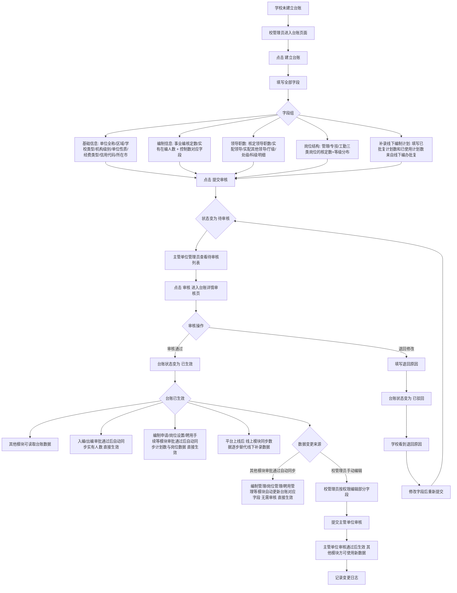
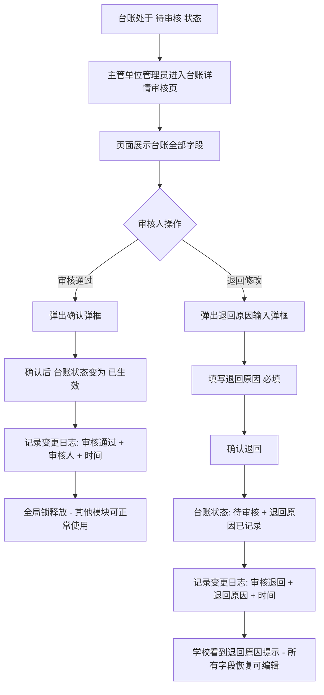
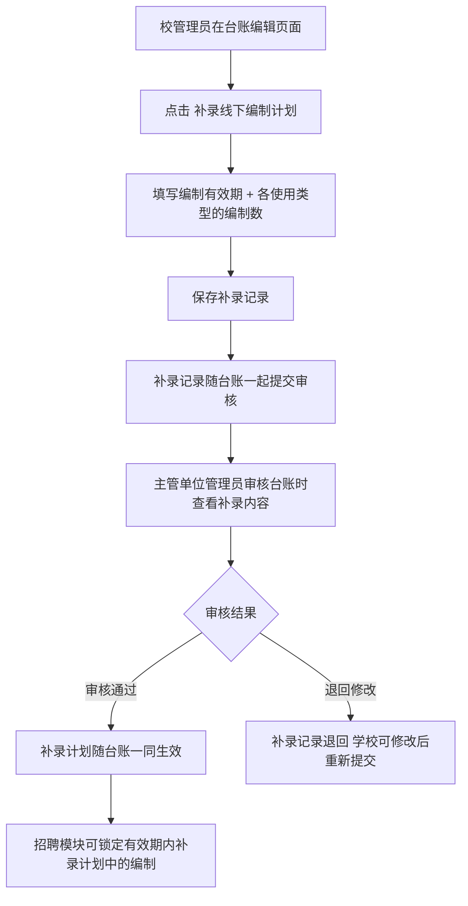

# 编制岗位台账模块

## 产品需求文档

**学校编制与岗位数据唯一权威数据源**

---

| 项目 | 内容 |
|------|------|
| 📅 日期 | 2026-07-14 |
| 📌 版本 | Version 1.0（正式版） |
| 📎 父文档 | PRD_总纲_柳州教育人事管理平台.md |

---

## 📑 目录

1. [模块概述](#一模块概述) — 定位、业务背景、核心价值、适用角色
2. [业务流程](#二业务流程) — 台账全生命周期、审核流程、编制计划补录、状态流转（Mermaid 流程图）
3. [功能清单](#三功能清单) — F07.01~F07.11 完整功能点（含前置条件/角色/业务规则/交互规则）
4. [页面字段清单](#四页面字段清单) — 各页面字段定义 + 校验规则表
5. [操作级权限矩阵](#五操作级权限矩阵)
6. [数据模型](#六数据模型) — 38 个字段的完整数据定义
7. [页面清单](#七页面清单)
8. [异常处理](#八异常处理) — 边界情况 + 错误场景
9. [通知触发点](#九通知触发点)
10. [操作日志埋点](#十操作日志埋点)
11. [验收标准](#十一验收标准) — 功能判定 + 关键测试场景
12. [迭代记录](#十二迭代记录)

---

## 一、模块概述

### 1.1 模块定位

编制岗位台账模块是柳州教育人事管理平台的**数据底座层（P0 基础层）**，作为全校编制和岗位数据的**唯一权威数据源**。台账以学校为单位建立，涵盖基础信息（10 个字段）、事业编编制（7 个字段）、控制数编制（7 个字段）、领导职数（6 个字段）、岗位结构（8 个字段）共 **38 个字段**，由校管理员录入、主管单位审核通过后正式生效，供编制申请、教师入编、教师出编、岗位设置、岗位晋升、招聘岗位、聘用手续等 7 个业务模块读取和回写。

本模块在总纲排期中为 **P0 平台基础层**，是岗位设置和编制使用申请的前置依赖——台账审批通过后，其他模块方可使用。

### 1.2 业务背景

- **数据孤岛消除**：当前平台中多个业务模块各自独立维护学校的编制和岗位数据，分散在多个页面文件中，数据值可能不一致。台账模块将这些分散数据归集到一个统一数据源，实现"一校一账、数出一源"
- **编制岗位一体化管理**：事业编（实名制）和控制数（备案制）的核定数、实有人数、已批复计划数、已使用计划数统一在一个台账中管理，实时联动各业务模块的审批操作
- **审核机制保障数据质量**：学校提交台账后须主管单位审核通过方可生效，审核期间全局锁定其他模块。审核时若发现数据问题则退回修改，由学校修正后重新提交
- **跨模块数据联动**：入编审批通过 → 实有在编人数 +1；出编审批通过 → 实有在编人数 -1；编制申请审批通过 → 已批复计划数累加；岗位设置审批通过 → 岗位结构更新。台账为所有联动操作的唯一落点
- **编制计划补录**：支持校管理员补录线下已批复的编制使用计划（含有效期），补录后招聘模块可锁定这些编制。解决编制申请模块上线前存量编制批复数据的录入问题

### 1.3 核心价值

| 价值 | 说明 |
|------|------|
| 📊 唯一数据源 | 消除多个模块各自维护编制数据的"数据孤岛"问题，台账为全校编制和岗位数据的唯一权威来源 |
| 🔗 跨模块联动 | 入编/出编/编制申请/岗位设置审批通过后自动回写台账，实时更新在编人数、批复计划数、岗位结构 |
| 🔒 全局锁定 | 台账审核期间全局锁定其他模块，确保基础数据变更时的数据一致性 |
| 📋 审核把关 | 主管单位审核台账数据，发现问题退回修改，学校修正后重新提交，确保数据准确可靠 |
| 📈 编制可视化 | 编制容量/占用/余量三段式可视化展示，岗位结构按等级×编制类型交叉展示，一目了然 |
| 📝 变更可追溯 | 每次编辑保存、审核通过、退回修改均记录变更日志，含变更内容、操作人、时间 |

### 1.4 适用角色

| 角色 | 标识 | 访问权限 |
|------|------|----------|
| 系统管理员 | `system` | 可查看全平台台账数据（只读），不可编辑、不可审核。系统管理员不参与业务审批 |
| 市管理员 | `city` | 查看全市学校列表和台账详情。审核市直属学校的待审核台账。可补录线下编制计划 |
| 区管理员 | `district` | 查看本区学校列表和台账详情。审核本区学校的待审核台账 |
| 校管理员 | `school` | 仅可查看和编辑本校台账。未建立台账时填写全部字段并提交审核。待审核/已生效后按权限矩阵编辑部分字段。可补录线下编制计划 |
| 教师 | `teacher` | 无台账模块访问权限 |

### 1.5 模块范围

侧边栏「通用」分组下的「编制岗位台账」菜单项，对应 **3 个页面**：

| 页面 | 功能点 | 说明 |
|------|--------|------|
| 台账管理列表页 | F07.01-F07.03 | 管理员视图：学校列表、搜索筛选、状态标签页、统计汇总、审核入口 |
| 台账学校视图页 | F07.04-F07.06, F07.08-F07.10 | 学校视图：本校台账概览、编制可视化、填写/编辑/提交、编制计划补录、到期提醒、实聘下钻、待审核只读 |
| 台账详情审核页 | F07.07, F07.11 | 详情/审核页：台账详情查看、审核通过/退回、编辑台账、变更日志 |

---

## 二、业务流程

### 2.1 台账全生命周期

### 2.2 审核流程详解

### 2.2a 编制计划补录流程

编制计划补录由**校管理员**在台账编辑页面操作，保存后须提交主管单位审核，审核通过后方可生效并被招聘模块使用。审核人在审核台账时可查看补录内容，若发现问题则退回修改。

### 2.3 台账状态流转

| 状态 | 说明 |
|------|------|
| **未建立** → **待提交** → **待审核** → **已生效** | 正常流转路径 |
| **待审核** → **已驳回** → **待审核** | 审核退回后学校修改重提 |

> 注：台账从"已生效"状态不可直接回到"待审核"。数据变更区分两类场景——① **其他模块审批通过后的自动同步**（如入编审批通过后实有人数+1）：系统直接更新台账对应字段，无需再次审核，即时生效；② **校管理员手动编辑**：编辑后须提交主管单位审核，审核通过后方可生效并被其他模块使用。主管单位审核时若发现数据问题，应退回修改让学校修正后重新提交。

---

## 三、功能清单

> **功能点总览：** 本模块共 **11** 个功能点，覆盖管理员列表（3）、学校台账（6）、详情审核（2）三大功能域。

| 编号 | 功能名称 | 功能 ID | 优先级 | 功能域 | 适用角色 | 所属页面 |
|------|----------|---------|--------|--------|----------|----------|
| 1 | 台账学校列表 | F07.01 | P0 | 管理员列表 | 市/区管理员 | 台账管理列表页 |
| 2 | 列表筛选与统计 | F07.02 | P0 | 管理员列表 | 市/区管理员 | 台账管理列表页 |
| 3 | 台账审核入口 | F07.03 | P0 | 管理员列表 | 市/区管理员 | 台账管理列表页 |
| 4 | 本校台账概览 | F07.04 | P0 | 学校台账 | 校管理员 | 台账学校视图页 |
| 5 | 台账填写与提交 | F07.05 | P0 | 学校台账 | 校管理员 | 台账学校视图页 |
| 6 | 台账编制可视化 | F07.06 | P1 | 学校台账 | 校管理员 | 台账学校视图页 |
| 7 | 台账详情与审核 | F07.07 | P0 | 详情审核 | 市/区/校管理员 | 台账详情审核页 |
| 8 | 编制计划补录 | F07.08 | P1 | 学校台账 | 校管理员 | 台账学校视图页 |
| 9 | 编制计划到期提醒 | F07.09 | P1 | 学校台账 | 市/区/校管理员 | 台账学校视图页 / 台账详情审核页 |
| 10 | 实聘人员列表（岗位下钻） | F07.10 | P2 | 学校台账 | 市/区/校管理员 | 台账学校视图页 / 台账详情审核页 |
| 11 | 编辑台账 | F07.11 | P0 | 详情审核 | 校管理员 | 台账详情审核页 |

---

### F07.01 台账学校列表 `P0`

- **页面**：台账管理列表页
- **适用角色**：市管理员（全市学校）；区管理员（本区学校）
- **前置条件**：当前用户已登录，拥有台账模块权限

**核心业务规则**：

1. 列表展示管辖范围内所有学校的台账记录，默认按学校名称排序
2. 每所学校一行，展示其台账关键指标的快照
3. 列表字段：标准视图为 **14 列**（全部/待审核/已驳回/已生效标签页）：序号、单位编号、单位名称、所属区域、学校类型、单位级别、事业编核定数、实有在编人数、控制数核定数、实有控制数、岗位总量、提交时间、状态、操作。待提交标签页使用**简化 6 列表格**：序号、学校编号、学校名称、所属区域、最近提醒、操作
4. 标准视图状态标签：**待审核**（黄色）、**已驳回**（红色，待审核且存在退回原因）、**已生效**（绿色）。待提交状态的台账不在此处展示，由独立的「待提交」标签页以简化表格承载
5. 列表分页显示，每页 10 条
6. 数据范围：按角色管辖范围过滤——市管理员看全市，区管理员看本区
7. 操作列按钮根据台账状态动态变化：待提交→「提醒建立」（无台账记录的新学校）或「提醒提交」（已建立未提交）或「已提醒」（当天已提醒）；待审核→「查看」「审核」（管辖范围内）；已驳回→「查看」；已生效→「查看」

**交互规则**：

- 顶部显示汇总统计栏：学校总数、事业编制合计、控制数合计、在编人数合计
- 列表为空时显示"暂无学校台账数据"空状态
- 点击「查看」→ 跳转台账详情审核页，以查看模式展示台账全部信息
- 点击「审核」→ 跳转台账详情审核页，以审核模式展示，可进行审核操作
- 区管理员仅可审核本区学校，非本区学校的「审核」按钮不显示

---

### F07.02 列表筛选与统计 `P0`

- **页面**：台账管理列表页
- **适用角色**：市/区管理员
- **前置条件**：已进入台账管理列表页

**核心业务规则**：

1. **顶部统计卡片**：显示当前筛选条件下的汇总数据——学校总数、事业编制合计、控制数合计、在编人数合计
2. **状态标签页**（5 个）：全部 / 待审核 / 已驳回 / 已生效 / 待提交。切换时列表和统计数据同步更新。其中「全部」标签页仅展示已提交过的台账，不包含待提交状态的记录
3. **搜索框**：支持按学校名称模糊搜索
4. **区域筛选**（仅市管理员可见）：下拉选择区县过滤
5. **提醒提交**：待提交标签页中展示两类学校——① 机构目录中存在但台账中无记录的新学校，显示「提醒建立」按钮；② 已建立台账但未提交的学校，显示「提醒提交」按钮。当天已提醒过的学校显示"已提醒"文字

**交互规则**：

- 统计栏在搜索/筛选/标签页切换时实时更新
- 「提醒提交」按钮点击后系统发送提醒通知（正式阶段需对接消息推送服务）
- 搜索框输入后自动触发过滤，避免频繁请求

---

### F07.03 台账审核入口 `P0`

- **页面**：台账管理列表页
- **适用角色**：市管理员（市直属学校）；区管理员（本区学校）
- **前置条件**：有待审核的台账记录，且当前用户拥有审核权限

**核心业务规则**：

1. 待审核标签页中展示所有处于"待审核"状态的台账记录
2. 每条待审核记录操作列显示「查看」和「审核」按钮
3. 点击「审核」→ 跳转到台账详情审核页，进入审核模式
4. 审核权限校验：市管理员只能审核"市直属"的台账；区管理员只能审核本区的台账。非管辖范围内的待审核记录仅显示「查看」
5. 审核操作在详情审核页完成（详见 F07.07）

**交互规则**：

- 待审核标签页数字角标实时显示待审核数量
- 管辖范围外的待审核记录不显示「审核」按钮

---

### F07.04 本校台账概览 `P0`

- **页面**：台账学校视图页
- **适用角色**：校管理员
- **前置条件**：当前用户为校管理员角色，已登录

**核心业务规则**：

1. **未建立台账**：显示引导页——"尚未建立编制岗位台账"提示 + 引导说明文字 +「建立台账」按钮
2. **已建立台账**：展示本校台账完整信息，分为以下区域：
   - ① **页面头部**：台账标题 + 状态标签（编辑中/待审核/已驳回/已生效）+ 提交/更新时间 + 操作按钮（已生效和已驳回状态显示「编辑」按钮，点击后进入编辑模式）
   - ② **基础信息区**（只读展示）：分"标识信息"和"分类属性"两组展示。标识信息含单位名称、单位编号、统一社会信用代码；分类属性含所属区域、学校类型、单位级别、单位性质、经费类型、岗位设置分类。数据来源于机构管理模块，提示"机构基础信息如需修改，请前往机构管理模块编辑"并附带超链接
   - ③ **编制概览区**（编制到期提醒条 + 4 张统计卡片）：先显示补录计划到期提醒（如有即将过期的补录计划），再以文字卡片形式展示事业编核定数/实有/空缺/可申请以及控制数核定数/实有/空缺/可申请
   - ④ **编制使用情况**（左右双卡片）：事业编卡片（容量/占用/余量三段式）+ 控制数卡片（同上）
   - ⑤ **岗位结构区**：三类岗位（管理/专技/工勤）的核定岗位数/实有人数/等级分布 + 小高地岗位 + 岗位总量
   - ⑥ **领导职数区**：核定领导职数、实配领导、实配其他领导、厅级/处级/科级分级别明细
3. 各区域的字段编辑权限按生效后权限矩阵控制（详见第五节）

**交互规则**：

- 台账待审核状态时顶部显示提示条："⏳ 台账已提交至上级管理部门审核，审核期间不可修改"
- 已驳回时显示退回原因（红色背景卡片）
- 右侧展示变更记录时间轴（只读），按时间倒序显示编辑/提交/审核/退回等操作历史
- 页面布局为左侧主内容区 + 右侧变更日志侧边栏

---

### F07.05 台账填写与提交 `P0`

- **页面**：台账学校视图页
- **适用角色**：校管理员
- **前置条件**：台账处于"未建立"或"已驳回"状态

**核心业务规则**：

1. **首次建立台账**：
   - ① 从引导页点击「建立台账」→ 进入编辑模式，所有字段可编辑
   - ② 填写全部字段（按 5 个信息分组展示），字段分组：基础信息 / 编制信息 / 领导职数 / 岗位结构 / 编制计划
   - ③ 点击「提交审核」→ 弹框标题为"首次提交申报"，不展示变更明细区域。确认后台账状态变为"待审核"，记录提交时间
2. **退回后重新提交 / 已生效后编辑提交**：
   - ① 顶部显示退回原因卡片（如有）
   - ② 所有字段恢复可编辑（预填上次填写的数据）
   - ③ 点击「提交审核」→ 弹框标题为"再次提交申报"，展示「📋 本次变更内容」区域（列出字段新旧值对比和补录计划增减），**须填写修改原因**（必填）
   - ④ 确认后清除退回原因，状态恢复为"待审核"
3. **数据校验**（以下全部通过方可提交审核）：
   - ① **完整性校验**：机构基础信息必须全部填写完整；事业编制信息和控制数编制信息必须填写，且两项核定数至少有一项大于 0；岗位结构必须完整填写；领导职数必须完整填写
   - ② **待完善人员校验**：提交前须确认本校不存在待完善人员——即所有在编教师账号必须已匹配岗位类别和岗位等级。若存在待完善人员，提示"本校还有 X 名教师缺少岗位信息，请前往账号管理补充后再提交台账"，并阻止提交
   - ③ **岗位结构校验**：各等级核定数合计不能超过对应类别的核定岗位数；三类核定岗位数合计必须等于岗位总量
4. 提交前系统自动同步汇总数据：领导职数合计由厅/处/科三级明细自动汇总；补录计划的已批复统计由计划列表自动汇总
5. 提交后台账进入待审核状态，审核期间学校不可修改
6. **取消编辑行为**：未提交过的台账取消编辑时直接丢弃数据回到未建立状态；已提交过的台账取消编辑时从存储重新加载，丢弃本次所有修改

**交互规则**：

- 已生效和已驳回状态下需点击「编辑」按钮进入编辑模式。编辑模式下底部显示「取消编辑」和「提交审核」两个按钮
- 首次提交时弹框标题为"首次提交申报"，不展示变更明细；再次提交时弹框标题为"再次提交申报"，展示变更明细，须填写修改原因
- 提交成功后刷新页面，退出编辑模式进入待审核只读视图（提示条显示详见 F07.04）
- 支持单文件申报附件上传（PDF/Word/Excel/图片，≤10MB，不支持压缩包格式 .zip/.rar/.7z/.tar/.gz）

---

### F07.06 台账编制可视化 `P1`

- **页面**：台账学校视图页
- **适用角色**：校管理员
- **前置条件**：台账已建立（含已提交、待审核、已生效状态）

**核心业务规则**：

1. **编制概览卡片**（4 张文字卡片）：事业编制（核定数）、控制数（核定数）、在编人数（事业编实有+控制数实有）、空缺编制（可申请编制数+可申请控制数）
2. **编制使用情况**（双卡片左右布局）：
   - ① 事业编卡片：
     - 编制容量（文字展示）：显示核定编制数。可申请数 > 0 时蓝色，可申请数 ≤ 0 时红色
     - 编制占用：实有在编人数 + 空缺编制计算公式（"空缺编制 = 核定数 - 实有人数 = X 人"）。如有跨校人员，显示"└ 其中跨校人员 X 人（借调 X / 支教 X / 轮岗 X）"。已批复计划数（含 ⓘ 提示 +「查看明细 ›」链接，编辑模式下额外显示「[+ 补录]」链接）、已使用计划数（缩进展示，含 ⓘ 提示）、未使用计划数（含 ⓘ 提示）。如有已过期但仍有占用的计划，追加"到期占用中"行（橙色文字）
     - 编制余量：可申请编制数（含 ⓘ 提示，核定 - 实有 - 已批复）
   - ② 控制数卡片：同上结构
3. **岗位结构表格**：三类岗位 × 等级双向交叉表——行=类别（管理/专技/工勤）× 等级，列=核准岗位数/实有人数（含事业编+控制数分列+超岗聘用数+小高地岗位）
4. 所有由公式计算的字段系统实时自动计算，无需手动刷新

**交互规则**：

- 编制容量颜色：可申请数 > 0 时蓝色，可申请数 ≤ 0 时红色
- 岗位结构表中超岗聘用数大于 0 时以红色字体高亮
- 各编制指标旁 ⓘ 图标点击弹出浮层解释该字段的含义和计算方式
- 已批复计划数旁「查看明细 ›」链接点击弹出计划明细弹框；编辑模式下「[+ 补录]」链接点击弹出补录弹框

---

### F07.07 台账详情与审核 `P0`

- **页面**：台账详情审核页
- **适用角色**：市/区管理员（审核+查看）；校管理员（查看+编辑，编辑功能详见 F07.11）
- **前置条件**：从台账列表点击"查看"或"审核"进入。页面支持通过参数切换模式：`mode=view`（查看，全部角色可用）、`mode=review`（审核，仅市/区管理员可用，且须在管辖范围内）。编辑模式见 F07.11

**核心业务规则**：

1. **查看模式（mode=view）**：
   - ① 全部台账字段只读展示，与学校视图的字段分组一致
   - ② 右侧展示变更记录时间轴
   - ③ 基础信息数据从机构管理模块同步展示
   - ④ 编制补录计划以表格形式展示：使用类型、编制数、有效期起止、状态
2. **审核模式（mode=review，仅市/区管理员）**：
   - ① 全部台账字段**只读展示**，审核人不可修改字段值。若发现数据问题，应通过「退回修改」让学校修正后重新提交
   - ② 页面底部显示**两个操作按钮**：
     - **退回修改**（红色）：弹出退回原因输入弹框（必填）→ 确认后记录退回原因，写入变更日志。学校看到退回原因后可重新编辑提交
     - **审核通过**（绿色）：弹出确认弹框，显示学校名称 → 确认后台账状态变为"已生效"，记录审核人和审核时间，写入变更日志
   - ③ 市管理员仅可审核"市直属"台账，区管理员仅可审核本区台账。无权限时显示 🔒 专属错误页，提示管辖范围并引导返回列表
3. **权限控制**：区管理员访问非本区台账时显示"您无权查看该校的台账数据"错误页；市管理员对非市直属台账仅可查看（无法进入审核模式）。编辑功能见 F07.11
4. **全局锁定**：台账处于待审核状态时，其他模块（编制申请/岗位设置/招聘等）暂停新申请。审核通过后锁定释放
5. 变更日志记录每次操作的类型（提交申报/审核通过/审核退回）、操作人、时间和变更内容。变更明细以**可折叠形式**展示，默认收起，点击"▸ 变更明细（N 项）"展开，点击"▾ 收起明细"收起

**交互规则**：

- 面包屑导航：工作台 / 编制岗位台账 / 台账详情（学校名称）
- 审核模式下页面头部显示黄色「🟡 待审核」状态标签
- 审核模式下全部字段只读，审核人不可修改
- 退回原因弹框校验：退回原因不能为空
- 审核通过弹框显示学校名称，确认后台账立即生效
- 无权限访问时显示 🔒 专属错误页，提示管辖范围并提供「← 返回列表」按钮

---

### F07.08 编制计划补录 `P1`

- **页面**：台账学校视图页（校管理员编辑模式）
- **适用角色**：校管理员（台账编辑模式下可补录，补录后随台账一同提交审核）
- **前置条件**：台账已建立且处于可编辑状态（未建立/已驳回/已生效后编辑），当前用户为校管理员

**核心业务规则**：

1. 编制计划补录由**校管理员**在台账编辑页面操作，用于录入线下已通过编办批复的编制使用记录。补录弹框**按编制类型分开**，每次只处理一种编制类型（事业编或控制数），弹框标题为"补录线下{事业编/控制数}编制计划"
2. 补录弹框包含以下字段：
   - ① **批复文号**（文本输入，必填，如"柳编办[2025]8号"）
   - ② **编制有效期起始**（日期选择，必填）
   - ③ **编制有效期截止**（日期选择，必填，须晚于起始日期）
   - ④ **使用类型明细表**（多行输入，6 种使用类型，每行含 4 列）：
     - 使用类型（固定枚举）：① 统一公开招聘 / ② 自主实施招聘 / ③ 中高级人才招聘 / ④ 引进高层次人才 / ⑤ 调动 / ⑥ 其他
     - 批复（数字输入，默认 0，编办批准数）
     - 已占用（数字输入，默认 0，招聘途中已锁定的数量）
     - 已入编（数字输入，默认 0，已正式入编的数量。若已有入编记录则字段锁定为只读）
     - 未使用（系统自动计算：批复 − 已占用 − 已入编）
   - ⑤ **附件**（文件上传，选填，支持 PDF/Word/Excel/JPG/PNG，≤10MB）
   - ⑥ **备注**（文本域，选填，补充说明）
3. 逐行填写各使用类型的编制使用情况。如某类型无数据填 0，合计不能全为 0
4. 表格底部显示公式："未使用合计 = 批复合计 − 已占用合计 − 已入编合计 = X 人"，动态更新
5. 每条补录记录系统自动生成唯一编号，保存到台账对应编制类型的补录计划列表中
6. 补录记录保存后，**随台账一同提交主管单位审核**。审核通过后，补录计划随台账一同生效
7. **审核通过生效后**，编制有效期内且未被招聘锁定的补录记录方可被招聘模块使用；过期的补录记录以"已过期"标注
8. 支持**编辑已有补录计划**：点击已保存的补录计划可打开编辑弹框，弹框标题变为"编辑线下{事业编/控制数}编制计划"
9. 审核人在审核台账时可查看补录内容，若发现问题则退回修改让学校重新提交

**交互规则**：

- 校管理员在台账编辑页面的编制使用情况卡片中点击「[+ 补录]」链接或「+ 补录线下计划」按钮弹出补录弹框
- 表头 ⓘ 图标点击可查看每个字段的含义和填写示例
- 合计行和未使用公式行自动计算，不能全为 0（保存时校验）
- 关闭弹框时若已填写数据，弹出确认提示"已填写的数据将丢失，确认关闭？"
- 补录记录在台账详情页以表格形式展示（批复文号 / 使用类型明细 / 编制数 / 有效期 / 状态）
- 已过期的计划显示灰色"已过期"标签
- 补录记录随台账提交审核，审核期间不可修改

---

### F07.09 编制计划到期提醒 `P1`

- **页面**：台账学校视图页 / 台账详情审核页
- **适用角色**：市/区/校管理员（查看台账时展示）
- **前置条件**：台账中存在补录编制计划记录

**核心业务规则**：

1. 台账概览区域顶部展示编制计划到期提醒条，根据计划状态分三类：
   - ① **即将到期**（⚠️ 橙色提醒）：距到期日 ≤ 60 天且仍有剩余名额的计划。提示文案："X 个计划即将到期，请尽快安排招聘或入编"。逐计划显示：计划编号、剩余人数、剩余天数、到期日期
   - ② **已到期但仍有占用**（🟠 橙色提醒）：已到期但仍有在途人员待入编的计划。提示文案："X 个计划已过期，仍有在途人员待入编"。逐计划显示：计划编号、占用人数、到期日期。附加说明："占用名额仍有效，请尽快为占用人员办理入编手续"
   - ③ **已到期且彻底失效**（🔒 灰色提醒）：已到期且无占用的计划。提示文案："X 个计划已到期，未使用名额已释放"。逐计划显示：计划编号、已释放名额数、到期日期
2. 三类提醒按优先级排列：过期但有占用 → 已到期失效 → 即将到期
3. 提醒条仅在编制概览区上方展示，不阻断其他内容的显示
4. **提醒消失规则**：
   - ⚠️ 即将到期：剩余名额用完或计划到期后自动消失
   - 🟠 已过期有占用：所有占用人员完成入编（占用数归零）后自动消失
   - 🔒 已到期失效：显示 30 天后自动隐藏（名额已释放，提醒价值递减）
5. **手动关闭**：每种提醒条右侧提供「✕ 忽略」按钮，点击后该条提醒当前会话内不再显示（刷新页面后若条件仍满足则重新出现）
6. 过期但有占用的计划：占用名额在入编时仍可继续使用（锁定状态不释放）；已到期且无占用的计划：未使用的编制名额自动释放，不可再被招聘锁定

---

### F07.10 实聘人员列表（岗位等级下钻） `P2`

- **页面**：台账学校视图页 / 台账详情审核页
- **适用角色**：市/区/校管理员
- **前置条件**：台账已建立且岗位结构表中有实聘数据

**核心业务规则**：

1. 岗位结构表中每个等级的实有人数合计为可点击的数字链接
2. 点击后弹出动态标题弹框（标题格式为"{岗位类别} — {等级} 实聘人员"，如"专业技术岗位 — 七级 实聘人员"），分两个标签页展示：
   - ① **已匹配人员**：已明确岗位类别和等级的教师列表，字段包括姓名、编制类型、身份证号、入编方式、跨校状态
   - ② **待完善人员**：属于本校但缺少岗位类别或等级信息的人员列表，字段与已匹配人员一致，提示"请前往账号管理补充"并附带超链接跳转
3. 弹框顶部显示汇总统计：该等级的核定数、实聘数、超岗数
4. 数据来源：从教师账号列表和行政账号列表中按学校名称和岗位信息匹配
5. 支持分页显示
6. 支持切换查看同一岗位类别下不同等级的人员列表（弹框内标签页切换）

**交互规则**：

- 岗位结构表中的合计数字以下划线链接样式展示（蓝色可点击）
- 弹框宽度自适应，最大 880px，内容区可滚动
- 待完善人员标签页仅在存在不完整数据时显示
- 已匹配人员为空时显示"暂无匹配的实聘人员"空状态

---

### F07.11 编辑台账 `P0`

- **页面**：台账详情审核页
- **适用角色**：校管理员（仅本校）
- **前置条件**：台账已建立，当前用户为校管理员，通过 `mode=edit` 参数进入编辑模式。主管单位（市/区管理员）不可使用编辑模式

**核心业务规则**：

1. 校管理员在台账详情审核页可通过编辑模式修改本校台账数据
2. 编辑模式下全部可编辑字段展示为可输入状态，与学校视图的编辑表单字段一致
3. 底部显示两个操作按钮：
   - **取消编辑**：放弃本次修改，跳转回查看模式（`mode=view`）
   - **保存修改**：弹出确认弹框（标题"保存修改"），须填写修改原因（必填），确认后保存修改内容，记录变更日志，台账进入待审核状态
4. 编辑模式下的可编辑字段范围与学校视图编辑模式一致（详见第五节权限矩阵）
5. 编辑保存后变更进入待审核状态，须主管单位审核通过后方可生效并被其他模块使用
6. 主管单位（市/区管理员）不可使用编辑模式——主管单位在审核时如发现数据问题应退回修改，由学校修正后重新提交

**交互规则**：

- 页面头部显示「编辑中」状态标签
- 岗位结构表支持直接修改数值，自动重算合计行
- 保存修改弹框仅包含修改原因输入框（必填），变更内容由系统在后台计算后直接写入变更日志
- 保存成功后自动返回查看模式，Toast 提示"台账修改已保存"

---

## 四、页面字段清单

### 4.1 台账管理 — 列表页字段（14 列）

| # | 字段名称 | 类型 | 说明 |
|---|----------|------|------|
| 1 | 序号 | 数字 | 列表行号，按分页递增 |
| 2 | 单位编号 | 文本 | 系统自动生成的机构唯一编号，格式 `gxlzh-{区域编码}-{序号}`（如 `gxlzh-08-001`），从机构目录关联 |
| 3 | 单位名称 | 文本 | 全站统一的单位标识，从机构目录关联 |
| 4 | 所属区域 | 枚举 | 市直属/各区县名 |
| 5 | 学校类型 | 枚举 | 小学/初中/高中/完中/九年一贯制/中职/幼儿园/特殊教育/专门学校/十二年一贯制 |
| 6 | 单位级别 | 枚举 | 副厅级/正处级/副处级/正科级/副科级/其他未定级 |
| 7 | 事业编核定数 | 数字 | 编办批复的事业编制员额上限 |
| 8 | 实有在编人数 | 数字 | 当前实际在编的事业编制人员数 |
| 9 | 控制数核定数 | 数字 | 编办批复的聘用控制数员额上限 |
| 10 | 实有控制数 | 数字 | 当前实际在岗的控制数人员数 |
| 11 | 岗位总量 | 数字 | 系统自动计算：事业编核定数 + 控制数核定数 - 小高地岗位数 |
| 12 | 提交时间 | 日期时间 | 学校提交审核的时间，未提交时显示"—" |
| 13 | 状态 | 枚举 | 待提交 / 待审核 / 已驳回 / 已生效 |
| 14 | 操作 | 操作按钮 | 查看 / 审核（待审核 + 管辖范围内） |

### 4.2 基础信息字段（9 个字段，只读）

基础信息来源于机构管理模块，台账页只读展示。页面显示提示"机构基础信息如需修改，请前往机构管理模块编辑"并附带超链接跳转。数据分为两组展示：

| # | 分组 | 字段名称 | 类型 | 必填 | 说明 |
|---|------|----------|------|------|------|
| 1 | 标识信息 | 单位名称 | 文本 | 是 | 事业单位法人证书上的法定名称，与公章一致 |
| 2 | 标识信息 | 单位编号 | 文本 | — | 系统自动生成，格式 `gxlzh-{区域编码}-{序号}`（如 `gxlzh-08-001`），从机构目录关联 |
| 3 | 标识信息 | 统一社会信用代码 | 文本 | 是 | 18 位，单位的法定身份证号 |
| 4 | 分类属性 | 所属区域 | 枚举 | 是 | 市直属/城中区/鱼峰区/柳南区/柳北区/柳江区/柳城县/鹿寨县/融安县/融水县/三江县 |
| 5 | 分类属性 | 学校类型 | 枚举 | 是 | 小学/初中/高中/完中/九年一贯制/十二年一贯制/中职/幼儿园/特殊教育/专门学校 |
| 6 | 分类属性 | 单位级别 | 枚举 | 是 | 副厅级/正处级/副处级/正科级/副科级/其他未定级 |
| 7 | 分类属性 | 单位性质 | 枚举 | 是 | 事业单位/参公事业单位/机关单位/其他 |
| 8 | 分类属性 | 经费类型 | 枚举 | 是 | 全额拨款/差额拨款/自收自支 |
| 9 | 分类属性 | 岗位设置分类 | 枚举 | — | 自治区示范高中/自治区特色高中/普通高中/初中/小学/幼儿园，从机构目录关联 |

### 4.3 编制信息字段（事业编 7 个字段 + 控制数 7 个字段）

| # | 分组 | 字段名称 | 类型 | 必填 | 生效后编辑权限 | 说明 |
|---|------|----------|------|------|---------------|------|
| 1 | 事业编 | 核定事业编制数 | 数字 | 是 | 仅校管理员可编辑 | 编办批复的事业编制员额上限 |
| 2 | 事业编 | 实有在编人数 | 数字 | 是 | 仅校管理员可编辑（生效后锁定） | 入编+1，出编-1（由业务流程驱动） |
| 3 | 事业编 | 已批复计划数 | 数字 | 是 | 只读（由业务流程驱动） | 编制申请审批通过时累加 |
| 4 | 事业编 | 已使用计划数 | 数字 | 是 | 只读（由业务流程驱动） | 入编审批通过时累加 |
| 5 | 事业编 | 未使用计划数 | 数字 | — | 系统自动计算 | 已批复计划数 - 已使用计划数 |
| 6 | 事业编 | 可申请编制数 | 数字 | — | 系统自动计算 | 核定数 - 实有人数 - 已批复计划数 |
| 7 | 控制数 | 核定控制数 | 数字 | 是 | 仅校管理员可编辑 | 编办批复的聘用控制数员额上限 |
| 8 | 控制数 | 实有控制数人数 | 数字 | 是 | 仅校管理员可编辑（生效后锁定） | 入编+1，出编-1（由业务流程驱动） |
| 9 | 控制数 | 已批复控制数 | 数字 | 是 | 只读（由业务流程驱动） | 编制申请审批通过时累加 |
| 10 | 控制数 | 已使用控制数 | 数字 | 是 | 只读（由业务流程驱动） | 入编审批通过时累加 |
| 11 | 控制数 | 未使用控制数 | 数字 | — | 系统自动计算 | 已批复控制数 - 已使用控制数 |
| 12 | 控制数 | 可申请控制数 | 数字 | — | 系统自动计算 | 核定数 - 实有人数 - 已批复控制数 |

> 注：已批复计划数和已使用计划数同时也受编制计划补录中未过期计划数的影响，补录记录中的批复数会计入"已批复"统计。

### 4.4 领导职数字段（6 个字段）

| # | 字段名称 | 类型 | 必填 | 生效后编辑权限 | 说明 |
|---|----------|------|------|---------------|------|
| 1 | 核定领导职数（合计） | 数字 | 是 | 只读（自动计算） | 由厅/处/科三级核定数自动合计 |
| 2 | 实配领导人数（合计） | 数字 | 是 | 只读（自动计算） | 由厅/处/科三级实配领导人数自动合计 |
| 3 | 实配其他领导人数（合计） | 数字 | 是 | 只读（自动计算） | 由厅/处/科三级实配其他领导人数自动合计 |
| 4 | 厅级领导职数 | 数字组 | 是 | 仅校管理员可编辑 | 含核定职数、实配领导人数、实配其他领导人数三个子字段 |
| 5 | 处级领导职数 | 数字组 | 是 | 仅校管理员可编辑 | 含核定职数、实配领导人数、实配其他领导人数三个子字段 |
| 6 | 科级领导职数 | 数字组 | 是 | 仅校管理员可编辑 | 含核定职数、实配领导人数、实配其他领导人数三个子字段 |

> 注：实配人数 = 实配领导人数 + 实配其他领导人数，系统自动计算。

### 4.5 岗位结构字段（8 个字段）

| # | 字段名称 | 类型 | 必填 | 生效后编辑权限 | 说明 |
|---|----------|------|------|---------------|------|
| 1 | 总量控制数 | 数字 | — | 系统自动计算 | 事业编核定数 + 控制数核定数 |
| 2 | 小高地岗位数 | 数字 | 是 | 仅校管理员可编辑 | 广西人才小高地专项岗位配额，包含在事业编核定数内 |
| 3 | 岗位总量 | 数字 | — | 系统自动计算 | 总量控制数 - 小高地岗位数 |
| 4 | 岗位三大类分布 | 数字组 | 是 | 仅校管理员可编辑 | 管理/专业技术/工勤技能岗位各自的核定数与实有人数 |
| 5 | 管理岗位等级分布 | 数字组 | 是 | 核准岗位数：生效后锁定 | 五级~十级，每等级含核定数、事业编实有、控制数实有、超岗聘用数 |
| 6 | 专业技术岗位等级分布 | 数字组 | 是 | 核准岗位数：生效后锁定 | 正高/副高/中级/初级，每等级含核定数、事业编实有、控制数实有、超岗聘用数、小高地岗位数 |
| 7 | 工勤技能岗位等级分布 | 数字组 | 是 | 核准岗位数：生效后锁定 | 一级~五级+普通工，每等级含核定数、事业编实有、控制数实有、超岗聘用数 |
| 8 | 实聘数明细 | 数字组 | — | 只读（由业务流程驱动） | 专业技术岗位每等级按实名编/控制数/超岗/小高地的实聘数拆分 |

### 4.6 编制计划补录 — 表单字段

补录弹框按编制类型分开（事业编 / 控制数），弹框标题为"补录线下{事业编/控制数}编制计划"。

| # | 字段名称 | 类型 | 必填 | 说明 |
|---|----------|------|------|------|
| 1 | 批复文号 | 文本 | 是 | 编办批复文件编号，如"柳编办[2025]8号" |
| 2 | 编制有效期起始 | 日期 | 是 | 编制批复的生效日期 |
| 3 | 编制有效期截止 | 日期 | 是 | 编制批复的失效日期，须晚于起始日期 |
| 4 | 使用类型 | 枚举 | 是 | 固定 6 种：① 统一公开招聘 / ② 自主实施招聘 / ③ 中高级人才招聘 / ④ 引进高层次人才 / ⑤ 调动 / ⑥ 其他 |
| 5 | 批复 | 数字 | — | 该使用类型下编办批准的数量，默认 0 |
| 6 | 已占用 | 数字 | — | 招聘途中已锁定的数量，默认 0 |
| 7 | 已入编 | 数字 | — | 已正式入编的数量，默认 0。若已有入编记录则锁定为只读 |
| 8 | 附件 | 文件 | 否 | 选填，支持 PDF/Word/Excel/JPG/PNG，≤10MB |
| 9 | 备注 | 文本 | 否 | 补充说明，选填 |

> 注：未使用 = 批复 − 已占用 − 已入编（系统自动计算）。合计校验：各使用类型批复数合计不能全为 0。

### 4.7 审核页面专属元素

| 审核专属元素 | 说明 |
|-------------|------|
| **审核操作栏** | 页面底部显示「退回修改」（红色）和「审核通过」（绿色）两个按钮。审核模式下所有字段只读，审核人不可修改 |
| **退回原因弹框** | 点击「退回修改」后弹出，退回原因为必填文本。确认后退回原因记录到台账中 |
| **审核确认弹框** | 点击「审核通过」后弹出确认弹框，展示学校名称，确认后台账立即生效 |
| **状态标识** | 页面标题显示「审核」字样 + 黄色「🟡 待审核」状态标签 + 提交时间 |

---

## 五、操作级权限矩阵

### 5.1 台账生效前（审核流程中）

| 操作 | 校管理员 | 区管理员 | 市管理员 | 系统管理员 |
|------|:--:|:--:|:--:|:--:|
| 填写/编辑全部字段（未建立/已驳回） | ✅ | — | — | — |
| 提交审核 | ✅ | — | — | — |
| 查看台账详情 | ✅ 本校 | ✅ 本区 | ✅ 全市 | ✅ 全平台 |
| 审核通过 | — | 🔸 本区 | 🔸 市直属 | — |
| 退回修改 | — | 🔸 本区 | 🔸 市直属 | — |

### 5.2 台账生效后（按字段编辑权限）

| 数据区 | 字段 | 校管理员 | 区管理员 | 市管理员 | 系统管理员 |
|--------|------|:--:|:--:|:--:|:--:|
| 基础信息 | 全部 9 个字段 | 只读 | 只读 | 只读 | 只读 |
| 事业编 | 核定编制数 | ✅ | 只读 | 只读 | 只读 |
| 事业编 | 实有在编人数 | 🔸 生效后锁定 | 只读 | 只读 | 只读 |
| 事业编 | 已批复计划数、已使用计划数 | 只读 | 只读 | 只读 | 只读 |
| 事业编 | 未使用计划数、可申请编制数 | 只读 | 只读 | 只读 | 只读 |
| 事业编/控制数 | 到期占用中 | 只读 | 只读 | 只读 | 只读 |
| 控制数 | 核定控制数 | ✅ | 只读 | 只读 | 只读 |
| 控制数 | 实有控制数人数 | 🔸 生效后锁定 | 只读 | 只读 | 只读 |
| 控制数 | 已批复控制数、已使用控制数 | 只读 | 只读 | 只读 | 只读 |
| 控制数 | 未使用控制数、可申请控制数 | 只读 | 只读 | 只读 | 只读 |
| 领导职数 | 合计 3 字段 | 只读 | 只读 | 只读 | 只读 |
| 领导职数 | 分级别子字段 | ✅ | 只读 | 只读 | 只读 |
| 岗位结构 | 小高地岗位数 | ✅ | 只读 | 只读 | 只读 |
| 岗位结构 | 核准岗位数 | 🔸 生效后锁定 | 只读 | 只读 | 只读 |
| 岗位结构 | 实有人数 | 只读 | 只读 | 只读 | 只读 |

> 注：上述编辑权限为台账生效后的初始化编辑权限。所有编辑操作均须提交主管单位审核，审核通过后方可生效。主管单位审核时不可修改台账数据，发现问题应退回修改。系统管理员仅可查看，不参与业务操作。

### 5.3 全局锁定规则

> **台账审核期间全局锁定**：台账处于待审核状态时，其他模块（编制使用申请、岗位设置、招聘岗位、教师入编、教师出编、岗位晋升、聘用手续）不可发起新申请，进行中的审批也暂停操作，直至台账审核完成。

---

## 六、数据模型

### 6.0 存储说明

- **当前阶段**：数据以浏览器端存储方式保存，以学校为维度组织。无后端、无数据库。
- **正式阶段（规划）**：将迁移至服务端数据库，对应学校编制台账表和台账管理 API。

### 6.1 台账完整数据定义（共 38 个业务字段 + 状态管理字段 + 变更记录）

#### 一、台账状态管理信息

| # | 字段名称 | 类型 | 说明 |
|---|----------|------|------|
| 1 | 台账状态 | 枚举 | 待审核 / 已生效（未建立的学校在台账中不存在记录） |
| 2 | 提交时间 | 日期 | 学校提交审核的时间 |
| 3 | 审核通过时间 | 日期 | 审核通过的时间 |
| 4 | 审核人 | 文本 | 审核操作人姓名 |
| 5 | 退回原因 | 文本 | 审核退回时填写的原因，重新提交后清空 |

#### 二、基础信息（9 个字段，来源于机构管理模块）

| # | 字段名称 | 类型 | 示例值 | 含义 | 数据来源 |
|---|----------|------|--------|------|----------|
| 1 | 单位全称 | 文本 | 柳州市第一中学 | 事业单位法人证书上的法定名称 | 编办批复 |
| 2 | 所属区域 | 枚举 | 城中区 / 市直属 | 学校所在行政区 | 行政划分 |
| 3 | 学校类型 | 枚举 | 高中 | 办学层次 | 教育部门 |
| 4 | 单位级别 | 枚举 | 正处级 | 学校在行政体系中的级别 | 编办核定 |
| 5 | 单位性质 | 枚举 | 事业单位 | 机构的组织属性 | 编办核定 |
| 6 | 经费类型 | 枚举 | 全额拨款 | 经费的财政保障方式 | 编办+财政 |
| 7 | 统一社会信用代码 | 文本 | 18位 | 单位的法定身份证号 | 事业单位登记管理局 |
| 8 | 所在市 | 文本 | 柳州市 | 学校所在城市，为常量 | 行政划分 |

> **机构编号（orgId）格式**：`gxlzh-{区域编码}-{序号}`，由机构管理模块新增机构时自动生成。区域编码：`00` 市直属、`01` 柳城县、`02` 鹿寨县、`03` 融安县、`04` 融水县、`05` 三江县、`06` 柳北区、`07` 城中区、`08` 鱼峰区、`09` 柳南区、`10` 柳江区。序号从 `001` 开始，同区域内按最大序号 +1 递增。示例：`gxlzh-08-001` = 鱼峰区第 1 所机构。

#### 三、编制信息 — 事业编（7 个字段）

| # | 字段名称 | 类型 | 示例值 | 含义 | 变更驱动 |
|---|----------|------|--------|------|----------|
| 1 | 核定事业编制数 | 数字 | 88 | 编办批复的事业编制员额上限 | 编办核定，手动维护 |
| 2 | 实有在编人数 | 数字 | 80 | 当前实际在编的事业编制人员数 | 入编+1，出编-1 |
| 3 | 已批复计划数 | 数字 | 5 | 编制使用申请中已获批的计划数累计 | 编制申请审批通过 |
| 4 | 已使用计划数 | 数字 | 4 | 已通过入编实际使用的计划数 | 入编审批通过 |
| 5 | 未使用计划数 | 数字 | 1 | 已批复计划数 - 已使用计划数 | 系统自动计算 |
| 6 | 可申请编制数 | 数字 | 3 | 核定数 - 实有人数 - 已批复计划数 | 系统自动计算 |
| 7 | 到期占用中 | 数字 | 0 | 已过期但仍有在途人员待入编的编制数 | 系统自动计算（根据补录计划状态） |

#### 四、编制信息 — 控制数（7 个字段）

| # | 字段名称 | 类型 | 示例值 | 含义 | 变更驱动 |
|---|----------|------|--------|------|----------|
| 1 | 核定控制数 | 数字 | 16 | 编办批复的聘用控制数员额上限 | 编办核定，手动维护 |
| 2 | 实有控制数人数 | 数字 | 14 | 当前实际在岗的控制数人员数 | 入编+1，出编-1 |
| 3 | 已批复控制数 | 数字 | 3 | 编制使用申请中已获批的控制数累计 | 编制申请审批通过 |
| 4 | 已使用控制数 | 数字 | 1 | 已通过入编实际使用的控制数 | 入编审批通过 |
| 5 | 未使用控制数 | 数字 | 2 | 已批复控制数 - 已使用控制数 | 系统自动计算 |
| 6 | 可申请控制数 | 数字 | 1 | 核定数 - 实有人数 - 已批复控制数 | 系统自动计算 |
| 7 | 到期占用中 | 数字 | 0 | 已过期但仍有在途人员待入编的控制数 | 系统自动计算（根据补录计划状态） |

#### 五、领导职数（6 个字段）

| # | 字段名称 | 类型 | 示例值 | 含义 | 变更驱动 |
|---|----------|------|--------|------|----------|
| 1 | 核定领导职数 | 数字 | 5 | 编办批准的校级领导岗位数上限 | 编办核定，手动维护 |
| 2 | 实配领导人数 | 数字 | 4 | 当前实际在岗的校级领导人数 | 组织部门任命 |
| 3 | 实配其他领导人数 | 数字 | 3 | 享受相应职级待遇的管理人员 | 组织部门备案 |
| 4 | 厅级领导职数明细 | 数字组 | 核定 0，实配领导 0，实配其他领导 0 | 厅级领导职数的核定与实配 | 组织部门核定 |
| 5 | 处级领导职数明细 | 数字组 | 核定 0，实配领导 5，实配其他领导 0 | 处级领导职数的核定与实配 | 组织部门核定 |
| 6 | 科级领导职数明细 | 数字组 | 核定 0，实配领导 0，实配其他领导 0 | 科级领导职数的核定与实配 | 组织部门核定 |

> 注：核定领导职数（合计）= 厅级核定职数 + 处级核定职数 + 科级核定职数。实配领导人数（合计）= 厅级实配领导 + 处级实配领导 + 科级实配领导。实配其他领导人数（合计）= 厅级实配其他领导 + 处级实配其他领导 + 科级实配其他领导。实配人数 = 实配领导人数 + 实配其他领导人数，系统自动计算。

#### 六、岗位结构（8 个字段）

| # | 字段名称 | 类型 | 示例值 | 含义 | 变更驱动 |
|---|----------|------|--------|------|----------|
| 1 | 总量控制数 | 数字 | 104 | 事业编核定数 + 控制数核定数 | 系统自动计算 |
| 2 | 小高地岗位数 | 数字 | 0 | 广西人才小高地专项岗位配额 | 自治区人社厅批复 |
| 3 | 岗位总量 | 数字 | 104 | 总量控制数 - 小高地岗位数 | 系统自动计算 |
| 4 | 岗位三大类分布 | 数字组 | 管理/专技/工勤 | 岗位三大类的核定数与实有人数 | 岗位设置申请审批 |
| 5 | 管理岗位等级分布 | 数字组 | 五级~十级 | 按等级的核定/实有分布 | 岗位设置申请审批 |
| 6 | 专业技术岗位等级分布 | 数字组 | 三级~十三级 | 按等级+层级的核定/实有分布 | 岗位设置申请审批 |
| 7 | 工勤技能岗位等级分布 | 数字组 | 一级~五级+普通工 | 按等级的核定/实有分布 | 岗位设置申请审批 |
| 8 | 实聘数明细 | 数字组 | 按编制类型拆分 | 每等级按实名编/控制数/超岗/小高地拆分 | 入编/出编审批通过 |

#### 七、编制计划补录记录

补录计划按编制类型分为两个独立数组：事业编补录计划列表和控制数补录计划列表。

| # | 字段名称 | 类型 | 说明 |
|---|----------|------|------|
| 1 | 记录编号 | 文本 | 系统自动生成的唯一编号 |
| 2 | 批复文号 | 文本 | 编办批复文件编号 |
| 3 | 编制类型 | 枚举 | 事业编 / 控制数 |
| 4 | 来源类型 | 枚举 | 线上（编制申请模块同步）/ 线下（手动补录） |
| 5 | 有效期起始 | 日期 | 编制批复的生效日期 |
| 6 | 有效期截止 | 日期 | 编制批复的失效日期 |
| 7 | 使用类型明细 | 数字组 | 6种类型，每种含批复数、已占用数、已入编数、未使用数（自动计算） |
| 8 | 附件 | 文件 | 选填，批复文件扫描件 |
| 9 | 备注 | 文本 | 补充说明 |
| 10 | 创建时间 | 日期 | 补录记录的创建时间 |
| 11 | 计划状态 | 枚举 | 有效 / 即将到期 / 已过期 / 已过期有占用 |

#### 八、变更日志记录

系统维护两套独立记录：变更日志（页面展示）和提交日志（原始记录）。

| 记录类型 | 用途 | 包含字段 |
|----------|------|----------|
| **变更日志** | 页面右侧时间轴展示 | 操作类型（提交申报/再次提交申报/审核通过/审核退回）、操作时间、操作人、操作描述、退回原因、变更明细（可折叠展开）、补录计划变更、附件信息 |
| **提交日志** | 记录每次提交时的完整快照 | 提交时间、提交人、字段变更列表、补录计划变更列表、修改原因、附件信息 |

> 注：变更明细以可折叠形式展示，默认收起，点击"▸ 变更明细（N 项）"展开，再次点击收起。

#### 九、元数据

| # | 字段名称 | 类型 | 说明 |
|---|----------|------|------|
| 1 | 最后更新时间 | 日期 | 台账数据的最后修改日期 |
| 2 | 最后更新人 | 文本 | 最后一次修改操作的执行人 |

### 6.2 自动计算字段公式

| 计算字段 | 计算公式 | 说明 |
|----------|----------|------|
| 总量控制数 | 核定事业编制数 + 核定控制数 | 编制总量基准 |
| 岗位总量 | 总量控制数 - 小高地岗位数 | 常规岗位可分配总量 |
| 未使用计划数（事业编） | 已批复计划数 - 已使用计划数 | 待使用的计划数 |
| 可申请编制数（事业编） | 核定事业编制数 - 实有在编人数 - 已批复计划数 | 可申请的最大编制数 |
| 未使用控制数 | 已批复控制数 - 已使用控制数 | 待使用的控制数 |
| 可申请控制数 | 核定控制数 - 实有控制数人数 - 已批复控制数 | 可申请的最大控制数 |
| 空缺编制（事业编） | 核定事业编制数 - 实有在编人数 | 当前空缺数 |
| 空缺编制（控制数） | 核定控制数 - 实有控制数人数 | 当前空缺数 |

### 6.3 跨模块数据流

台账作为唯一数据源，7 个业务模块从台账读取数据，审批通过后回写台账：

| 模块 | 读取的台账数据 | 审批通过后回写的数据 |
|------|---------------|---------------------|
| 编制使用申请 | 事业编核定数/实有人数/计划数；控制数核定数/实有人数/计划数 | 已批复计划数（事业编/控制数）累加 |
| 教师入编 | 事业编核定数/实有人数/未使用计划数；控制数核定数/实有人数/未使用控制数；信用代码；领导职数 | 实有人数+1；已使用计划数+1 |
| 教师出编 | 事业编实有人数、控制数实有人数 | 实有人数-1 |
| 岗位设置 | 总量控制数、小高地岗位数、岗位总量、经费类型、学校类型 | 岗位大类分布、各等级分布更新 |
| 岗位晋升 | 专业技术岗位等级配额 | —（入编确认时更新实聘数） |
| 招聘岗位 | 单位全称、学校类型、单位级别、经费类型、所在市、所属区域 | —（入编确认时更新） |
| 聘用手续 | 单位全称、学校类型、单位级别、经费类型、所属区域 | —（不涉及占编占岗） |

---

## 七、页面清单

| # | 页面名称 | 页面文件 | 页面类型 | 功能说明 | 权限控制 |
|---|---------|----------|----------|----------|----------|
| 1 | 编制岗位台账管理 | `org-ledger-admin.html` | 列表 + 搜索筛选 | 管理员视角的学校列表（14列）、状态标签页、搜索筛选、统计汇总、审核入口、提醒提交 | 市管理员：全市；区管理员：本区 |
| 2 | 编制岗位台账（学校） | `org-ledger-school.html` | 概览 + 编辑 | 学校视角的本校台账详情、编制可视化、台账填写/编辑/提交、待审核只读、退回修改、变更日志 | 校管理员：本校 |
| 3 | 编制岗位台账详情 | `org-ledger-detail.html` | 详情 + 审核 + 编辑 | 台账完整详情查看、审核操作、编辑台账、编制计划补录、变更日志 | 市/区管理员：审核+查看；校管理员：查看+编辑 |

---

## 八、异常处理

### 8.1 边界情况

- **台账数据为空（未建立）**：学校管理员看到引导页——"尚未建立编制岗位台账"提示 +「建立台账」按钮。管理员的学校列表中将该校标记为"未建立"
- **机构目录数据缺失**：台账基础信息从机构管理模块关联读取。如果机构目录中无该校数据，基础信息字段显示"未同步"，提示"请先在机构管理中完善学校基础信息"
- **必填字段未填写**：提交审核时校验所有必填字段，未通过则提示"请填写所有必填字段"并定位到第一个缺失字段位置
- **岗位结构校验失败**：各等级核定数合计超过类别核定岗位数时，提示具体哪个类别的哪个等级超出上限
- **编制计划无效**：补录的编制计划中批复数合计为 0 时，提示"至少填写一项编制数"
- **提交后审核中**：待审核和已生效状态下学校端显示只读视图。已驳回状态下方可编辑并重新提交

### 8.2 错误场景

- **存储不可用**：浏览器隐私模式或存储空间满时，页面显示"存储不可用，请联系管理员"
- **台账数据损坏**：如果台账数据损坏或无法解析，页面展示错误提示并引导管理员进行数据恢复
- **全局锁定冲突**：台账审核期间其他模块提交申请时，提示"编制岗位台账审核中，请稍后再试"
- **非管辖范围审核**：区管理员试图审核非本区台账时，不显示「审核」按钮。直接通过页面参数访问审核模式时，系统校验权限并提示无权操作
- **教师角色访问**：教师角色无台账模块访问权限，侧边栏不显示台账菜单项
- **审核期间并发编辑**：同一台账被多个管理员同时审核时，后提交者覆盖前者。需引入版本号校验机制确保数据一致性（正式版）
- **编制计划过期**：已过期的补录计划在台账中标注"已过期"，不计入编制占用统计。招聘模块不可锁定过期计划中的编制
- **附件上传失败**：单文件超过 10MB 时弹出提示并阻止上传。不支持的文件格式在文件选择对话框中过滤

---

## 九、通知触发点

| 触发操作 | 通知对象 | 通知内容 | 渠道 |
|----------|----------|----------|------|
| 台账提交审核 | 主管单位管理员 | "{学校名称} 已提交编制岗位台账，请及时审核" | 站内消息 / 工作台待办 |
| 台账审核通过 | 校管理员 | "您的编制岗位台账已审核通过，各业务模块可正常使用" | 站内消息 |
| 台账审核退回 | 校管理员 | "您的编制岗位台账已被退回，原因：{退回原因}。请修改后重新提交" | 站内消息 / 工作台待办 |
| 台账全局锁定 | 所有相关模块的管理员 | "编制岗位台账审核中，编制申请/岗位设置/招聘等模块暂停新申请" | 工作台通知 |
| 台账全局锁定释放 | 所有相关模块的管理员 | "编制岗位台账已完成审核，各模块已恢复正常使用" | 工作台通知 |

> 注：通知需对接消息推送服务实现实时触达。通知规则如下——① **提交审核**和**审核退回**产生工作台待办（铃铛通知），需及时处理；② **审核通过**和**数据自动同步**（如入编后实有人数+1）仅通过站内消息告知，不产生待办，因为无后续操作或为系统自动行为。

---

## 十、操作日志埋点

遵循总纲 4.7 操作日志规范，本模块以下操作须自动记录日志：

| 功能域 | 操作类型 | 记录内容 |
|--------|----------|----------|
| 台账管理 | 建立台账 | 操作人、学校名称、初始编制数（核定事业编/控制数） |
| 台账管理 | 提交审核 | 操作人、学校名称、提交时间 |
| 台账管理 | 审核通过 | 操作人、学校名称、审核时间 |
| 台账管理 | 审核退回 | 操作人、学校名称、退回原因 |
| 台账管理 | 编辑台账 | 操作人、学校名称、修改原因、变更字段及新旧值 |
| 台账管理 | 补录编制计划 | 操作人、学校名称、补录计划内容（有效期+各使用类型编制数） |
| 台账管理 | 附件上传 | 操作人、学校名称、文件名、文件大小 |

---

## 十一、验收标准

### 11.1 功能判定标准

1. 市管理员可查看全市学校台账列表，区管理员仅可查看本区学校列表
2. 台账列表支持按状态筛选，搜索框可按学校名称搜索
3. 校管理员首次进入台账页面看到引导页，点击「建立台账」可进入编辑模式
4. 校管理员填写全部必填字段后可成功提交审核，台账状态变为"待审核"
5. 主管单位管理员可对待审核台账进行审核通过、退回修改操作
6. 审核通过后台账状态变为"已生效"，各业务模块可正常使用台账数据
7. 退回修改时校管理员看到退回原因，可重新编辑并提交
8. 台账生效后按权限矩阵控制各角色的编辑权限（仅校管理员可编辑，编辑后须提交审核，市/区管理员只读）
9. 编制概览卡片正确显示事业编/控制数的核定数、实有人数、空缺、可申请数
10. 编制容量文字颜色按可申请数正确变化（>0 蓝色，≤0 红色）
11. 岗位结构表各等级核定数合计不超过类别核定数
12. 补录编制计划可正常新增、查看，过期计划正确标注
13. 变更日志正确记录每次编辑、提交、审核、退回操作
14. 台账审核期间全局锁定：其他模块不可发起新申请
15. 提交申报附件上传功能正常（PDF/Word/Excel/图片，≤10MB，单文件）
16. 教师角色无台账模块访问权限

### 11.2 关键测试场景

| # | 测试场景 | 预期结果 |
|---|----------|----------|
| 1 | 校管理员首次建立台账——填写全部字段并提交 | 台账状态变为"待审核"，记录提交时间。变更日志记录"提交申报" |
| 2 | 区管理员审核本区学校台账——审核通过 | 台账状态变为"已生效"，变更日志记录"审核通过"。台账可被其他模块读取 |
| 3 | 区管理员审核本区学校台账——退回修改 | 台账状态保持"待审核"，退回原因已记录。学校端看到退回原因，可重新编辑提交 |
| 4 | 市管理员审核台账——审核通过 | 台账状态变为"已生效"，变更日志记录"审核通过"。其他模块可读取台账数据 |
| 5 | 台账生效后校管理员编辑台账 | 进入编辑模式后可编辑核定数、领导职数等字段（实有人数和核准岗位数锁定），保存后进入待审核状态 |
| 6 | 台账生效后校管理员尝试编辑实有人数 | 字段锁定为只读，显示"已生效台账不允许修改"，不可编辑 |
| 7 | 校管理员补录线下编制计划 | 补录弹框可正常填写批复文号、有效期和各使用类型编制数，保存后随台账提交审核 |
| 8 | 台账待审核时，编制申请模块提交新申请 | 被全局锁定规则阻止，提示"台账审核中，请稍后再试" |
| 9 | 台账审核通过后，编制申请模块正常提交 | 台账数据可正常读取，提交成功，全局锁定释放 |
| 10 | 校管理员查看本校台账概览 | 4 张统计卡片数据正确，编制使用情况卡片文字展示正确，岗位结构表完整展示 |
| 11 | 区管理员通过页面参数访问非本区台账的审核模式 | 显示 🔒 专属错误页，提示"您无权查看该校的台账数据"并提供「← 返回列表」按钮 |
| 12 | 市管理员在台账列表中搜索"八中" | 列表过滤仅显示名称包含"八中"的学校 |
| 13 | 岗位结构表三级~十三级编制数合计校验 | 各级合计不超过专业技术岗位核定数，超出时提示具体超限信息 |
| 14 | 教师角色尝试访问台账页面 | 侧边栏不显示台账菜单项，直接访问时显示"无权访问" |
| 15 | 提交申报时上传附件 | PDF/Word/Excel/图片可正常上传。超过 10MB 时被拦截并提示 |
| 16 | 台账中存在即将到期（≤60天）的补录计划 | 概览区顶部显示 ⚠️ 到期提醒条，逐计划显示剩余天数和剩余人数 |
| 17 | 台账中存在已过期但仍有占用的补录计划 | 显示 🟠 提示"X 个计划已过期，仍有在途人员待入编"，占用名额仍有效 |
| 18 | 台账中所有计划均已过期且无占用 | 显示 🔒 提示"X 个计划已到期，未使用名额已释放" |
| 19 | 点击岗位结构表中某等级的合计数字 | 弹出"{类别} — {等级} 实聘人员"弹框，已匹配标签页展示人员列表 |
| 20 | 本校存在缺少岗位信息的教师时查看实聘列表 | 待完善标签页出现，提示"请前往账号管理补充"并附带超链接 |
| 21 | 校管理员在详情页进入编辑模式 | 页面头部显示「编辑中」标签，底部显示「取消编辑」+「保存修改」按钮 |
| 22 | 编辑模式下点击「保存修改」 | 弹出"保存修改"弹框，须填写修改原因（必填），确认后保存并记录变更日志 |
| 23 | 校管理员在已驳回状态下重新编辑并提交 | 弹框标题为"再次提交申报"，展示变更明细，须填写修改原因 |
| 24 | 补录计划截止日期已过期但仍有占用时确认补录 | 弹出确认提示"该计划截止日期已过期，但尚有 X 人占用未入编。确定补录此过期计划吗？" |
| 25 | 市管理员对非市直属台账进入审核模式 | 显示 🔒 错误页"市管理员仅可审核/编辑市直属学校台账"，提供「← 返回列表」按钮 |
| 26 | 切换到「待提交」标签页 | 列表切换为简化 6 列视图，展示未建立台账的学校和已建立未提交的学校 |

---

## 十二、迭代记录

| 版本 | 日期 | 变更内容 | 变更人 |
|------|------|----------|--------|
| v1.0 | 2026-07-14 | 初始版本，创建编制岗位台账模块 PRD。覆盖 11 个功能点：台账学校列表（F07.01）、列表筛选与统计（F07.02）、台账审核入口（F07.03）、本校台账概览（F07.04）、台账填写与提交（F07.05）、台账编制可视化（F07.06）、台账详情与审核（F07.07）、编制计划补录（F07.08）、编制计划到期提醒（F07.09）、实聘人员列表（F07.10）、编辑台账（F07.11）。包含 3 个页面、38 字段完整数据模型、Mermaid 流程图、权限矩阵（生效前+生效后+全局锁定）、跨模块数据流、异常处理、通知触发点、操作日志埋点、验收标准 26 场景。 | 产品 |

---

> 柳州教育人事管理平台 · 编制岗位台账模块 PRD · Version 1.0（正式版） · 2026-07-14
>
> 父文档：PRD_总纲_柳州教育人事管理平台.md · 内部文档
