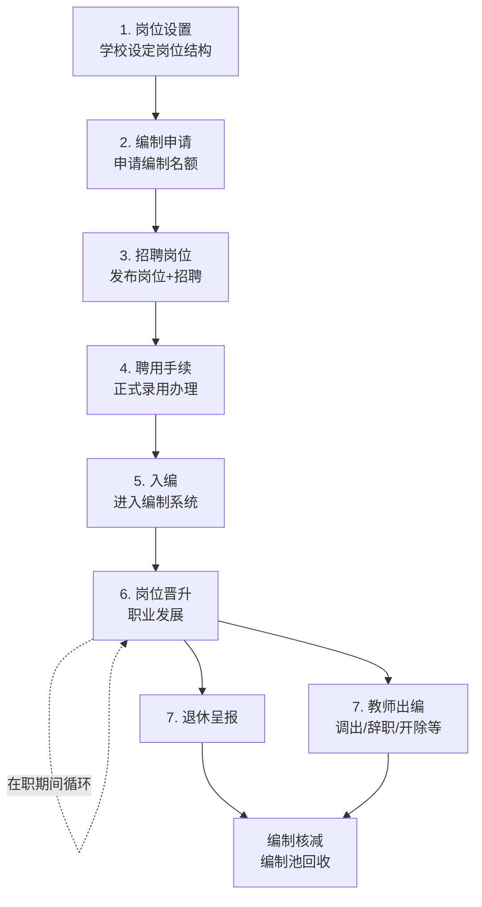
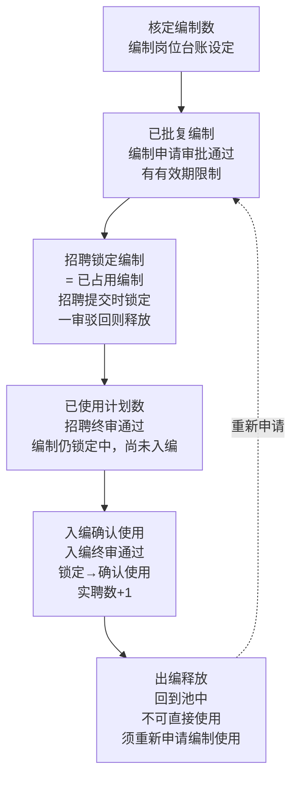
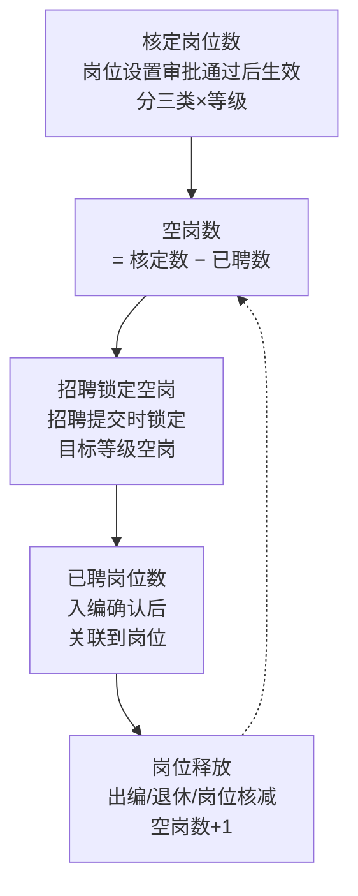
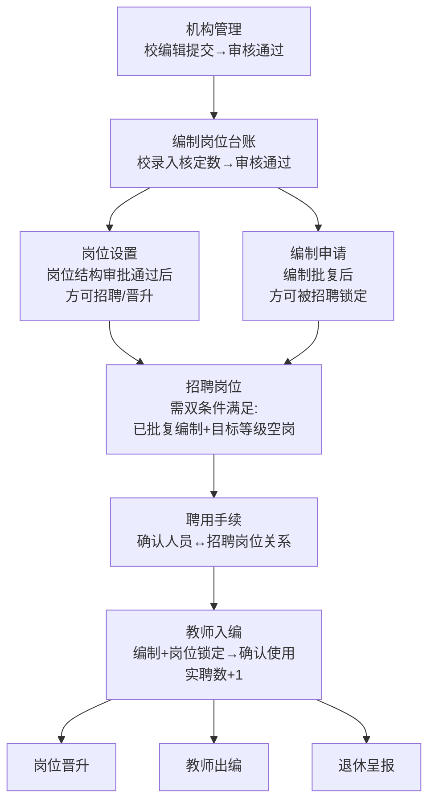

# 柳州教育人事管理平台 — 产品需求文档 · 总纲

> **文档版本**：Version 2.0  
> **日期**：2026-07-02  
> **文档定位**：开发团队内部  
> **适用范围**：全部 16 个功能模块（13 个已建成/在建 + 3 个规划中）

---

## 目录

1. [文档概述](#一文档概述)
2. [产品架构](#二产品架构)
3. [整体业务流程](#三整体业务流程)
4. [通用产品规则](#四通用产品规则)
5. [功能清单](#五功能清单)
6. [模块 PRD 索引](#六模块-prd-索引)
7. [排期计划](#七排期计划)

---

## 一、文档概述

### 1.1 项目背景

柳州市教育局下辖数百所公办中小学校及幼儿园，教职工编制管理（事业编 + 控制数）涉及编制申请、入编、出编、岗位设置、岗位晋升、招聘岗位、聘用手续、退休呈报等完整的人力资源管理链条。此外，编外教师（合同制）队伍也在持续扩大，需要统一纳管。

当前这些业务依赖纸质流程 + 分散的 Excel 台账，存在**数据不互通、审批周期长、统计困难、编制数据滞后**等问题。本平台旨在以信息化手段打通教育局 ↔ 学校之间的 HR 管理全链路，实现"一平台管编制、一张表看全局"。

### 1.2 产品目标

| 目标 | 说明 |
|------|------|
| 编制全流程数字化 | 覆盖编制申请→审批→入编→岗位晋升→出编→核减的完整闭环，实时更新编制台账，杜绝"超编超岗" |
| 多角色协同办公 | 市/区/校三级管理员 + 教师，各角色有独立工作台、待办提醒、权限隔离，审批链可配置 |
| 数据统一与规范 | 统一字段命名、枚举值体系、状态机、审批流程，确保跨模块数据可对比、可汇总、可导出 |
| 未来可扩展 | 预留与教育局其他系统（学籍、财务、OA）对接的接口设计，支持从 Demo 迁移至正式后端 |

### 1.3 适用范围

本文档覆盖柳州教育人事管理平台**全部 16 个功能模块**（13 个已建成/在建 + 3 个规划中）的需求定义。当前阶段为**纯前端 Demo**（localStorage 模拟数据），后续将迁移至 Vue 3 + Spring Boot + PostgreSQL 正式架构。

各模块的详细功能点、字段定义、流程图见对应的独立 PRD 文档（详见[第六节 模块 PRD 索引](#六模块-prd-索引)）。

### 1.4 术语定义

| 术语 | 全称 | 说明 |
|------|------|------|
| 事业编 | 事业编制（实名编） | 实名制管理，一人一编，编制在人在。入编需实名登记 |
| 控制数 | 聘用教师控制数（备案制） | 备案制管理，以学校为单位控制总数。入编为批量备案 |
| 合同制 | 编外合同制教师 | 非编制教师，签订劳动合同。单独管理通道 |
| 双轨 | 事业编轨 + 控制数轨 | 大部分模块（入编、出编、编制申请、岗位设置）都区分这两种编制类型 |
| 编制池 | 编制名额池 | 追踪核定编制数→已批复→已占用→确认使用的完整状态链 |
| 岗位池 | 岗位空缺池 | 各等级岗位的空岗数+锁定数+已聘数的统称，按等级分别管理 |
| 空岗数 | — | 岗位池中某等级当前可用的空缺岗位数 = 核定数 − 已聘数 − 锁定数 |
| 已批复编制 | — | 编制申请审批通过后的编制名额，**有有效期**，过期未锁定则失效 |
| 已占用编制 | — | 招聘申请提交时锁定的编制（尚未入编确认使用） |
| 锁定 | — | 申请提交时暂扣编制/岗位，审批驳回则释放，区别于"确认使用" |
| 确认使用 | — | 入编终审通过后，编制/岗位从"锁定"转为永久确认，实聘数+1 |
| 借岗 | — | 招聘申请时目标等级空岗不足，借用其他等级的空岗数 |
| 聘用汇总表 | — | 岗位设置/岗位晋升提交时附带的各等级实聘数统计表 |
| 实聘数 | 实际在聘人数 | 当前实际在岗聘用的教职工人数，入编+1、出编-1 |
| 终审 | 最终审批 | 审批链的最后一个节点。终审通过后业务数据生效 |
| 30天撤销 | — | 入编/招聘终审通过后30天内，审批人可操作"通过→驳回"回退 |
| 编办 | 编制委员会办公室 | 外部审批机构，编制使用申请的最终审批方（线下） |
| 人社 | 人力资源和社会保障局 | 外部审批机构，岗位设置等人事事项的审批方（线下） |
| 岗位核减 | — | 减少岗位数，同时释放被占用的编制和岗位，回到池中 |

---

## 二、产品架构

### 2.1 用户角色体系

**角色层级**：系统管理员 → 市管理员 → 区管理员 → 校管理员 → 教师

| 角色 | 标识 | 核心职责 | 典型操作 |
|------|------|----------|----------|
| 系统管理员 | `system` | 平台运维、账号管理、权限分配 | 创建/停用账号、分配角色、菜单管理、操作日志查看。**不参与业务审批，无工作台** |
| 市管理员 | `city` | 市直属学校审批、全市数据汇总 | 审批市直属学校的编制申请/入编/出编/晋升/岗位设置，查看全市报表 |
| 区管理员 | `district` | 区属学校审批、区级数据汇总 | 审批区属学校的各类申请，管理区级编制池 |
| 校管理员 | `school` | 学校数据维护、发起申请 | 录入教职工信息、发起编制/晋升/招聘申请、聘用手续办理、出编登记 |
| 教师 | `teacher` | 个人信息维护、申请提交 | 查看个人档案、申请岗位晋升、完善教育教学信息 |

### 2.2 功能模块全景图

#### 已完成模块（8 个）

| 模块 | 核心功能 |
|------|----------|
| 📋 编制使用申请 | 学校申请使用编制名额，双轨管理，二级审批，审批结果录入，批次管理 |
| 👤 教师入编 | 事业编实名入编（一人一表）+ 控制数备案入编（批量），单级审批，30天撤销期 |
| 🚪 教师出编 | 8种出编类型(事业编)/4种(控制数)，审批后永久锁定，自动冻结账号 |
| 📐 岗位设置 | 三类岗位(管理/专技/工勤)×等级，比例校验（按学校类型），二级审批+结果录入 |
| 📈 岗位晋升 | 批次发布→教师申请→三级审批→结果录入，双表类型，空岗数实时计算；含岗位考核降级处理 |
| 📝 招聘岗位 | 三类招聘（自主招聘/统一公招/中高级招聘），自主招聘三级审批，其余二级审批，与编制池岗位池联动 |
| 📎 聘用手续办理 | 招聘/调动两种来源，3/2套表单，二级审批+结果录入，附件4核减/暂缓 |
| 📊 编制岗位台账 | 校管理员录入→主管单位审核→通过后供其他模块使用；34字段模型，跨模块数据聚合 |

#### 进行中模块（5 个）

| 模块 | 核心功能 |
|------|----------|
| 🏢 机构管理 | 校编辑提交→主管单位审核→通过后供其他模块调用；统一学校目录，21字段模型，管理员-学校映射 |
| 🔧 系统管理 | 账号管理、菜单管理、角色权限配置、操作日志 |
| 👤 编外教师入职管理 | 合同制教师入职记录，列表和详情，独立于编制体系 |
| 🚪 编外教师离职管理 | 合同制教师离职记录，列表和详情，独立于编制体系 |
| 👤 个人中心 | 个人信息查看/编辑、教育教学信息、证书信息、账号安全 |

#### 规划中模块（3 个）

| 模块 | 核心功能 |
|------|----------|
| 📊 数据概览 | 各角色查看全模块数据统计，编制/岗位/人员/审批多维汇总 |
| 🏅 退休呈报 | 退休申请、退休年龄自动计算、审批流程 |
| 📢 师德师风举报 | 举报提交、受理、调查、处理结果公示 |

> 共 8 个已完成模块 + 5 个进行中模块 + 3 个规划中模块

### 2.3 技术架构（当前阶段）

- **架构模式**：纯前端 SPA-Like（多 HTML 页面 + Vanilla JS），localStorage 存储全部数据，无后端/无数据库
- **技术栈**：HTML5 + CSS3 + ES2020 JavaScript · Noto Sans SC 字体 · Nginx 静态服务 · Docker 部署
- **共享模块**：`src/menu-config.js`（统一侧边栏）、`src/logger.js`（操作日志）、`src/module-permissions.js`（权限控制）
- **规划迁移**：Vue 3 + Element Plus（前端）· Spring Boot（后端）· PostgreSQL（数据库）· MinIO（文件存储）

### 2.4 旧平台数据对接

旧平台（`lzjs.eduyunx.com`）为柳州市教育局现网运行的人事管理系统，基于 Ant Design Pro (UMI 3.5.17) + React 构建。

#### 2.4.1 对接原则

- **核心原则**：新旧平台**共用一套账号体系和机构数据**（同一账号可登录两个平台），但**管理员权限各自独立维护**。旧平台去除新增入口，**所有新增账号和新增机构在新平台进行**
- **账号体系**：旧平台存量账号保留。新增账号统一在新平台创建，创建后同步至旧平台（保证两边均可登录）。新平台为账号新增的主入口
- **机构数据**：旧平台存量机构保留。新增机构统一在新平台创建，创建后同步至旧平台。新平台为机构新增的主入口
- **权限独立**：管理员账号虽共用，但市/区/校管理员权限在新旧平台各自配置，互不影响
- **台账模块**：旧平台**无台账模块**，编制岗位台账为新平台完全新建的功能，不涉及旧平台数据迁移

#### 2.4.2 对接范围

| 对接内容 | 旧平台来源 | 新平台落点 | 对接方式 |
|----------|-----------|-----------|----------|
| 🔑 账号数据 | 旧平台账号体系（存量） | 登录模块 / 账号管理 | **共用一套账号**。**新增在新平台**，同步至旧平台。旧平台去除新增入口 |
| 🏫 机构数据 | 旧平台学校管理模块（存量） | 机构管理模块 | **共用一套机构数据**。**新增在新平台**，同步至旧平台 |
| 🔐 管理员权限 | — | 系统管理 / 角色权限配置 | **各自维护**。新旧平台独立配置，互不影响 |
| 📖 字典枚举值 | `/api/JiaoShi/DropdownData` | 全站下拉选项 | 手动提取 → 内置于前端代码 |
| 👤 教职工基础信息 | 旧平台教师管理模块 | 编制岗位台账 / 教师入编 | 正式阶段：数据迁移脚本 |
| 📊 编制/岗位台账数据 | —（旧平台无此模块） | 编制岗位台账 | **新平台完全新建** |
| 📝 审批流程数据 | 旧平台审批模块 | 各模块审批链 | 不迁移历史审批，新审批在新平台进行 |

#### 2.4.3 对接阶段策略

- **Demo 阶段（当前）**：枚举值已完成提取（21 个字段、370+ 值）。Demo 数据手动构建，账号/机构数据独立于旧平台。目标是页面功能和交互逻辑对齐旧平台
- **并行过渡期（规划）**：新平台接入旧平台存量账号和机构数据，实现统一登录。新增账号/机构在新平台操作，同步至旧平台。旧平台维持日常审批业务，新平台开始承载增量业务。台账数据在新平台初始化并独立运行
- **正式切换期（远期）**：旧平台历史业务数据全量迁移至新平台，旧平台降级为只读查询。所有新业务在新平台进行

#### 2.4.4 存量数据补齐方案

旧平台数据不完整——**无编制岗位信息、个人信息字段不全**。账号同步至新平台后，需引导用户补齐缺失数据。

**补齐内容分类：**

| 数据类型 | 缺失字段 | 补齐责任人 | 优先级 |
|----------|----------|-----------|--------|
| 编制/岗位核定数 | 核定编制数、核定控制数、各等级岗位核定数 | 区/市管理员 + 校管理员 | 🔴 必须 |
| 教师个人信息 | 学历、学位、职务、职称、任教学段/学科、汉语言水平、教师资格证等 | 教师本人 + 校管理员 | 🟡 部分必须 |
| 教师教育教学信息 | 初次任教时间、主要学段、其他学段、主要学科、其他学科 | 教师本人 | 🔵 建议补齐 |
| 学校基本信息 | 学校类型、办学规模、所属区域等 | 校管理员 | 🔴 必须 |

**补齐方式：**

- **方式1 — 首次登录引导（个人）**：教师首次登录新平台时，进入强制补齐向导，分步填写必填字段，不可跳过。选填字段可在个人中心补充
- **方式2 — 批量导入（学校）**：校管理员通过 Excel 模板批量导入本校教师的缺失信息
- **方式3 — 编制台账初始化（管理员）**：区/市管理员需录入编制岗位核定数作为台账初始值

**补齐前的功能限制：**

| 限制项 | 触发条件 | 解除条件 |
|--------|----------|----------|
| 编制申请不可发起 | 该校核定编制数未录入 | 台账初始化完成 |
| 招聘岗位不可发起 | 该校核定编制/岗位数未录入 | 台账初始化完成 |
| 岗位晋升不可申请 | 该教师职称/学历未补齐 | 教师补齐必填字段 |
| 岗位设置不可发起 | 学校类型/核定岗位数未录入 | 台账初始化 + 学校信息补齐 |

---

## 三、整体业务流程

### 3.1 教师全生命周期管理

以下展示了一名教师从"岗位空缺"到"退休出编"的完整业务链路：

### 3.2 核心数据池联动

平台存在两个相互关联但独立管理的数据池：**编制池**（管人头编制）和**岗位池**（管岗位空缺）。

#### A. 编制池

编制池追踪**"学校核定编制总数 → 已批复多少 → 招聘锁定多少 → 入编确认使用多少"**的完整状态链。编制池的**核定编制数由编制岗位台账设定**——校管理员录入、主管单位审核通过后，核定数生效，其他模块方可使用。

**编制生命周期：**

**编制有效期规则：**

- ⏰ 已批复编制有有效期，**有效期内**方可被招聘申请锁定
- ⏰ 超过有效期且未被锁定的已批复编制 → 失效，不可再被招聘锁定
- ⏰ **已被锁定的编制**，即使锁定期内原批复过期，仍可继续走招聘→入编流程

**各操作对编制池的影响：**

| 操作 | 影响 |
|------|------|
| ✅ 编制岗位台账 | 设定学校核定编制总数和各等级岗位总数 |
| ✅ 编制申请 | 审批通过后"已批复编制"增加（带有效期） |
| 🔒 招聘申请 | 提交时**锁定**有效期内已批复编制 |
| 🔓 招聘一审驳回 | **释放**锁定的编制 |
| 📊 招聘终审通过 | **已使用计划数 +1**（编制仍锁定） |
| ↩️ 招聘30天内撤销 | **已使用计划数 -1**，编制**释放锁定** |
| ➖ 聘用手续 | **不涉及占编**（仅确认人员↔岗位关系） |
| ⭐ 入编审批通过 | 编制**确认使用**（锁定→确认使用），实聘数 +1 |
| ↩️ 入编30天内撤销 | 编制**回退**（确认使用→锁定），实聘数 -1 |
| ⭐ 出编审批通过 | 编制**释放**，实聘数 -1（释放的编制不可直接使用，须重新申请编制使用并审批通过） |
| 🔓 岗位核减 | 编制**释放** |

#### B. 岗位池

岗位池追踪**"学校每个岗位等级有多少空岗、招聘锁定多少、已聘多少"**。

**岗位生命周期（按等级分别管理）：**

**各操作对岗位池的影响：**

| 操作 | 影响 |
|------|------|
| ✅ 岗位设置 | 设定各等级岗位总数（管理/专技/工勤 × 等级） |
| 🔒 招聘申请 | 提交时**锁定**目标等级空岗（若借岗，锁定借出方等级空岗） |
| 🔓 招聘一审驳回 | **释放**锁定的岗位 |
| 📊 招聘终审通过 | **空岗数 -1**（岗位仍锁定中） |
| ↩️ 招聘30天内撤销 | **空岗数 +1**，岗位**释放锁定** |
| ➖ 聘用手续 | **不涉及占岗**（仅确认人员↔岗位关系） |
| ⭐ 入编审批通过 | 岗位**确认使用**（锁定→确认使用，人员与岗位绑定） |
| ↩️ 入编30天内撤销 | 岗位**回退**（确认使用→锁定） |
| 🔄 岗位晋升 | 旧等级**释放** + 新等级**占用**（岗位池内转移，不涉及编制池） |
| ⭐ 出编审批通过 | 岗位**释放**（空岗数 +1） |
| 🔓 岗位核减 | 岗位**释放**（空岗数 +1） |

#### C. 双池联动关系（精确时序）

| 业务操作 | 触发时机 | 编制池 | 岗位池 | 实聘数 |
|----------|----------|--------|--------|--------|
| 编制申请 | 审批通过 | ✅ 批复编制生效 | — | — |
| 🏷️ 招聘申请 | 提交申请时 | 🔒 锁定已批复编制 | 🔒 锁定目标等级空岗（若借岗，则锁定借岗等级空岗） | — |
| 招聘 · 一审驳回 | 审批驳回时 | 🔓 释放锁定的编制 | 🔓 释放锁定的岗位 | — |
| 招聘 · 审批通过 | 终审通过 | 📊 已使用计划数 +1 | 📊 空岗数 -1 | — |
| ↩️ 招聘 · 30天内撤销 | 审批人操作"通过→驳回" | 🔓 已使用计划数 -1，编制释放锁定 | 🔓 空岗数 +1，岗位释放锁定 | — |
| 🏷️ 聘用手续 | 审批通过 | — 不涉及 | — 不涉及（仅确认人员↔招聘岗位的关系） | — |
| ⭐ 入编 · 审批通过 | 终审通过 | ✅ 编制确认使用 | ✅ 岗位确认使用 | 📈 +1 |
| ↩️ 入编 · 30天内撤销 | 审批人操作"通过→驳回" | ↩️ 编制回退（确认使用→锁定） | ↩️ 岗位回退（确认使用→锁定） | 📉 -1 |
| ⭐ 出编 · 审批通过 | 终审通过 | 🔓 释放编制（须重新申请才可启用） | 🔓 释放岗位（空岗数 +1） | 📉 -1 |
| 岗位晋升 | 审批通过 | — 不涉及 | 🔄 释放旧等级 + 占用新等级 | — 不变 |
| 岗位核减 | 核减操作时 | 🔓 释放占用的编制 | 🔓 释放占用的岗位 | — 不涉及 |

**核心时序总结：**

1. **编制申请** → 批复编制名额，**有有效期**（过期未锁定则失效）
2. **招聘申请** → 提交时即**锁定**有效期内已批复编制 + 目标等级空岗；**一审驳回释放锁定**；终审通过后"已使用计划数+1"；**终审通过30天内可撤销**
3. **聘用手续** → 仅确认人员与招聘岗位的关系，**不涉及占编占岗**
4. **入编审批通过** → 编制+岗位从"锁定"转为**确认使用**，实聘数 +1
5. **入编30天内撤销** → 编制+岗位**回退**（确认使用→锁定），实聘数 -1
6. **出编审批通过** → 编制+岗位**双释放**，实聘数 -1；释放的编制**不可直接使用**，须重新走编制申请流程
7. **岗位晋升** → 仅在岗位池内转移（旧等级释放 + 新等级占用），不涉及编制池
8. **岗位核减** → 编制+岗位双释放
9. **编制有效期** → 已批复编制过期未锁定则失效；**已被锁定的编制即使过期仍可入编**

### 3.3 审批链总结

部分模块涉及**编办/人社等外部审批**，流程为：学校提交 → 主管单位内部审批 → 学校线下拿到外部批复后录入结果 → 主管单位确认。

| 模块 | 审批级数 | 完整审批路径（区属） | 完整审批路径（市直属） |
|------|----------|---------------------|----------------------|
| 机构管理 | 单级 | 校编辑提交 → 区审核 → 通过后其他模块可用 | 校编辑提交 → 市审核 → 通过后其他模块可用 |
| 编制岗位台账 | 单级 | 校录入 → 区审核 → 通过后其他模块可用 | 校录入 → 市审核 → 通过后其他模块可用 |
| 编制使用申请 | 二级 + 编办结果 | 校发起 → 区审批 → **校录入编办结果** → 区确认 | 校发起 → 市审批 → **校录入编办结果** → 市确认 |
| 教师入编 | 单级 | 校提交 → 区（终审） | 校提交 → 市（终审） |
| 教师出编 | 单级 | 校提交 → 区（终审） | 校提交 → 市（终审） |
| 岗位设置 | 二级 + 人社结果 | 校发起 → 区审批 → **校录入人社结果** → 区确认 | 校发起 → 市审批 → **校录入人社结果** → 市确认 |
| 岗位晋升 | 三级 + 结果录入 | 教师申请 → 校初审 → 区复审 → **校录入结果** → 区终审确认 | 教师申请 → 校初审 → 市复审 → **校录入结果** → 市终审确认 |
| 招聘岗位 | 按类型区分 | **自主招聘**：校 → 区（初审）→ 市（终审）。**统一公招/中高级招聘**：校 → 区/市（终审） | **自主招聘**：校 → 市（终审）。**统一公招/中高级招聘**：校 → 市（终审） |
| 聘用手续 | 二级 + 结果录入 | 校发起 → 区初审 → **校录入结果** → 区终审确认 | 校发起 → 市初审 → **校录入结果** → 市终审确认 |
| 退休呈报（规划中） | 待定 | 待定 | 待定 |

> **注**：① 所有模块均涉及编办/人社外部审批，区别在于交互模式不同：**编制申请/岗位设置/岗位晋升/聘用手续**采用"学校线下取得批复→回平台录入结果→主管单位确认"模式；**教师入编/教师出编/招聘岗位**采用"主管单位审批通过后交编办/人社，一般不会驳回仅可能要求修改，因此放开主管单位30天内'审批通过→驳回'操作，让学校修改后重报"模式。② "校录入XX结果"指学校线下取得编办/人社批复后，在平台内录入结果数据。

### 3.4 模块间依赖与并行/串行规则

#### A. 模块前置依赖

#### B. 并行/串行规则矩阵

> 下表说明：当左侧模块处于**审批中**状态时，顶部模块能否**发起新申请**。✅ = 可并行  ⚠️ = 条件允许  ❌ = 不可发起

| 审批中 ↓ → 新申请 | 编制申请 | 招聘岗位 | 聘用手续 | 教师入编 | 教师出编 | 岗位晋升 | 岗位设置 |
|-------------------|:--------:|:--------:|:--------:|:--------:|:--------:|:--------:|:--------:|
| **编制申请** | ✅ 并行（不同批次可并行） | ⚠️ 可发起（仅锁定已批复编制，审批中的不可锁） | ✅ 并行 | ✅ 并行（使用已批复编制） | ✅ 并行 | ✅ 并行 | ✅ 并行 |
| **招聘岗位** | ✅ 并行 | ⚠️ 可发起（不可锁定同一编制/岗位） | ⚠️ 其他批次可（同批次审批中不可） | ⚠️ 其他批次可（同批次审批中不可） | ✅ 并行 | ✅ 并行 | ⚠️ 可发起（审批通过时校验新核定数≥已聘+招聘锁定+晋升锁定） |
| **岗位设置** | ✅ 并行 | ❌ 不可（需等岗位结构审批通过） | ✅ 可并行（聘用不占岗。审批通过时校验新核定数≥已聘+锁定数） | ❌ 不可（含聘用汇总表，实聘数冻结） | ❌ 不可（含聘用汇总表，实聘数冻结） | ❌ 不可（需等岗位结构审批通过） | ❌ 不可（同校审批中不可重复提交） |
| **岗位晋升** | ✅ 并行 | ✅ 并行 | ✅ 并行 | ❌ 不可（晋升聘用汇总表需实聘数稳定） | ❌ 不可（晋升聘用汇总表需实聘数稳定） | ❌ 不可（晋升审批中不可提交新晋升） | ❌ 不可（晋升改变实聘数，与岗位设置聘用汇总表互斥） |
| **教师入编** | ✅ 并行 | ✅ 并行 | ✅ 并行 | ✅ 并行（其他人）（同一人不可重复入编） | ✅ 并行（其他人）（同一人入编审批中不可出编） | ❌ 不可（入编改变实聘数，与晋升聘用汇总表互斥） | ❌ 不可（入编改变实聘数，与岗位设置聘用汇总表互斥） |
| **教师出编** | ✅ 并行 | ✅ 并行 | ✅ 并行 | ✅ 并行（其他人）（同一人出编审批中不可入编） | ✅ 并行（其他人）（同一人不可重复出编） | ❌ 不可（出编改变实聘数，与晋升聘用汇总表互斥） | ❌ 不可（出编改变实聘数，与岗位设置聘用汇总表互斥） |
| **编制岗位台账** | colspan="7" | ❌ **台账审核期间（修改核定编制数/岗位数），所有模块暂停新申请，进行中的审批也暂停**（台账是底层基础数据，修改期间需全局锁定以确保数据一致性） |

#### C. 关键约束规则总结

- **规则1 — 岗位设置审批中全局冻结实聘数**：岗位设置提交时包含**岗位聘用汇总表**（各等级实聘数统计）。审批期间需保证汇总表数据不变，因此**影响实聘数的模块（教师入编、教师出编、岗位晋升）暂停新申请，进行中的审批也暂停**。招聘岗位（需岗位结构审批通过）、编制申请（编制与岗位独立）、聘用手续（不占岗不占编不改变实聘数）不受影响。岗位设置审批通过时校验：**新核定岗位数 ≥ 已聘岗位数 + 招聘锁定数 + 晋升锁定数**
- **规则2 — 编制批复是招聘前提**：招聘申请时只能锁定已审批通过的编制（已批复编制），审批中或未批复的编制不可锁定。同一编制不可被多个招聘同时锁定
- **规则3 — 招聘是入编和聘用的前提**：聘用手续和教师入编必须在对应招聘岗位审批通过后方可发起
- **规则4 — 同一人员互斥**：仅限制**同一人**，不限制其他人。同一人不可同时处于入编审批中和出编审批中；同一人不可同时处于晋升审批中和出编审批中。不同人员之间入编与出编可并行。入编是晋升的前提
- **规则5 — 招聘与晋升的空岗互斥（双向）**：招聘申请和岗位晋升申请提交时都会锁定目标等级空岗。① 岗位晋升审批中，招聘可并行发起，但**可申请的空岗数不含已被晋升锁定的岗位**；② 招聘岗位审批中，岗位晋升可并行发起，但**锁定目标等级时不可包含已被招聘锁定的岗位**。提交时均需实时校验：**（招聘锁定数 + 晋升锁定数）≤ 该等级当前空岗数 + 可借用空岗数**，超出拒绝
- **规则6 — 编制岗位台账全局锁定**：台账修改核定编制数/岗位数等底层数据时，提交审核即触发**全局锁定**：① 其他模块不可发起新申请；② 其他模块进行中的审批暂停操作（待台账审核完成后方可继续）。台账审核通过后全局锁释放。此规则优先级最高，覆盖规则1~5
- **规则7 — 聘用汇总表互斥（岗位设置 + 岗位晋升 ↔ 入编 + 出编）**：岗位设置和岗位晋升提交时均含**聘用汇总表**，需要各等级实聘数稳定。因此：① 岗位设置或岗位晋升审批中，入编/出编不可发起；② 反之，入编/出编审批中，岗位设置和岗位晋升也不可发起。四者之间两两互斥，保证聘用汇总表数据一致性
- **规则8 — 同模块不可重复提交**：岗位晋升审批中不可提交新晋升；岗位设置审批中同校不可重复提交
- **规则9 — 岗位核减**：不受其他模块审批状态限制，核减后立即释放编制和岗位

### 3.5 端到端关键业务场景

#### 场景1 — 新学校完整上线（Happy Path）

1. 机构管理：校管理员提交学校基础信息 → 主管单位审核通过
2. 编制岗位台账：校管理员录入核定编制数和各等级岗位数 → 主管单位审核通过
3. 岗位设置：校管理员提交岗位设置方案（含聘用汇总表）→ 审批通过 → 校录入人社结果 → 确认
4. 编制使用申请：校管理员提交编制使用申请 → 审批通过 → 校录入编办结果 → 确认（获得已批复编制）
5. 招聘岗位：校管理员发起招聘申请（锁定已批复编制+目标空岗）→ 终审通过
6. 聘用手续：校管理员为招聘岗位办理聘用手续 → 审批通过
7. 教师入编：校管理员提交入编 → 终审通过（编制+岗位确认使用，实聘数+1）
8. 岗位晋升：教师申请晋升 → 三级审批 → 校录入结果 → 终审确认（旧等级释放+新等级占用）

> 验证点：每步操作后检查编制池（核定→批复→锁定→确认使用）、岗位池（空岗数递减→确认使用→释放→新占）、实聘数（0→+1→不变）。

#### 场景2 — 人员出编回收链路

1. 教师出编：校管理员提交出编申请 → 终审通过（编制+岗位双释放，实聘数-1）
2. 编制使用申请：校管理员重新申请编制使用（出编释放的编制不可直接用）→ 审批通过 → 获得新已批复编制
3. 招聘岗位：使用新批复编制发起招聘 → 锁定空岗 → 终审通过
4. 后续走场景1的聘用→入编流程

> 验证点：出编后编制不可直接使用、空岗数+1、实聘数-1、新编制申请需走完整审批。

#### 场景3 — 并行互斥压力测试

1. 岗位设置审批中 → 尝试发起招聘岗位 → ❌ 应被拒绝
2. 岗位设置审批中 → 尝试发起入编/出编/晋升 → ❌ 应被拒绝
3. 招聘岗位审批中 → 尝试同批次聘用手续 → ❌ 应被拒绝
4. 招聘+晋升同时锁定同一等级空岗 → 校验（锁定数之和 ≤ 空岗数+可借用数）
5. 编制岗位台账审核中 → 尝试任何模块新申请 → ❌ 应被拒绝
6. 岗位设置审批通过时 → 新核定数 < 已聘+锁定 → ❌ 应被拒绝

#### 场景4 — 岗位核减释放链路

**前置状态**：某学校已批复编制中有 2 个被招聘锁定（已占用），对应 2 个岗位处于锁定状态。

1. 岗位核减操作：管理员对该校执行岗位核减（减少 1 个岗位）
2. 验证编制释放：被核减岗位关联的编制释放锁定 → 编制回到池中 → **不可直接使用**，需重新申请编制使用
3. 验证岗位释放：被核减岗位释放 → 空岗数 +1
4. 验证实聘数不变：岗位核减不改变实聘数
5. 验证不受限：即使其他模块审批中，岗位核减仍可执行

> 验证点：核减后编制池（锁定-1）、岗位池（空岗+1）、实聘数不变、释放的编制不可直接用、核减不受并发限制。

---

## 四、通用产品规则

### 4.1 角色权限规则

- **数据可见性**：市管理员可查看全市数据，区管理员可查看本区数据，校管理员仅可查看本校数据，教师仅可查看本人数据
- **市直属学校**：跳过区级审批环节，由市管理员直接处理
- **系统管理员**：仅负责平台运维（账号管理、菜单配置、日志查看），**不参与业务审批**

#### 4.1.1 角色×模块权限矩阵

> 下表定义各角色在各模块中的**最大权限**。模块 PRD 中进一步细化到操作级（发起/审批/查看/编辑/撤回）。

| 模块 | 系统管理员 | 市管理员 | 区管理员 | 校管理员 | 教师 |
|------|:---------:|:-------:|:-------:|:-------:|:---:|
| 系统基础（登录/工作台） | ✅ 登录（无工作台） | ✅ 使用 | ✅ 使用 | ✅ 使用 | ✅ 使用 |
| 机构管理 | ✅ 查看 | ✅ 审批市直属+查看全市 | ✅ 审批本区+查看本区 | 🔸 编辑提交本校 | — |
| 编制岗位台账 | ✅ 查看 | ✅ 审批市直属+查看全市 | ✅ 审批本区+查看本区 | 🔸 录入编辑本校 | — |
| 编制使用申请 | — | ✅ 审批市直属+查看全市 | ✅ 审批本区+查看本区 | 🔸 发起本校 | — |
| 岗位设置 | — | ✅ 审批市直属+查看全市 | ✅ 审批本区+查看本区 | 🔸 发起本校 | — |
| 招聘岗位 | — | ✅ 终审市直属+查看全市 | ✅ 初审/终审本区+查看本区 | 🔸 发起本校 | — |
| 聘用手续 | — | ✅ 审批市直属+查看全市 | ✅ 审批本区+查看本区 | 🔸 发起本校 | — |
| 教师入编 | — | ✅ 审批市直属+查看全市 | ✅ 审批本区+查看本区 | 🔸 提交本校 | — |
| 教师出编 | — | ✅ 审批市直属+查看全市 | ✅ 审批本区+查看本区 | 🔸 发起本校 | — |
| 岗位晋升 | — | ✅ 复审市直属+终审确认+查看全市 | ✅ 复审本区+终审确认+查看本区 | 🔸 初审本校 | 🔸 申请本人 |
| 编外教师入职管理 | — | ✅ 审批市直属+查看全市 | ✅ 审批本区+查看本区 | 🔸 发起本校 | — |
| 编外教师离职管理 | — | ✅ 审批市直属+查看全市 | ✅ 审批本区+查看本区 | 🔸 发起本校 | — |
| 个人中心 | ✅ 个人 | ✅ 个人 | ✅ 个人 | ✅ 个人 | ✅ 编辑本人 |
| 系统管理 | ✅ 全部 | — | — | — | — |
| 数据概览（规划中） | ✅ 全局 | ✅ 全市 | ✅ 本区 | ✅ 本校 | — |

> ✅ = 可操作/查看　🔸 = 可操作（受数据范围限制）　— = 不可访问

### 4.2 审批流程通用规则

- **审批状态机**：所有模块统一使用 `pending_first` → `first_approved` / `first_rejected` → `pending_second` → … → `completed`。驳回可附带原因，驳回后申请人可修改重提
- **30天撤销**：入编和招聘岗位终审通过后30天内，审批人可操作"通过→驳回"回退。入编撤销：编制+岗位回退到锁定状态，实聘数-1；招聘撤销：已使用计划数-1，编制+岗位释放锁定
- **审批通知**：审批通过/驳回后在待办中心生成提醒（当前为 Demo 模拟，正式版需推送通知）
- **批量审批**：部分模块（编制申请、入编控制数）支持批量勾选审批，一次操作多条记录

### 4.3 数据状态与异常处理

- **业务状态机**：每条业务记录有明确的当前状态（待一审/一审通过/一审驳回/待二审/二审通过/已完成等），状态之间转换需遵循预设的状态机。驳回可附带原因，驳回后申请人可修改重提
- **生效机制**：终审通过后数据立即生效（编制岗位台账更新、岗位数据同步更新、人员状态变更）
- **不可逆操作**：出编审批通过后数据永久锁定不可编辑；入编和招聘审批通过后30天内可撤销（通过→驳回）
- **数据关联校验**：删除/驳回操作需检查关联数据（如：有人在编则不能删除该编制记录；岗位设置新核定数须 ≥ 已聘+锁定数）
- **并发冲突处理**：① 同一编制/岗位不可被多个申请同时锁定，后提交者提示"已被占用"；② 台账全局锁定时其他模块提交提示"台账审核中，请稍后再试"；③ 数据修改冲突采用"后提交者校验最新版本"策略
- **外部系统对接说明**：本系统不与编办/人社系统直接打通。各模块中的"校录入编办结果""校录入人社结果"均为线下人工取得批复后，**手动录入平台**，不涉及系统间接口调用。平台唯一对接的外部数据源为公司内部**旧平台**（详见 2.4 旧平台数据对接）

### 4.4 字段命名规范

- **跨页面一致性**：同一字段在列表页、表单页、详情页、审批页中必须使用相同的 Label 名称。例如列表页叫"单位名称"，详情页就不能叫"学校名称"
- **枚举值统一**：性别、民族、学历、学位、职务、职称、学段、学科、政治面貌等枚举值全站统一
- **命名约定**：字段名使用 camelCase（JS 变量），Label 使用中文全称（用户可见）

### 4.5 交互规范

- **不支持草稿**：本项目不支持"保存草稿"功能。表单提交后直接进入待审批状态
- **提交后不可撤回**：申请提交进入审批后，**申请人不支持主动撤回**。只有审批驳回后，申请人才可修改并重新提交。唯一的例外是审批人操作的"30天撤销"（入编/招聘终审通过→驳回），该操作由审批人发起而非申请人
- **通用交互模式**：模态弹框(modal-overlay)、状态标签(status badge)、Toast 通知(2.5s自动消失)、分页(pagination)、标签页(tabs)、搜索过滤栏

### 4.6 通知规则

- **通知触发时机**：① 审批结果变更（通过/驳回）→ 通知申请人；② 审批流转到下一节点 → 通知下一节点审批人；③ 台账/机构审核通过 → 通知全校管理员；④ 30天撤销操作 → 通知原申请人和当前审批人
- **通知渠道**：Demo 阶段为站内消息（工作台待办提醒）。正式阶段扩展至短信/微信推送。各模块 PRD 中标注具体触发点和通知内容模板
- **通知聚合**：同一申请的多条通知在工作台中合并展示，避免重复刷屏。点击通知直接跳转到对应审批/详情页面

### 4.7 操作日志规范

- **必须留痕的操作类型**：① 审批操作（通过/驳回/撤回/30天撤销）；② 数据创建/修改/删除（含台账修改、机构编辑）；③ 账号状态变更（启停/密码重置/角色变更）；④ 批量操作（批量审批、批量导入）；⑤ 数据导出（Excel/PDF 导出）
- **日志记录字段**：操作人（账号+姓名）、操作时间、IP 地址、操作类型、操作对象（模块+记录 ID）、变更前后值（关键字段）、操作结果（成功/失败+失败原因）
- **日志不可篡改**：日志一旦写入不可编辑或删除，仅系统管理员可查看。各模块 PRD 中标注本模块的具体日志埋点

---

## 五、功能清单

| 模块 | 页面数 | 核心功能 | 状态 |
|------|:------:|----------|:----:|
| 系统基础 | 8 | 登录/注册/忘记密码/首次登录改密、工作台(待办+快捷操作+通知)、个人中心、角色用户管理 | 已完成 |
| 编制使用申请 | 3 | 批次管理(手动+AUTO)、双轨申请、附件上传、二级审批、审批结果录入、编制池联动 | 已完成 |
| 教师入编 | 5 | 事业编一人一表(实名制)、控制数批量上传(备案制)、单级审批、30天撤销窗口 | 已完成 |
| 教师出编 | 3 | 8+4种出编类型、审批后永久锁定、自动冻结账号、编制池回收 | 已完成 |
| 岗位设置 | 6 | 三类岗位(管理/专技/工勤)×等级、比例自动校验(按学校类型)、二级审批+结果录入 | 已完成 |
| 岗位晋升 | 10 | 批次发布、教师申请、三级审批、双表、空岗数实时计算、终审确认；含岗位考核降级 | 已完成 |
| 招聘岗位 | 6 | 三类招聘（自主/公招/中高级），自主三级其余二级，与编制池岗位池联动 | 已完成 |
| 聘用手续 | 7 | 招聘/调动双来源、3/2套表单、二级审批+结果录入、附件4核减/暂缓 | 已完成 |
| 编制岗位台账 | 3 | 34字段数据模型、状态(待生效/生效中)、跨模块数据聚合、编辑权限矩阵 | 已完成 |
| 机构管理 | 1 | 统一学校目录、21字段、CRUD、管理员-学校映射 | 进行中 |
| 系统管理 | 4 | 账号管理(启停/编辑)、菜单管理、角色权限配置、操作日志查看 | 进行中 |
| 编外教师入职管理 | 3 | 合同制教师入职列表、详情查看，独立于编制体系 | 进行中 |
| 编外教师离职管理 | 3 | 合同制教师离职列表、详情查看，独立于编制体系 | 进行中 |
| 数据概览 | 0 | 各角色全模块数据统计仪表盘，编制/岗位/人员/审批多维汇总 | 规划中 |
| 退休呈报 | 0 | 退休申请/审批 | 规划中 |
| 师德师风举报 | 0 | 举报提交/受理/调查/处理公示 | 规划中 |

---

## 六、模块 PRD 索引

以下为各模块详细 PRD 的规划目录。"✅ 已有" 的为现有文档（将在新版中整合重写），"📝 待写" 的为后续待产出。

| # | PRD 文档 | 内容概要 | 状态 |
|:--:|----------|----------|:----:|
| 0 | PRD_总纲_柳州教育人事管理平台.md | 本文档。项目背景/目标/架构/通用规则/功能清单/排期 | 📝 待写 |
| 1 | PRD_系统基础模块.md | 登录注册、工作台、个人中心、忘记密码、首次登录改密、角色切换 | ✅ 已有 |
| 2 | PRD_编制使用申请模块.md | 双轨申请、批次管理、附件上传、审批流、结果录入、编制池联动 | ✅ 已有 |
| 3 | PRD_教师入编模块.md | 事业编实名入编、控制数批量入编、审批、30天撤销、市管只读 | ✅ 已有 |
| 4 | PRD_教师出编模块.md | 8+4种出编类型、审批锁定、账号冻结、编制回收 | ✅ 已有 |
| 5 | PRD_岗位设置模块.md | 三类岗位、等级体系、比例校验、审批流、结果录入 | ✅ 已有 |
| 6 | PRD_岗位晋升模块.md | 批次管理、双表类型、三级审批、空岗计算、终审确认 | ✅ 已有 |
| 7 | PRD_招聘岗位模块.md | 三类招聘（自主/公招/中高级）、自主三级其余二级、编制池岗位池联动、30天撤销 | 📝 待写 |
| 8 | PRD_聘用手续模块.md | 双来源表单、附件4核减暂缓、审批流、结果录入 | ✅ 已有 |
| 9 | PRD_编制岗位台账模块.md | 34字段模型、状态管理、跨模块聚合、权限矩阵 | ✅ 已有 |
| 10 | PRD_机构管理模块.md | 学校目录、21字段、CRUD、管理员映射 | ✅ 已有 |
| 11 | PRD_系统管理模块.md | 账号管理、菜单配置、角色权限、操作日志 | 📝 待写 |
| 12 | PRD_编外教师入职管理模块.md | 合同制教师入职列表和详情 | 📝 待写 |
| 13 | PRD_编外教师离职管理模块.md | 合同制教师离职列表和详情 | 📝 待写 |
| 14 | PRD_数据概览模块.md | 全模块数据统计仪表盘，按角色展示编制/岗位/人员/审批汇总 | 📝 待写 |
| 15 | PRD_退休呈报模块.md | 退休申请、年龄自动计算、审批 | 📝 待写 |
| 16 | PRD_师德师风举报模块.md | 举报/受理/调查/处理公示 | 📝 待写 |

### 6.1 各模块 PRD 统一模板

每份模块 PRD 按以下结构编写（约 15-20 页/模块）。总纲中未展开的细节（校验规则、异常场景、验收标准等）均在此落地。

| 章节 | 内容 |
|------|------|
| 1. 模块概述 | 模块定位、业务背景、核心价值、适用角色 |
| 2. 业务流程 | Mermaid 流程图 + 文字说明。覆盖正常流程 + 异常分支 |
| 3. 功能点详述 | 每个页面的功能点、交互规则、**字段定义表+校验规则**（字段名/类型/必填/枚举值/校验规则/说明） |
| 4. 审批链设计 | 审批节点、流转条件、**操作级权限矩阵**（谁能发起/审批/查看/编辑/撤回，按角色×操作列出） |
| 5. 数据模型 | localStorage Key 设计、数据结构 JSON Schema、与编制台账的数据关联 |
| 6. 页面清单 | 该模块下所有页面文件名 + 页面类型 + 权限控制 |
| 7. 异常处理 | **边界情况+错误场景**（空数据、并发冲突、权限不足、数据校验失败、审批超时等） |
| 8. 通知触发点 | 本模块哪些操作触发通知、通知谁、通知内容模板（遵循总纲 4.6 通知规则） |
| 9. 操作日志埋点 | 本模块哪些操作需记录日志、记录内容（遵循总纲 4.7 日志规范） |
| 10. 验收标准 | 功能完成的判定标准、关键测试场景用例、已知边界条件清单 |
| 11. 迭代记录 | 版本号、变更内容、变更日期、变更人 |

---

## 七、排期计划（按模块依赖排序）

优先级严格按照 3.4 模块间依赖与并行/串行规则排列——底层基础模块先建，上层业务模块按依赖链依次开发。

### P0 — 平台基础层「已完成」

🔴 基础设施 + 数据底座（没有它，其他模块无法运行）

| 顺序 | 模块 | 依赖 | 被谁依赖 |
|:----:|------|------|----------|
| ① | 系统基础（登录/工作台/角色） | 无 | 所有模块 |
| ② | 机构管理 | 无（审核通过后下游可用） | 台账 → 所有业务模块 |
| ③ | 编制岗位台账 | 机构管理审核通过 | 岗位设置、编制申请 → 招聘 → 入编/晋升/出编 |

### P1 — 岗位/编制基础层「已完成」

🟠 岗位结构 + 编制批复（台账就绪后可并行建设）

| 顺序 | 模块 | 依赖 | 被谁依赖 |
|:----:|------|------|----------|
| ④ | 岗位设置 | 台账审批通过 | 招聘岗位、岗位晋升 |
| ⑤ | 编制使用申请 | 台账审批通过 | 招聘岗位 |

### P2 — 核心业务链「已完成」

🟡 招聘 → 聘用 → 入编 → 晋升/出编（严格按依赖顺序串行）

| 顺序 | 模块 | 依赖 | 被谁依赖 |
|:----:|------|------|----------|
| ⑥ | 招聘岗位 | 岗位设置审批通过 + 已批复编制 | 聘用手续、教师入编 |
| ⑦ | 聘用手续 | 招聘审批通过（可跨批次） | —（不占编不占岗） |
| ⑧ | 教师入编 | 招聘审批通过（可跨批次） | 岗位晋升、教师出编 |
| ⑨ | 教师出编 | 入编确认后 | — |
| ⑩ | 岗位晋升 | 入编确认后 + 岗位设置审批通过 | —（出编与晋升可并行开发） |

### P3 — 配套能力层「进行中」

🟢 运维管理 + 独立业务（可与 P1-P2 并行）

| 模块 | 依赖 | 说明 |
|------|------|------|
| 系统管理（账号/菜单/权限/日志） | 系统基础 | 平台运维能力，可与 P1-P2 并行 |
| 个人中心 | 系统基础 | 教师个人信息管理，可与 P1-P2 并行 |
| 编外教师入职管理 | 机构管理审核通过 | 独立于编制体系，可与 P1-P2 并行 |
| 编外教师离职管理 | 机构管理审核通过 | 独立于编制体系，可与 P1-P2 并行 |

### P4 — 扩展模块「规划中」

🔵 数据消费 + 业务扩展（核心链稳定后）

| 模块 | 依赖 | 说明 |
|------|------|------|
| 数据概览 | 所有业务模块有数据积累 | 跨模块统计仪表盘 |
| 退休呈报 | 入编确认后 | 与出编同层，可参考出编逻辑 |
| 师德师风举报 | 系统基础 | 独立业务模块 |
| 数据导出 | 各模块列表页完成 | Excel/PDF 导出 |
| 通知系统 | 审批链完善 | 站内消息、待办推送 |

### P5 — 正式化迁移「远期规划」

⚪ 从 Demo 到正式产品（所有业务模块开发完成后启动）

- 后端 API 开发（Spring Boot）+ 数据库设计（PostgreSQL）
- 前端框架迁移（Vanilla JS → Vue 3 + Element Plus）
- Demo 数据 → 正式数据库迁移
- 文件上传服务（MinIO/OSS）
- 通知推送集成（短信/微信/站内信）
- 与教育局 OA / 学籍系统对接
- 生产环境部署（Docker + K8s）

---

> **文档状态**：大纲确认完成，待展开为完整 PRD 文档体系。
>
> *柳州教育人事管理平台 · 产品需求文档 · Version 2.0 · 2026-07-02*
